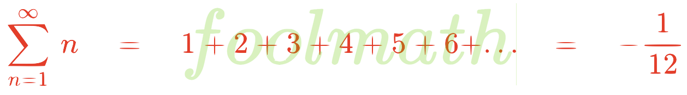
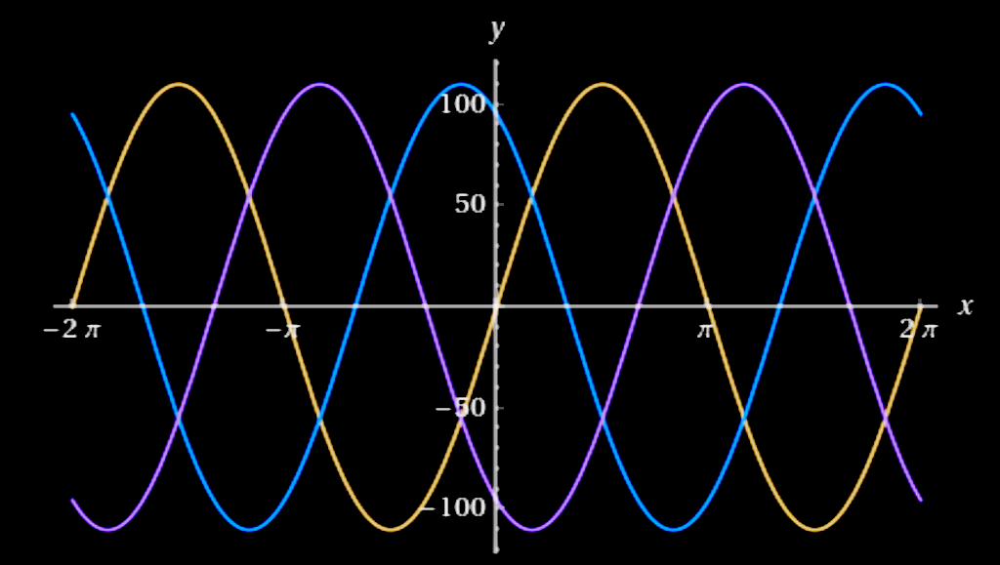
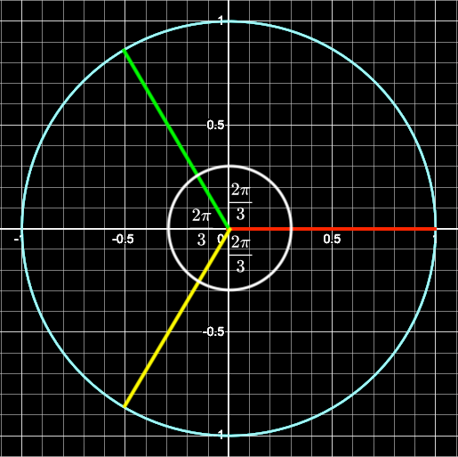

## **Page 2**



[Previous Page](https://github.com/chunglim/foolmath#welcome-to-the-foolmath-repository)&nbsp;|&nbsp;[Next Page](./PAGE-3.md#page-3)&nbsp;|&nbsp;[Contribute](#support-foolmath)

### **Solve $`x`$ for $`x+2=x`$.**

```math
\begin{alignat*}{5}
&\,&x+2\quad&=\quad&&x\qquad&\small\text{(1)}\\
&\,&(x+2)^2\quad&=&& x^2\\
&\,&\cancel{x^2}+4x+4\quad&=&&\cancel{x^2}\\
&\,&4x\quad&=&&-4\\
&\,&x\quad&=&&-1\qquad&\small\text{(2)}\\
&\small\text{substitute (2) in (1)}\qquad&-1+2\quad&=&&-1\\
&\small\text{Thus}&1\quad&=&&-1
\end{alignat*}
```
_source code:_&nbsp;[x+2eqx.tex](./src/x+2eqx.tex)&nbsp;|&nbsp;[Go to top](#page-2)&nbsp;|&nbsp;[TOC](https://github.com/chunglim/foolmath#table-of-contents)

Wow, there are many ways to skin the cat, indeed.<br><br>
Now, have a look at the valid proof of _Euler's identity_.

### **$`e^{i\pi}=?`$, also known as _Euler's identity_**

```math
\begin{alignat*}{7}
&\,&\sin{x}&=\sum_{n=0}^{\infty}\frac{(-1)^n}{(2n+1)!}x^{2n+1}&&=x-\frac{x^3}{3!}+\frac{x^5}{5!}-\frac{x^7}{7!}+...\qquad&\small\text{for all x}\\
&\,&\cos{x}&=\sum_{n=0}^{\infty}\frac{(-1)^n}{(2n)!}x^{2n}&&=1-\frac{x^2}{2!}+\frac{x^4}{4!}-\frac{x^6}{6!}+...\qquad&\small\text{for all x}\\
&\,&e^x&=\sum_{n=0}^{\infty}\frac{x^n}{n!}&&=1+x+\frac{x^2}{2!}+\frac{x^3}{3!}+\frac{x^4}{4!}+...\qquad&\small\text{for all x}\\
&\,&e^{ix}&=\rlap{1+ix+\frac{(ix)^2}{2!}+\frac{(ix)^3}{3!}+\frac{(ix)^4}{4!}+\frac{(ix)^5}{5!}+\frac{(ix)^6}{6!}+\frac{(ix)^7}{7!}+\frac{(ix)^8}{8!}+...}\\
&\,&\,&=\rlap{1+ix-\frac{x^2}{2!}-\frac{ix^3}{3!}+\frac{x^4}{4!}+\frac{ix^5}{5!}-\frac{x^6}{6!}-\frac{ix^7}{7!}+\frac{x^8}{8!}+...}\\
&\,&\,&=\rlap{\left(1-\frac{x^2}{2!}+\frac{x^4}{4!}-\frac{x^6}{6!}+\frac{x^8}{8!}-...\right)+i\left(x-\frac{x^3}{3!}+\frac{x^5}{5!}-\frac{x^7}{7!}+...\right)}\\
&\,&e^{ix}&=\cos{x}+i\sin{x}&&\small\text{***}\\
&\,&e^{i\pi}&=\cos{\pi}+\cancelto{0}{i\sin{\pi}}\\
&\small\text{Thus}\normalsize\qquad&e^{i\pi}&=-1\qquad\small\text{(valid proof)}
\end{alignat*}
```
_source code:_&nbsp;[euler.tex](./src/euler.tex)&nbsp;|&nbsp;[Go to top](#page-2)&nbsp;|&nbsp;[TOC](https://github.com/chunglim/foolmath#table-of-contents)

Euler's identity shall be used in the other proofs (whether valid or foolish).<br>
Let's see the first foolish proofs using _Euler's identity_.

### **$`e^x=1`$, no matter what $`x`$ maybe.**

#### **Proof 1**

```math
\begin{alignat*}{5}
&\,&e^x\quad&=\quad&&e^{i\pi.2\frac{x}{i\pi.2}}\\
&\,&\,&=&&(e^{i\pi})^{2\frac{x}{2i\pi}}\\
&\,&\,&=&&(-1)^{2\frac{x}{2i\pi}}\\
&\,&e^x\quad&=&&1^\frac{x}{2i\pi}\qquad&\small(1)\\
&\small\text{as}&e^{i\pi}\quad&=&&-1\\
&\,&\ln{e^{i\pi}}\quad&=&&\ln{(-1)}\\
&\,&i\pi\cancelto{1}{\ln{e}}&=&&\ln{(-1)}\\
&\,&i\pi\quad&=&&\ln{(-1)}\qquad&\small(2)\\
&\small\text{from (1)}&e^x\quad&=&&1^\frac{x}{2\ln(-1)}\\
&\,&\,&=&&1^\frac{x}{\ln(-1^2)}\\
&\,&\,&=&&1^\frac{x}{\cancelto{0}{\ln{1}}}\\
&\,&\,&=&&1^\frac{x}{0}\\
&\,&\,&=&&1^\infty\\
&\small\text{Thus}&e^x\quad&=&&1\qquad&\small\text{(so foolish)}
\end{alignat*}
```
_source code:_&nbsp;[ex_eq_1_0.tex](./src/ex_eq_1_0.tex)&nbsp;|&nbsp;[Go to top](#page-2)&nbsp;|&nbsp;[TOC](https://github.com/chunglim/foolmath#table-of-contents)

Q: Bruh, how can you divide by $0$ and evaluate $1^\infty$ to $1$?<br>
A: Hold on, there is another neater proof.

#### **Proof 2**

```math
\begin{alignat*}{5}
&\,&e^{i\pi}\quad&=\quad&&-1\\
&\,&\left(e^{i\pi}\right)^2\quad&=&&-1^2\\
&\,&e^{2i\pi}\quad&=&&1\\
&\small\text{power }n\text{ both sides}&e^{2ni\pi}\quad&=&&1^n\qquad&\small\text{for all n}\\
&\,&e^{2ni\pi}\quad&=&&1\\
&\small\times e\text{ both sides}&e^{2ni\pi}.e\quad&=&&e\\
&\,&e^{2ni\pi+1}\quad&=&&e&\small(1)\\
&\small\text{power }(2ni\pi+1)\text{ both sides}&\left(e^{2ni\pi+1}\right)^{2ni\pi+1}\quad&=&&e^{2ni\pi+1}\\
&\small\text{from (1)}\normalsize\quad\,&e^{(2ni\pi+1)(2ni\pi+1)}\quad&=&&e\\
&\,&e^{(2ni\pi+1)^2}\quad&=&&e\\
&\,&e^{(2ni\pi)^2+2(2ni\pi)(1)+1^2}\quad&=&&e\\
&\,&e^{-4n^2\pi^2+4ni\pi+1}\quad&=&&e\\
&\,&e^{-4n^2\pi^2}.e^{4ni\pi}.\cancel{e}\quad&=&&\cancel{e}\\
&\,&e^{-4n^2\pi^2}.e^{4ni\pi}\quad&=&&1\\
&\,&e^{-4n^2\pi^2}.\left(e^{i\pi}\right)^{4n}\quad&=&&1\\
&\,&e^{-4n^2\pi^2}.(-1)^{2.2n}\quad&=&&1\\
&\,&e^{-4n^2\pi^2}.\cancelto{1}{1^{2n}}\quad&=&&1\\
&\,&e^{-4n^2\pi^2}\quad&=&&1\\
&\rlap{\small\text{as }n\text{ can be any real values, }x=-4n^2\pi^2\text{, can also be any real values.}}\\
&\,&\small\text{Thus}\normalsize\qquad e^x\quad&\,=\quad1
\end{alignat*}
```
_source code:_&nbsp;[ex_eq_1_1.tex](./src/ex_eq_1_1.tex)&nbsp;|&nbsp;[Go to top](#page-2)&nbsp;|&nbsp;[TOC](https://github.com/chunglim/foolmath#table-of-contents)

Now, let's see the value of $\frac{\text{circumference}}{\text{diameter}}$, you know.

### **How much is $`\pi`$?**

#### **Solution 1**

```math
\begin{alignat*}{5}
&\,&e^{i\pi}\quad&=\quad&&-1\\
&\,&\ln{e^{i\pi}}\quad&=&&\ln{(-1)}\\
&\,&i\pi\cancelto{1}{\ln e}\quad&=&&\ln{(-1)}\\
&\,&\pi\quad&=&&\frac{\ln{(-1)}}{i}\\
&\,&\,&=&&\frac{2\ln{(-1)}}{2i}\\
&\,&\,&=&&\frac{\ln{(-1)^2}}{2i}\\
&\,&\,&=&&\frac{\cancelto{0}{\ln{1}}}{2i}\\
&\small\text{Thus}&\pi\quad&=&&0
\end{alignat*}
```
_source code:_&nbsp;[pi_eq_0_0.tex](./src/pi_eq_0_0.tex)&nbsp;|&nbsp;[Go to top](#page-2)&nbsp;|&nbsp;[TOC](https://github.com/chunglim/foolmath#table-of-contents)

If you don't believe, yet there are another solutions.

#### **Solution 2**

```math
\begin{alignat*}{5}
&\,&e^{i\pi}\quad&=\quad&&-1\\
&\,&(e^{i\pi})^2\quad&=&&(-1)^2\qquad&\,\\
&\,&e^{2i\pi}\quad&=&&1&\small(1)\\
&\,&e^{2i\pi}.e\quad&=&&e\\
&\,&e^{2i\pi+1}\quad&=&&e\\
&\,&\left(e^{2i\pi+1}\right)^{2i\pi+1}\quad&=&&e^{2i\pi+1}\\
&\,&e^{(2i\pi+1)(2i\pi+1)}\quad&=&&e^{2i\pi}.e\\
&\small\text{from (1)}\normalsize\qquad&e^{(2i\pi+1)(2i\pi+1)}\quad&=&&1e\\
&\,&e^{(2i\pi)^2+2.2i\pi+1^2}\quad&=&&e\\
&\,&e^{(-4\pi^2+4i\pi+1)}\quad&=&&e\\
&\,&e^{-4\pi^2}.e^{4i\pi}.\cancel{e}\quad&=&&\cancel{e}\\
&\,&e^{-4\pi^2}.e^{4i\pi}\quad&=&&1\\
&\,&e^{-4\pi^2}.e^{i\pi.2.2}\quad&=&&1\\
&\,&e^{-4\pi^2}.(-1)^{2.2}\quad&=&&1\\
&\,&e^{-4\pi^2}.\cancel{1}^2\quad&=&&\cancel{1}\\
&\,&\ln{(e^{-4\pi^2})}\quad&=&&\ln1\\
&\,&-4\pi^2\cancelto{1}{\ln{(e)}}\quad&=&&0\\
&\,&\pi^2\quad&=&&0\\
&\,&\small\text{Thus}\normalsize\qquad\pi\quad&=&&0
\end{alignat*}
```
_source code:_&nbsp;[pi_eq_0_1.tex](./src/pi_eq_0_1.tex)&nbsp;|&nbsp;[Go to top](#page-2)&nbsp;|&nbsp;[TOC](https://github.com/chunglim/foolmath#table-of-contents)

$\pi$ is really zero, let's confirm with the next solution.

#### **Solution 3**

```math
\begin{alignat*}{5}
&\,&e^{ix}\quad&=\quad&&\cos{x}+i\sin{x}\\
&\,&e^{2i\pi}\quad&=&&\cos{2\pi}+\cancelto{0}{i\sin{2\pi}}\\
&\,&\,&=&&1\\
&\small\text{ln() both sides}\normalsize\qquad&\ln{e^{2i\pi}}\quad&=&&\cancelto{0}{\ln{1}}\\
&\,&2i\pi\quad&=&&0\\
&\small&divide\,i\text{ both sides}&\frac{2\cancel{i}\pi}{\cancel{i}}\quad&=&&\cancelto{0}{\frac{0}{i}}\\
&\,&2\pi\quad&=&&0\\
&\qquad\small\text{Thus}&\pi\quad&=&&0
\end{alignat*}
```
_source code:_&nbsp;[pi_eq_0_2.tex](./src/pi_eq_0_2.tex)&nbsp;|&nbsp;[Go to top](#page-2)&nbsp;|&nbsp;[TOC](https://github.com/chunglim/foolmath#table-of-contents)

#### **Solution 4**

```math
\begin{alignat*}{5}
&\,&e^{i\pi}\quad&=\quad&&-1\\
&\,&\left(e^{i\pi}\right)^2\quad&=\quad&&(-1)^2\\
&\,&e^{2i\pi}\quad&=&&1\qquad\qquad&\small\text{(1)}\\
&\,&\sqrt[^i]{2}\quad&=&&\sqrt[^i]{2}\\
&\small\text{from (1)}&\sqrt[^i]{2\cdot e^{2i\pi}}\quad&=&&\sqrt[^i]{2}\\
&\,&\cancel{\sqrt[^i]{2}}\cdot\sqrt[^i]{e^{2i\pi}}\quad&=&&\cancel{\sqrt[^i]{2}}\\
&\,&e^{\frac{2\cancel{i}\pi}{\cancel{i}}}\quad&=&&1\\
&\small\ln{}\text{ both sides}\normalsize\qquad&\ln{e^{2\pi}}\quad&=&&\ln{1}\\
&\,&2\pi\cancelto{1}{\ln{e}}\quad&=&&0\\
&\qquad\small\text{Thus}&\pi\quad&=&&0
\end{alignat*}
```
_source code:_&nbsp;[pi_eq_0_3.tex](./src/pi_eq_0_3.tex)&nbsp;|&nbsp;[Go to top](#page-2)&nbsp;|&nbsp;[TOC](https://github.com/chunglim/foolmath#table-of-contents)

Hold on, $\pi$ is probably something else.

#### **Solution 5**

```math
\begin{alignat*}{5}
&\,&e^{i\pi}\quad&=\quad&&-1\\
&\,&\ln{e^{i\pi}}\quad&=&&\ln{(-1)}\\
&\,&i\pi\cancelto{1}{\ln{e}}\quad&=&&\ln{(-1)}\\
&\,&1^{i\pi}\quad&=&&1^{\ln{(-1)}}\\
&\,&(1^\pi)^i\quad&=&&1^{\ln{(-1)}}\\
&\,&1^i\quad&=&&1^{\ln{(-1)}}\\
&\,&\log_{1}1^i\quad&=&&\log_{1}1^{\ln{(-1)}}\\
&\,&i\log_{1}1\quad&=&&\ln{(-1)}\log_{1}1\\
&\,&i\quad&=&&\ln{(-1)}\\
&\,&i\quad&=&&\ln{(e^{i\pi})}\\
&\,&\cancel{i}\quad&=&&\cancel{i}\pi\cancelto{1}{\ln{e}}\\
&\small\text{Thus}&\pi\quad&=&&1
\end{alignat*}
```
_source code:_&nbsp;[pi_eq_1_0.tex](./src/pi_eq_1_0.tex)&nbsp;|&nbsp;[Go to top](#page-2)&nbsp;|&nbsp;[TOC](https://github.com/chunglim/foolmath#table-of-contents)

Yet, there are another silly solutions.

#### **Solution 6**

```math
\begin{alignat*}{5}
&\rlap{\text{Rotate 6 by 180}^\circ\text{, it will be 9.}}\\
&\rlap{\text{Rotate 6 by }\pi~\text{radians, it will be 9.}}\\
&\,&6+\pi\quad&=\quad&&9\\
&\,&\pi\quad&=&&9-6\\
&\small\text{Thus}&\pi\quad&=&&3
\end{alignat*}
```
_source code:_&nbsp;[pi_eq_3_0.tex](./src/pi_eq_3_0.tex)&nbsp;|&nbsp;[Go to top](#page-2)&nbsp;|&nbsp;[TOC](https://github.com/chunglim/foolmath#table-of-contents)

Oops! engineers also say that!

#### **Solution 7**

```math
\begin{alignat*}{7}
&\small\text{Let}&x\quad&=\quad&&\frac{\pi+3}{2}\\
&\,&2x\quad&=&&\pi+3\\
&\small\times(\pi-3)\qquad&2x(\pi-3)\quad&=&&(\pi+3)(\pi-3)\\
&\,&2\pi x-6x\quad&=&&\pi^2-9\\
&\,&9-6x\quad&=&&\pi^2-2\pi x\\
&\small+x^2&9-6x+x^2\quad&=&&\pi^2-2\pi x+x^2\\
&\,&(3-x)^2\quad&=&&(\pi-x)^2\\
&\,&3-\cancel{x}\quad&=&&\pi-\cancel{x}\\
&\small\text{Thus}&\pi\quad&=&&3
\end{alignat*}
```
_source code:_&nbsp;[pi_eq_3_1.tex](./src/pi_eq_3_1.tex)&nbsp;|&nbsp;[Go to top](#page-2)&nbsp;|&nbsp;[TOC](https://github.com/chunglim/foolmath#table-of-contents)

We have seen several foolish proofs so far, let's see valid proofs.

### **How much is $`i^i`$?**

```math
\begin{alignat*}{5}
&\small\text{from Euler's identity}&e^{ix}\quad&=\quad&&\cos{x}+i\sin{x}\\
&\,&i\quad&=&&0+i\\
&\,&\,&=&&\cos{\left(\frac{\pi}{2}\right)}+i\sin{\left(\frac{\pi}{2}\right)}\\
&\,&\,&=&&e^{i\frac{\pi}{2}}\\
&\small\text{power }i\text{ both sides}&i^i\quad&=&& e^{i^2\frac{\pi}{2}}\\
&\,&\small\text{Thus}\normalsize\qquad i^i\quad&=&&e^{-\frac{\pi}{2}}\qquad\small\text{(valid proof)}\\
&\rlap{\qquad\qquad\qquad\qquad\small\text{And it is a real number.}}
\end{alignat*}
```
_source code:_&nbsp;[i_power_i.tex](./src/i_power_i.tex)&nbsp;|&nbsp;[Go to top](#page-2)&nbsp;|&nbsp;[TOC](https://github.com/chunglim/foolmath#table-of-contents)

### **How much is $`\sqrt[^i]{i}`$?**

```math
\begin{alignat*}{5}
&\,&e^{i\pi}\quad&=\quad&&-1\\
&\,&\,&=&&i^2\\
&\small\text{take ln both sides}&\ln{e^{i\pi}}\quad&=&&\ln{i^2}\\
&\,&i\pi\cancelto{1}{\ln{e}}\quad&=&&2\ln{i}\\
&\,&\quad\frac{\pi}{2}\quad&=&&\frac{{1}}{i}\ln{i}\\
&\,&\quad\ln{i^\frac{1}{i}}\quad&=&&\frac{\pi}{2}\\
&\,&\quad i^\frac{1}{i}\quad&=&&e^\frac{\pi}{2}\\
&\,&\small\text{Thus}\normalsize\qquad\sqrt[^i]{i}\quad&=&&e^\frac{\pi}{2}\qquad\small\text{(valid proof)}\\
&\rlap{\qquad\qquad\qquad\qquad\small\text{And it is a real number.}}
\end{alignat*}
```
_source code:_&nbsp;[i_root_i.tex](./src/i_root_i.tex)&nbsp;|&nbsp;[Go to top](#page-2)&nbsp;|&nbsp;[TOC](https://github.com/chunglim/foolmath#table-of-contents)

### **Who said $`n^0=1`$?**

```math
\begin{alignat*}{5}
&\,&n^{-1}\quad&=\quad&&\frac{1}{n}\\
&\,&n^{\left(i^2\right)}\quad&=&&\frac{1}{n}\\
&\small\text{power }\frac{1}{i}\text{ both sides}&n^{\left(\frac{i^2}{i}\right)}\quad&=&&\left(\frac{1}{n}\right)^\frac{1}{i}\\
&\,&n^i\quad&=&&\frac{1^\frac{1}{i}}{n^\frac{1}{i}}\\
&\,&n^i.n^\frac{1}{i}\quad&=&&1^\frac{1}{i}\\
&\,&n^{i+\frac{1}{i}}\quad&=&&1^\frac{1}{i}\\
&\small\text{as }i=\frac{1}{-i}&n^{-\frac{1}{i}+\frac{1}{i}}\quad&=&&1^\frac{1}{i}\\
&\,&n^0\quad&=&&(-1)^{2.\frac{1}{i}}\\
&\small\text{as }e^{i\pi}=-1&\,&=&&(e^{\cancel{i}\pi})^\frac{2}{\cancel{i}}\\
&\,&\small\text{Thus}\normalsize\qquad n^0\quad&=&&e^{2\pi}\\
\end{alignat*}
```
_source code:_&nbsp;[nto0neq1.tex](./src/nto0neq1.tex)&nbsp;|&nbsp;[Go to top](#page-2)&nbsp;|&nbsp;[TOC](https://github.com/chunglim/foolmath#table-of-contents)

It is still a constant, but not `1`, not even an integer.<br>
It is even an irrational and transcendental number.<br><br>
Next, let's see valid proofs.

### **You might be wondering, why is $`\frac{d}{dx}e^x=e^x`$?**

There are many solutions out there, let's have a look.

#### **Proof 1: _Limit Definition_**

```math
\begin{alignat*}{5}
&\,&f'(x)\quad&=\quad&&\lim_{h\to0}\frac{f(x+h)-f(x)}{h}\\
&\,&\frac{d}{dx}e^x\quad&=&&\lim_{h\to0}\frac{e^{x+h}-e^x}{h}\\
&\,&\frac{d}{dx}e^x\quad&=&&e^x.\frac{e^h-1}{h}\qquad&\small(1)\\
&\,&\small\text{Let}\normalsize\qquad t\quad&=&&e^h-1\qquad&\small(2)\\
&\,&\ln{t}\quad&=&&\ln{(e^h-1)}\\
&\,&\,&=&&\frac{\ln{e^h}}{\ln{1}}\\
&\,&\ln{t}\quad&=&&h.\frac{\cancelto{1}{\ln{e}}}{\ln{1}}\\
&\,&h\quad&=&&\ln{t}.\ln{1}\\
&\,&h\quad&=&&\ln{(t+1)}\qquad&\small(3)\\
&\rlap{\qquad\qquad\small\text{since }h\text{ approaches }0\text{ , in order to balance the equation,}}\\
&\rlap{\qquad\qquad\qquad\qquad\quad\small\text{so }t\text{ must also approach }0.}\\
&\small\text{from (1), (2) and (3)}&\frac{d}{dx}e^x\quad&=&& e^x\lim_{t\to0}\frac{t}{\ln{(t+1)}}\\
&\,&\,&=&&e^x\lim_{t\to0}\frac{1}{\frac{1}{t}\ln{(t+1)}}\\
&\,&\frac{d}{dx}e^x\quad&=&&e^x\lim_{t\to0}\frac{1}{\ln{(t+1)}^\frac{1}{t}}\qquad&\small(4)\\
&\rlap{\small\text{recall}\normalsize\qquad\qquad\qquad e=\lim_{n\to0}(1+n)^\frac{1}{n}=\lim_{n\to\infty}\left(1+\frac{1}{n}\right)^n}\\
&\small\text{from (4)}&\frac{d}{dx}e^x\quad&=&&e^x\frac{1}{\cancelto{1}{\ln{e}}}\\
&\,&\small\text{Thus}\normalsize\qquad\frac{d}{dx}e^x\quad&=&&e^x\qquad\small\text{(valid proof)}
\end{alignat*}
```
_source code:_&nbsp;[d_e_power_x_0.tex](./src/d_e_power_x_0.tex)&nbsp;|&nbsp;[Go to top](#page-2)&nbsp;|&nbsp;[TOC](https://github.com/chunglim/foolmath#table-of-contents)

#### **Proof 2: _Taylor Series_**

```math
\begin{alignat*}{5}
&\,&e^x\quad&=\quad&&\sum_{i=0}^\infty\frac{x^n}{n!}\\
&\,&\,&=&&\frac{x^0}{0!}+\frac{x^1}{1!}+\frac{x^2}{2!}+\frac{x^3}{3!}+\frac{x^4}{4!}+...\\
&\,&e^x\quad&=&&1+\frac{x^1}{1}+\frac{x^2}{2!}+\frac{x^3}{3!}+\frac{x^4}{4!}+...\qquad&\small\text{(1)}\\
&\small\text{diff}&\frac{d}{dx}e^x\quad&=&&0+1+\frac{2x^1}{2!}+\frac{3x^2}{3!}+\frac{4x^3}{4!}+...\\
&\,&\,&=&&1+\frac{\cancel{2}x^1}{\cancel{2}.1!}+\frac{\cancel{3}x^2}{\cancel{3}.2!}+\frac{\cancel{4}x^3}{\cancel{4}.3!}+...\\
&\,&\,&=&&(1)\\
&\small\text{Thus}\normalsize\qquad&\frac{d}{dx}e^x\quad&=&&e^x\qquad\small\text{(valid proof)}
\end{alignat*}
```
_source code:_&nbsp;[d_e_power_x_1.tex](./src/d_e_power_x_1.tex)&nbsp;|&nbsp;[Go to top](#page-2)&nbsp;|&nbsp;[TOC](https://github.com/chunglim/foolmath#table-of-contents)

#### **Proof 3: _Implicit Differentiation_**

```math
\begin{alignat*}{5}
&\,&y\quad&=\quad&&e^x\\
&\,&\ln{y}\quad&=&&\ln{e^x}\\
&\,&\,&=&&x\cancelto{1}{\ln{e}}\\
&\,&\ln{y}\quad&=&&x\\
&\small\text{diff both sides}\normalsize\quad&\frac{d}{dx}\ln{y}\quad&=&&\frac{dx}{dx}\\
&\,&\frac{1}{y}\frac{dy}{dx}\quad&=&&1\\
&\,&\frac{dy}{dx}\quad&=&&y\\
&\qquad\small\text{Thus}\normalsize\qquad&\frac{d}{dx}e^x\quad&=&&e^x\qquad\small\text{(valid proof)}
\end{alignat*}
```
_source code:_&nbsp;[d_e_power_x_2.tex](./src/d_e_power_x_2.tex)&nbsp;|&nbsp;[Go to top](#page-2)&nbsp;|&nbsp;[TOC](https://github.com/chunglim/foolmath#table-of-contents)

#### **Proof 4: _Differential Equation_**

```math
\begin{alignat*}{5}
&\,&\frac{dy}{dx}\quad&=\quad&&y\\
&\,&\frac{dy}{y}\quad&=&&dx\\
&\small\text{integral}\quad&\int\frac{dy}{y}\quad&=&&\int{dx}\\
&\,&\ln{y}\quad&=&&x\qquad&\small\text{omit}~C\\
&\,&y\quad&=&&e^x\\
&\small\text{Thus}&\frac{d}{dx}e^x\quad&=&&e^x\qquad&\small\text{(valid proof)}
\end{alignat*}
```
_source code:_&nbsp;[d_e_power_x_3.tex](./src/d_e_power_x_3.tex)&nbsp;|&nbsp;[Go to top](#page-2)&nbsp;|&nbsp;[TOC](https://github.com/chunglim/foolmath#table-of-contents)

Four proofs should suffice.<br>
$e^x$ is the only expression, you can't kill with differentiation.

### **Multiplying factor to change power voltage from $`1\phi`$ to $`3\phi`$**

You may notice that the electrical power $1\phi\cdot110V$ is branched from $3\phi\cdot190V$. Or $1\phi\cdot220V$ is branched from $3\phi\cdot380V$ in some countries. This is because $110\sqrt{3}=190$ or $220\sqrt{3}=380$. You may wonder, why the factor is $\sqrt{3}$. Here's the proof.

This proof is kinda engineering, so $j$ denotes an imaginary number.



In $1\phi$ electricity, the voltage is measured across the _live_ line and _neutral_, which is always `0` and the amplitude of _live_ line is always a constant. But in $3\phi$ electricity, the voltage is measured across two _live_ lines. And each _live_ line is a sine curve (plus offset). How can we measure the voltage across two _live_ lines? Let's see.



A full circle covers the angle of $2\pi$ radians or $360^{\circ}$. And it is split into $3\phi$. So each phase will set an angle by $\frac{2\pi}{3}$ radians or $120^\circ$ apart from one another. The voltage across phases can be computed by the difference between phases. In this case we will subtract the voltage at $120^\circ$ from the voltage at $0^\circ$.

```math
\begin{alignat*}{5}
&\,&V_{ab}\quad&=\quad&&V_{an}\measuredangle0^\circ-V_{bn}\measuredangle120^\circ\\
&\,&\,&=&& V_{an}(\cos{0^\circ}+j\sin{{0^\circ}})-V_{bn}(\cos{120^\circ}+j\sin{{120^\circ}})\\
&\,&\,&=&&V_{an}(1+0)-V_{bn}(-\frac{1}{2}+j\cdot\frac{\sqrt{3}}{2})\\
&\,&V_{ab}\quad&=&&V_{an}-V_{bn}(-\frac{1}{2}+j\cdot\frac{\sqrt{3}}{2})\qquad&\small\text(1)\\
&\small\text{take magnitude}&|V_{an}|\quad&=&&|V_{bn}|\quad=\quad|V|\quad\small\text{(measure line to neutral)}\\
&\small\text{from (1)}&|V_{ab}|\quad&=&&|V|-|V|(-\frac{1}{2}+j\cdot\frac{\sqrt{3}}{2})\\
&\,&|V_{ab}|\quad&=&&|V|+\frac{1}{2}|V|-j|V|\cdot\frac{\sqrt{3}}{2}\\
&\,&\,&=&&|V|\frac{3}{2}-j|V|\cdot\frac{\sqrt{3}}{2}\\
&\,&\,&=&&|V|\left(\frac{3}{2}-j\cdot\frac{\sqrt{3}}{2}\right)\\
&\small\text{polar to rectangular}\normalsize\quad&|V_{ab}|\quad&=&&|V|\sqrt{\left(\frac{3}{2}\right)^2+\left(\frac{\sqrt{3}}{2}\right)^2}\\
&\,&\,&=&&|V|\sqrt{\frac{9}{4}+\frac{3}{4}}\\
&\,&\,&=&&|V|\sqrt{\frac{12}{4}}\\
&\qquad\qquad\small\text{Thus}\normalsize\qquad&|V_{ab}|\quad&=&&|V|\sqrt{3}\qquad\small\text{(valid proof)}\\
\end{alignat*}
```
_source code:_&nbsp;[3p_power.tex](./src/3p_power.tex)&nbsp;|&nbsp;[Go to top](#page-2)&nbsp;|&nbsp;[TOC](https://github.com/chunglim/foolmath#table-of-contents)

So now you know that the power $1\phi\cdot110V$ is branched from $3\phi\cdot190V$. Or $1\phi\cdot220V$ is branched from $3\phi\cdot380V$ in some countries. The multiplying factor is $\sqrt{3}$.

**Let's see some weirdness of mathematics.**

**The following math properties are not the proofs, but they are the demonstrations showing the valid weirdness of mathematics.**

### **Magic numbers**

Have you ever know a magic number `9`? Whatever multiplying with `9` will result number of digits. We keep adding each digit until the final result is one digit. The final result is always `9` for examples ...

`5 * 9 = 45`,<br>
then `4 + 5 = 9`

or

`135686 * 9 = 1221174`<br>
then `1 + 2 + 2 + 1 + 1 + 7 + 4 = 18`,<br>
and then `1 + 8 = 9`.

All explaination above is on base `10`. However this concept also applies to all bases. The magic number for each base is `base - 1`. This is a valid weirdness.

```
base 10: magic number = 10 - 1 = 9
1 * 9 = 9
2 * 9 = 18 --> 1 + 8 = 9
3 * 9 = 27 --> 2 + 7 = 9
4 * 9 = 36 --> 3 + 6 = 9
5 * 9 = 45 --> 4 + 5 = 9
6 * 9 = 54 --> 5 + 4 = 9
7 * 9 = 63 --> 6 + 3 = 9
8 * 9 = 72 --> 7 + 2 = 9
9 * 9 = 81 --> 8 + 1 = 9
The final result will always be 9.

base 8: magic number = 010 - 01 = 07
01 * 07 = 07
02 * 07 = 016 --> 01 + 06 = 07
03 * 07 = 025 --> 02 + 05 = 07
04 * 07 = 034 --> 03 + 04 = 07
05 * 07 = 043 --> 04 + 03 = 07
06 * 07 = 052 --> 05 + 02 = 07
07 * 07 = 061 --> 06 + 01 = 07
The final result will always be 07.

base 16: magic number = 0x10 - 0x1 = 0xf
0x1 * 0xf = 0xf
0x2 * 0xf = 0x1e --> 0x1 + 0xe = 0xf
0x3 * 0xf = 0x2d --> 0x2 + 0xd = 0xf
0x4 * 0xf = 0x3c --> 0x3 + 0xc = 0xf
0x5 * 0xf = 0x4b --> 0x4 + 0xb = 0xf
0x6 * 0xf = 0x5a --> 0x5 + 0xa = 0xf
0x7 * 0xf = 0x69 --> 0x6 + 0x9 = 0xf
0x8 * 0xf = 0x78 --> 0x7 + 0x8 = 0xf
0x9 * 0xf = 0x87 --> 0x8 + 0x7 = 0xf
0xa * 0xf = 0x96 --> 0x9 + 0x6 = 0xf
0xb * 0xf = 0xa5 --> 0xa + 0x5 = 0xf
0xc * 0xf = 0xb4 --> 0xb + 0x4 = 0xf
0xd * 0xf = 0xc3 --> 0xc + 0x3 = 0xf
0xe * 0xf = 0xd2 --> 0xd + 0x2 = 0xf
0xf * 0xf = 0xe1 --> 0xe + 0x1 = 0xf
The final result will always be 0xf.
```

You can try different bases. The results will be the same.

### **Vortex math**

Consider the following series, each number is the power of `2`. This is a valid math property.

```math
\begin{alignat*}{15}
&1,&\quad2,&\quad4,&\quad8,&~~~16,&~~32,&~~64,&~128,&~256,&~512,&~1024,&~2048,&~4096, ...\\
\rlap{\text{Keep adding each digit, until the final result is one digit, ...}}\\
&1,&\quad2,&\quad4,&\quad8,&\quad~7,&\quad5,&\quad1,&\quad~2,&\quad~4,&\quad~8,&\quad~~~7,&\quad~~~5,&\quad~~~1, ...\\
\rlap{\text{The series will repeat with the following sub-series.}}\\
&1,&\quad2,&\quad4,&\quad8,&\quad~7,&\quad5~
\end{alignat*}
```
_source code:_&nbsp;[vortex.tex](./src/vortex.tex)&nbsp;|&nbsp;[Go to top](#page-2)&nbsp;|&nbsp;[TOC](https://github.com/chunglim/foolmath#table-of-contents)

Do you feel that math is so strange?

### **A property of prime numbers**

The _square of a prime number_ other than `2` or `3` is always `a multiple of 24 pluses 1`. Let's see.

```math
\begin{alignat*}{3}
&~~5^2&=~~25&=(24*~~1)+1\\
&~~7^2&=~~49&=(24*~~2)+1\\
&11^2&=121&=(24*~~5)+1\\
&13^2&=169&=(24*~~7)+1\\
&17^2&=289&=(24*12)+1\\
&19^2&=361&=(24*15)+1\\
&23^2&=529&=(24*22)+1\\
&29^2&=841&=(24*35)+1\\
&31^2&=961&=(24*40)+1
\end{alignat*}
```
_source code:_&nbsp;[prime_0.tex](./src/prime_0.tex)&nbsp;|&nbsp;[Go to top](#page-2)&nbsp;|&nbsp;[TOC](https://github.com/chunglim/foolmath#table-of-contents)

Primes (other than `2` and `3`) can only have remainders of `1` or `5` when they are divided by `6`. If the remainder was `0`, `2` or `4` it would be _even_, and if it was `3`, it would be _divisible_ by `3`.

```math
\begin{alignat*}{5}
&\,&p\quad&=\quad&&6n+1\\
&\,&p^2\quad&=&&(6n+1)^2\\
&\,&p^2\quad&=&&36n^2+12n+1&&\qquad\small\text{(1)}\\
&\qquad\qquad\qquad\rlap{\text{If }n\text{ is even, }n(3n+1)\text{ is also even.}}\\
&\qquad\rlap{\text{If }n\text{ is odd, }3n+1\text{ is even, so }n(3n+1)\text{ is still even.}}\\
&\small\text{so for all }n\normalsize\quad&n(3n+1)\quad&=&&2k\qquad\small\text{for some integer }k\\
&\small\text{from (1)}&p^2\quad&=&&12n(3n+1)+1\\
&\,&\,&=&&12(2k)+1\\
&\qquad\qquad\small\text{Thus}&p^2\quad&=&&24k+1\qquad\small\text{(valid proof)}
\end{alignat*}
```
_source code:_&nbsp;[prime_1.tex](./src/prime_1.tex)&nbsp;|&nbsp;[Go to top](#page-2)&nbsp;|&nbsp;[TOC](https://github.com/chunglim/foolmath#table-of-contents)

The proof for the case that `p` has a remainder of `5` is almost the same, just start with `p = 6n - 1` instead of `6n + 1`.

### **Proof of $`\int_{-\infty}^\infty e^{-x^2}dx=\sqrt\pi`$**

This valid proof is called **_Gaussian intergral_**. It demonstrates the relation between $e$ and $\pi$.

```math
\begin{alignat*}{5}
&\,&I^2\quad&=\quad&&\int_{-\infty}^\infty\,e^{-x^2}\,dx.\int_{-\infty}^\infty\,e^{-y^2}\,dy\\
&\,&\,&=&&\iint_{-\infty}^\infty\,e^{-(x^2+y^2)}\,dx\,dy\\
&\rlap{\small\text{convert the double integral into polar coordinates}}\\
&\,&I^2\quad&=&&\int_0^{2\pi}\int_0^\infty\,e^{-r^2}rdr\,d\theta\\
&\rlap{\small\text{the inner integral}}\\
&\,&\int_0^\infty\,e^{-r^2}rdr\quad&=&&\left.-\frac{1}{2}e^{-r^2}\right\vert_0^\infty\\
&\,&\,&=&&-\frac{1}{2}e^{-\infty^2}-\left(\frac{1}{2}e^{-0^2}\right)\\
&\,&\,&=&&-0-\left(-\frac{1}{2}\right)\\
&\,&\int_0^\infty\,e^{-r^2}rdr\quad&=&&\frac{1}{2}\\
&\rlap{\small\text{substituting this result back into the double integral}}\\
&\,&I^2\quad&=&&\int_0^{2\pi}\,\frac{1}{2}\,d\theta\\
&\,&\,&=&&\left.\frac{\theta}{2}\right\vert_0^{2\pi}\\
&\,&\,&=&&\frac{\cancel{2}\pi}{\cancel{2}}-\cancelto{0}{\frac{0}{2}}\\
&\,&I^2\quad&=&&\pi\\
&\,&\small\text{Thus}\normalsize\qquad I~~\quad&=&&\sqrt{\pi}\qquad\small\text{(valid proof)}
\end{alignat*}
```
_source code:_&nbsp;[e_pi_relation.tex](./src/e_pi_relation_0.tex)&nbsp;|&nbsp;[Go to top](#page-2)&nbsp;|&nbsp;[TOC](https://github.com/chunglim/foolmath#table-of-contents)

Gaussian integral is one of many relations between $e$ and $\pi$.

### **Golden ratio from _Fibonacci sequence_**

```math
\begin{alignat*}{5}
&\,&F_0\quad&=\quad&&0\\
&\,&F_1\quad&=&&1\\
&\small\text{where }n\geqslant2&F_n\quad&=&&F_{n-1}+F_{n-2}\\
&\small\text{Let }&\Phi\quad&=&&\lim_{n\to\infty}\frac{F_{n+1}}{F_n}\\
&\,&\,&=&&\lim_{n\to\infty}\frac{F_n+F_{n-1}}{F_n}\\
&\,&\,&=&&1+\lim_{n\to\infty}\frac{F_{n-1}}{F_n}\\
&\,&\,&=&&1+\frac{1}{\Phi}\\
&\,&\Phi\quad&=&&\frac{\Phi+1}{\Phi}\\
&\,&\Phi^2\quad&=&&\Phi+1\\
&\,&\Phi^2-\Phi-1\quad&=&&0\\
&\,&\Phi\quad&=&&\frac{-(-1)\pm\sqrt{(-1^2)-4(1)(-1)}}{2(1)}\\
&\small\Phi\text{ is positive}&\,&=&&\frac{1+\sqrt{1+4}}{2}\\
&\,&\small\text{Thus}\normalsize\qquad\Phi\quad&=&&\frac{1+\sqrt{5}}{2}\qquad\small\text{(valid proof)}
\end{alignat*}
```
_source code:_&nbsp;[golden_fib.tex](./src/golden_fib.tex)&nbsp;|&nbsp;[Go to top](#page-2)&nbsp;|&nbsp;[TOC](https://github.com/chunglim/foolmath#table-of-contents)

Well, we have been talking about valid proofs for long.<br>
Let's start freaks again.

### **Isn't it $`\infty=\Phi`$?**

```math
\begin{alignat*}{5}
&\,&\infty^2\quad&=\quad&&\infty\qquad&\small\text{(1)}\\
&\,&\infty+1\quad&=&&\infty&\small\text{(2)}\\
&\small\text{(1)=(2)}\normalsize\quad&\infty^2\quad&=&&\infty+1\\
&\,&\infty^2-\infty-1\quad&=&&0\\
&\,&\infty\quad&=&&\frac{-(-1)\pm\sqrt{(-1^2)-4(1)(-1)}}{2(1)}\\
&\,&\,&=&&\frac{1\pm\sqrt{1+4}}{2}\\
&\small\text{take positive}&\infty\quad&=&&\frac{1+\sqrt{5}}{2}\\
&\,&\small\text{Thus}\normalsize\qquad\infty\quad&=&&\Phi\quad\small\text{a.k.a. Fibonacci golden ratio}
\end{alignat*}
```
_source code:_&nbsp;[infty_fibo.tex](./src/infty_fibo.tex)&nbsp;|&nbsp;[Go to top](#page-2)&nbsp;|&nbsp;[TOC](https://github.com/chunglim/foolmath#table-of-contents)

Now you can see, $\infty$ is as small as $1.618034$.

### **How much is $`1^i`$?**

```math
\begin{alignat*}{5}
&\,&-1\quad&=\quad&&e^{i\pi}\\
&\small\text{power }2i&-1^{2i}\normalsize\quad&=&&\left(e^{i\pi}\right)^{2i}\\
&\,&\left(-1^2\right)^i\quad&=&&e^{2\pi.i^2}\\
&\,&1^i\quad&=&&e^{2\pi.(-1)}\\
&\small\text{Thus}&1^i\quad&=&&e^{-2\pi}
\end{alignat*}
```
_source code:_&nbsp;[1poweri.tex](./src/1poweri.tex)&nbsp;|&nbsp;[Go to top](#page-2)&nbsp;|&nbsp;[TOC](https://github.com/chunglim/foolmath#table-of-contents)

Oops, a `unit real number` raises `a unit imaginary number` is real. The number is so small `0.001867...`. And it is not `1`, like what being said by _WolframAlpha_. Why, who know?

Let's see more about `a unit real number` and `a unit imaginary number`.

### **How much is $`\sqrt[^i]{1}`$?**

```math
\begin{alignat*}{5}
&\,&-1\quad&=\quad&&e^{i\pi}\\
&\small\text{power }i^3&\left(-1\right)^{i^3}\quad&=&&(e^{i\pi})^{i^3}\\
&\,&-1^{i^2i}\quad&=&&e^{i^4\pi}\\
&\,&-1^{-1i}\quad&=&&e^{(i^2)^2\pi}\\
&\,&-1^{-i}\quad&=&&e^{-1^2\pi}\\
&\,&-1^{-i}\quad&=&&e^{1\pi}\\
&\small\text{as }-i=\frac{1}{i}&-1^\frac{1}{i}\quad&=&&e^\pi\\
&\small\text{power }2&-1^\frac{2}{i}\quad&=&&e^{2\pi}\\
&\,&\left(-1^2\right)^\frac{1}{i}\quad&=&&e^{2\pi}\\
&\,&\quad1^{\frac{1}{i}}\quad&=&&e^{2\pi}\\
&\qquad\small\text{Thus}&\sqrt[^i]{1}\quad&=&&e^{2\pi}
\end{alignat*}
```
_source code:_&nbsp;[sqrti1.tex](./src/sqrti1.tex)&nbsp;|&nbsp;[Go to top](#page-2)&nbsp;|&nbsp;[TOC](https://github.com/chunglim/foolmath#table-of-contents)

You can see `a unit imaginary root` of `a unit real number` is real and indeed a big real. It is as big as `535.5`. Once again, it is not `1`, why does _WolframAlpha_ say so?

### **Either $`e=1`$ or $`\pi=0`$**

```math
\begin{alignat*}{5}
&\,&e^{i\pi}\quad&=\quad&&-1\\
&\small\text{power }i^3&\left(e^{i\pi}\right)^{i^3}\quad&=&&-1^{i^3}\\
&\,&\left(e^\pi\right)^{i^4}\quad&=&&\left(-1^{i^2}\right)^i\\
&\,&\left(e^\pi\right)^{i^2.i^2}\quad&=&&\left(-1^{-1}\right)^i\\
&\,&\left(e^\pi\right)^{(-1)(-1)}\quad&=&&\left(\frac{1}{-1}\right)^i\\
&\,&\left(e^\pi\right)^1\quad&=&&(-1)^i\\
&\small\text{power }2&e^{2\pi}\quad&=&&(-1)^{2i}\\
&\,&\,&=&&1^i\\
&\small\text{from the previous proof}&\,&=&&e^{-2\pi}\\
&\,&\small\text{Thus}\normalsize\qquad e^{2\pi}\quad&=&&e^{-2\pi}
\end{alignat*}
```
_source code:_&nbsp;[e1pi0.tex](./src/e1pi0.tex)&nbsp;|&nbsp;[Go to top](#page-2)&nbsp;|&nbsp;[TOC](https://github.com/chunglim/foolmath#table-of-contents)

Oops, either $e=1$ or $\pi=0$, indeed!

### **How much is $`e^i`$?**

```math
\begin{alignat*}{5}
&\,&e^i\quad&=\quad&&\left(e^i\right)^\frac{2\pi}{2\pi}\\
&\,&\,&=&&\left(e^{i\pi}\right)^{2.\frac{1}{2\pi}}\\
&\,&\,&=&&(-1)^{2.\frac{1}{2\pi}}\\
&\,&\,&=&&1^\frac{1}{2\pi}\\
&\small\text{Thus}\normalsize\qquad&e^i\quad&=&&1
\end{alignat*}
```
_source code:_&nbsp;[etoi.tex](./src/etoi.tex)&nbsp;|&nbsp;[Go to top](#page-2)&nbsp;|&nbsp;[TOC](https://github.com/chunglim/foolmath#table-of-contents)

### **Simple continued fraction expansion of $`\pi`$**

In our early primary school, we were taught that $\pi$ is approximately a rational number `22/7`. But actually $\pi$ is an irrational number. We can have higher degree of accuracy and precision using higher numerator and denomerator. This method is called **a simple continued fraction expansion of $\pi$**, of which the series has been evaluated by matheticians over the centuries. That is ...

```
3, 7, 15, 1, 292, 1, 1, 1, 2, 1, 3, 1, 14, 2, 1, 1, 2, 2, 2, 2, 1, 84, 2, 1, 1, 15, 3, 13, 1, 4, 2, 6, 6, 99, 1, 2, 2, 6, 3, 5, 1, 1, 6, 8, 1, 7, 1, 2, 3, 7, 1, 2, 1, 1, 12, 1, 1, 1, 3, 1, 1, 8, 1, 1, 2, 1, 6, 1, 1, 5, 2, 2, 3, 1, 2, 4, 4, 16, 1, 161, 45, 1, 22, 1, 2, 2, 1, 4, 1, 2, 24, 1, 2, 1, 3, 1, 2, 1, ...
```
(valid $\pi$ fraction expansion)

[Further reference](https://oeis.org/A001203)

**We might start with the first _two terms_.**

```math
\begin{alignat*}{5}
&\,&\pi\quad&\approx\quad&&3+\frac{1}{7}\\
&\,&\,&\approx&&\frac{21+1}{7}\\
&\small\text{Thus}\qquad&\pi\quad&\approx&&\frac{22}{7}\rlap{\quad=\quad3.14}\\
&\rlap{\qquad\quad\small\text{(valid approximation)}}
\end{alignat*}
```
_source code:_&nbsp;[pi_exp_2_terms.tex](./src/pi_exp_2_terms.tex)&nbsp;|&nbsp;[Go to top](#page-2)&nbsp;|&nbsp;[TOC](https://github.com/chunglim/foolmath#table-of-contents)

**Or we might want higher accuracy and precision. Let's take _three terms_.**

```math
\begin{alignat*}{5}
&\,&\pi\quad&\approx\quad&&3+\frac{1}{7+\frac{1}{15}}\\
&\,&\,&\approx&&3+\frac{1}{\frac{106}{15}}\\
&\,&\,&\approx&&3+\frac{15}{106}\\
&\small\text{Thus}\qquad&\pi\quad&\approx&&\frac{333}{106}\rlap{\quad=\quad3.1415}\\
&\rlap{\qquad\qquad\small\text{(valid approximation)}}
\end{alignat*}
```
_source code:_&nbsp;[pi_exp_3_terms.tex](./src/pi_exp_3_terms.tex)&nbsp;|&nbsp;[Go to top](#page-2)&nbsp;|&nbsp;[TOC](https://github.com/chunglim/foolmath#table-of-contents)

**And we go a little further, Let's take _five terms_.**

```math
\begin{alignat*}{5}
&\,&\pi\quad&\approx\quad&&3+\frac{1}{7+\frac{1}{15+\frac{1}{1+\frac{1}{292}}}}\\
&\,&\,&\approx\quad&&3+\frac{1}{7+\frac{1}{15+\frac{1}{\frac{293}{292}}}}\\
&\,&\,&\approx\quad&&3+\frac{1}{7+\frac{1}{15+\frac{292}{293}}}\\
&\,&\,&\approx\quad&&3+\frac{1}{7+\frac{1}{\frac{4687}{293}}}\\
&\,&\,&\approx\quad&&3+\frac{1}{7+\frac{293}{4687}}\\
&\,&\,&\approx\quad&&3+\frac{1}{\frac{33102}{4687}}\\
&\,&\,&\approx\quad&&3+\frac{4687}{33102}\\
&\small\text{Thus}\quad&\pi\quad&\approx\quad&&\frac{103993}{33102}\rlap{\quad=\quad3.141592653}\\
&\rlap{\qquad\qquad\quad\small\text{(valid approximation)}}
\end{alignat*}
```
_source code:_&nbsp;[pi_exp_5_terms.tex](./src/pi_exp_5_terms.tex)&nbsp;|&nbsp;[Go to top](#page-2)&nbsp;|&nbsp;[TOC](https://github.com/chunglim/foolmath#table-of-contents)

### **Support _foolmath_**

I keep adding these kinds of freaks or topics, which are considered interesting, no matter what they are foolish or valid math. **_foolmath_** is a passion project I do under my curiosity at my retirement. Your support will motivate me to curate and expand this repository with even more fascinating content, and especially it can help me pay the bills.

If you find **_foolmath_** entertaining, educational, or you simply enjoy its content, or just feeling generous, please consider [buy me a coffee](https://www.buymeacoffee.com/chunglim). I will highly appreciate and will be very grateful.

<a href="https://www.buymeacoffee.com/chunglim" target="_blank"></a>


Note: All contributions are voluntary and not required to access or use the content. See [LICENSE](./LICENSE.md).<br><br>
[Go to top](#page-2)&nbsp;|&nbsp;[TOC](https://github.com/chunglim/foolmath#table-of-contents)&nbsp;|&nbsp;[Previous Page](https://github.com/chunglim/foolmath#welcome-to-the-foolmath-repository)&nbsp;|&nbsp;[Next Page](./PAGE-3.md#page-3)

<br><br>
