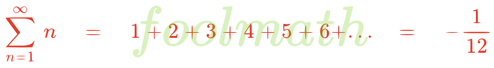

## **Page 2**



[previous page](https://github.com/chunglim/foolmath#welcome-to-the-foolmath-repository)&nbsp;|&nbsp;next page

### **Magic squares**

Some or most mathematicians know that we can fill numbers in any odd-sized square matrices, and summations of each row, each column and each diagonal line are all equal. This is caused by balancing numbers in the matrix. The numbers to fill are natural numbers starting from `1` and carry on with the next natural number and no overlap. This doesn't work with even-sized square matrices. Because there is no middle element having the same number of elements at its left side and its right side in even-sized square matrices.

There is a rule explaining how to fill the matrix. (valid rule)

- `1` is placed at the **middle of the first row**.
- The next element is placed at `+1` **upper right** of the current element.
- If it overflows at the **top** of the matrix, then drop it to the **bottom in that column**.
- If it overflows at the **right** of the matrix, place it at the **first column in that row**.
- If it overflows at the **top right corner**, place it **under the current element** i.e. the same column and the next row.
- If it strikes a **non-empty element**, place it **under the current element** i.e. the same column and the next row.

For simplicity, I code C to generate each magic square.

```c
#include <stdio.h>
#include <string.h>

#define isodd(n)    ((n) % 2)
#define isempty(n)  (!(n))
#define MAXDIM      15

void initialize(int [][MAXDIM+1], int);
void matrix(int [][MAXDIM+1], int);

int main()
{
    int i, j, n, a[MAXDIM+1][MAXDIM+1];

    do {
        printf("enter dimension <odd number 1-%d>: ", MAXDIM);
        scanf("%d", &n);
    } while (!isodd(n) || n > MAXDIM);
    initialize(a, n);
    matrix(a, n);
    int sumrow,
        sumcol[n+1];
    memset(sumcol, 0, sizeof (int) * (n + 1));
    for (i = 1; i <= n; i++) {
        sumrow = 0;
        for (j = 1; j <= n; j++) {
            printf("%*d", j == 1 ? 4 : 5, a[i][j]);
            sumrow += a[i][j];
            sumcol[j] += a[i][j];
        }
        printf("%6d\n", sumrow);
    }
    puts("\n");
    for (j = 1; j <= n; j++)
        printf("%*d", j == 1 ? 4 : 5, sumcol[j]);
    puts("\n");
    return 0;
}

void initialize(int a[][MAXDIM+1], int n)
{
    int i, j;

    for (i = 1; i <= n; i++)
        for (j = 1; j <= n; j++)
            a[i][j] = 0;
}

void matrix(int a[][MAXDIM+1], int n)
{
    int i, j, index;

    i = 1; j = (n + 1) / 2;
    a[i][j] = 1;
    for (index = 2; index <= n * n; index++) {
        j++; i--; /* normal case */
        if (i < 1)
            if (j <= n)
                for (i = n; !isempty(a[i][j]); i--)
                    ; /* overflow top go bottom */
            else { /* top right corner go next row same column */
                i += 2;
                j--;
            }
        else
            if (j > n) /* overflow right go first column */
                j = 1;
            else
                if (!isempty(a[i][j])) { /* next occupied go next row same column */
                    i += 2;
                    j--;
                }
        a[i][j] = index;
    }
}
```
_source code:_&nbsp;[square.c](./src/square.c)&nbsp;|&nbsp;[Go to top](#page-2)&nbsp;|&nbsp;[TOC](https://github.com/chunglim/foolmath#table-of-contents)

**Notes:**

- This property of mathematics is **_valid_**.
- In order to create understandable matrices, I use `.tex` math notation files. But you don't rely on these `.tex` files, which are in turn generated from C code. So coding style of these `.tex` files is probably not what you desire. Please refer to the output results or `.c` file, which is well commented, where necessary.
- C source code presented here only generates text output on console or terminal. It doesn't generate `.tex` files.
- In this repository, C source code is rare, so I don't write `Makefile`.
- This C source code is expected to compile and run on any operating systems. It is simply C99 source code. I personally use GNU `gcc` or LLVM `clang` compiler on Unix-liked operating systems e.g. Linux, macOS, FreeBSD, NetBSD or OpenBSD, which natively supports `gcc` or `clang` compiler out of the box. (Native C compiler depends on the operating system being used.)
- For other operating systems or compilers, please consult the documentation for each system or compiler.

**Compilation or build**

Note that `%` or probably `$` is a shell prompt, you don't have to type.

For GNU `gcc`,<br>
% `gcc -Wall -Wextra -Werror -pedantic-errors -Os -std=c99 -pedantic -s square.c`

For LLVM `clang`, it is nearly the same, just omit `-s` option,<br>
% `clang -Wall -Wextra -Werror -pedantic-errors -Os -std=c99 -pedantic square.c`

**Running**

% `./a.out`<br>
`enter dimension <odd number 1-15>:`

After compilation and running `./a.out`, you will get prompted for an odd number. Fill any odd number in the given range and press enter.

Here we start the first one, `3 x 3` matrix contains `9` elements i.e. `1...9`, so that we fill these numbers into the matrix, then summations of each row, each column and each diagonal line are all equal.

```math
\begin{array}{rrrcr}
\,&\,&\,&15&\,\\
8&1&6&\ldots&15\\
3&5&7&\ldots&15\\
4&9&2&\ldots&15\\
\vdots&\vdots&\vdots&15&\,\\
15&15&15&\,&\,
\end{array}
```
_source code:_&nbsp;[3x3.tex](./src/3x3.tex)&nbsp;|&nbsp;[Go to top](#page-2)&nbsp;|&nbsp;[TOC](https://github.com/chunglim/foolmath#table-of-contents)

You can see that summations of each row, each column and each diagonal line are all `15`.<br><br>
Now let's see a little bigger square matrix i.e. `5 x 5` matrix.

```math
\begin{array}{rrrrrcr}
\,&\,&\,&\,&\,&65&\,\\
17&24&1&8&15&\ldots&65\\
23&5&7&14&16&\ldots&65\\
4&6&13&20&22&\ldots&65\\
10&12&19&21&3&\ldots&65\\
11&18&25&2&9&\ldots&65\\
\vdots&\vdots&\vdots&\vdots&\vdots&65&\,\\
65&65&65&65&65&\,&\,
\end{array}
```
_source code:_&nbsp;[5x5.tex](./src/5x5.tex)&nbsp;|&nbsp;[Go to top](#page-2)&nbsp;|&nbsp;[TOC](https://github.com/chunglim/foolmath#table-of-contents)

Now, the summation for `5 x 5` matrix is `65`.<br><br>
Let's see a big square matrix, not sure if you can display it in mobile devices.<br>
This is the output of `15 x 15` matrix.

```math
\begin{array}{rrrrrrrrrrrrrrrcr}
\,&\,&\,&\,&\,&\,&\,&\,&\,&\,&\,&\,&\,&\,&\,&1695&\,\\
122&139&156&173&190&207&224&1&18&35&52&69&86&103&120&\ldots&1695\\
138&155&172&189&206&223&15&17&34&51&68&85&102&119&121&\ldots&1695\\
154&171&188&205&222&14&16&33&50&67&84&101&118&135&137&\ldots&1695\\
170&187&204&221&13&30&32&49&66&83&100&117&134&136&153&\ldots&1695\\
186&203&220&12&29&31&48&65&82&99&116&133&150&152&169&\ldots&1695\\
202&219&11&28&45&47&64&81&98&115&132&149&151&168&185&\ldots&1695\\
218&10&27&44&46&63&80&97&114&131&148&165&167&184&201&\ldots&1695\\
9&26&43&60&62&79&96&113&130&147&164&166&183&200&217&\ldots&1695\\
25&42&59&61&78&95&112&129&146&163&180&182&199&216&8&\ldots&1695\\
41&58&75&77&94&111&128&145&162&179&181&198&215&7&24&\ldots&1695\\
57&74&76&93&110&127&144&161&178&195&197&214&6&23&40&\ldots&1695\\
73&90&92&109&126&143&160&177&194&196&213&5&22&39&56&\ldots&1695\\
89&91&108&125&142&159&176&193&210&212&4&21&38&55&72&\ldots&1695\\
105&107&124&141&158&175&192&209&211&3&20&37&54&71&88&\ldots&1695\\
106&123&140&157&174&191&208&225&2&19&36&53&70&87&104&\ldots&1695\\
\vdots&\vdots&\vdots&\vdots&\vdots&\vdots&\vdots&\vdots&\vdots&\vdots&\vdots&\vdots&\vdots&\vdots&\vdots&1695&\,\\
1695&1695&1695&1695&1695&1695&1695&1695&1695&1695&1695&1695&1695&1695&1695&\,&\,
\end{array}
```
_source code:_&nbsp;[15x15.tex](./src/15x15.tex)&nbsp;|&nbsp;[Go to top](#page-2)&nbsp;|&nbsp;[TOC](https://github.com/chunglim/foolmath#table-of-contents)

Now, the summation for `15 x 15` matrix is `1695`.

**Summary**

The result of summation for each row, each column or each diagonal line can be calculated.

+ `n x n` is the dimension of the matrix.
+ Total number of all elements will be `n x n` or $n^2$.
+ The sum of all elements will be $\frac{n^2(n^2+1)}{2}$.
+ The sum of each line will be $\frac{n^2(n^2+1)}{2n}$.
+ Thus each sum is $\frac{n(n^2+1)}{2}$.
+ Let's counter check the summation of each matrix, we previously did.
  - `3 x 3` matrix, each sum $=\frac{3(3^2+1)}{2}=\frac{3(9+1)}{2}=\frac{3(10)}{2}=15$
  - `5 x 5` matrix, each sum $=\frac{5(5^2+1)}{2}=\frac{5(25+1)}{2}=\frac{5(26)}{2}=65$
  - `15 x 15` matrix, each sum $=\frac{15(15^2+1)}{2}=\frac{15(225+1)}{2}=\frac{15(226)}{2}=1695$

All summations are correct as expected.

[Go to top](#page-2)&nbsp;|&nbsp;[TOC](https://github.com/chunglim/foolmath#table-of-contents)

### **Why is $`\sqrt{2}`$ irrational?**

We have learnt that $\sqrt{2}$ is irrational. Have you ever seen the proof?<br>
Here we go.

```math
\begin{alignat*}{5}
&\small\text{let }\normalsize\qquad\qquad&\sqrt{2}\quad&=\quad&&\frac{a}{b}\\
&\rlap{\small\text{where a and b are unsigned integers and }\frac{a}{b}\text{ is the simplest fraction.}}\\
&\rlap{\small\text{either of them can be even, but not both.}}\\
&\rlap{\small\text{otherwise, if both are even, we can simplify further.}}\\
&\,&2\quad&=&&\frac{a^2}{b^2}\qquad&\small\text{(1)}\\
&\,&a^2\quad&=&&2b^2\\
&\rlap{\small\text{so }a^2\text{ is even, and }a\text{ is also even, because }odd^2\text{ is always odd.}}\\
&\small\text{let }&a\quad&=&&2k\\
&\small\text{(1)}&2\quad&=&&\frac{(2k)^2}{b^2}\\
&\,&2\quad&=&&\frac{4k^2}{b^2}\\
&\,&b^2\quad&=&&\frac{4k^2}{2}\\
&\,&b^2\quad&=&&2k^2\\
&\rlap{\small\text{so }b^2\text{ is even, and }b\text{ is also even.}}\\
&\rlap{\small\text{so }a\text{ and }b\text{ are both even, and they can be simplified further.}}\\
&\rlap{\small\text{so the assumption }\sqrt{2}=\frac{a}{b}\text{ is wrong,}}\\
&\rlap{\small\text{Thus }\sqrt{2}\text{ is irrational.}\qquad\qquad\text{(valid proof)}}\\
\end{alignat*}
```
_source code:_&nbsp;[sqrt2_irr.tex](./src/sqrt2_irr.tex)&nbsp;|&nbsp;[Go to top](#page-2)&nbsp;|&nbsp;[TOC](https://github.com/chunglim/foolmath#table-of-contents)

We have talked about valid proof for a while.<br><br>
Let's start fool proofs again.

### **How do programmers increase a variable?**

```math
\begin{alignat*}{5}
&\,&(n+1)^2\quad&=\quad&&n^2+2n+1\\
&\,&n^2\quad&=&&(n+1)^2-(2n+1)\\
&\small-n(2n+1)\text{ both sides}&n^2-n(2n+1)\quad&=&&(n+1)^2-(2n+1)-n(2n+1)\\
&\,&\,&=&&(n+1)^2-2n-1-2n^2-n\\
&\,&\,&=&&(n+1)^2-2n^2-3n-1\\
&\,&\,&=&&(n+1)^2-(2n^2+3n+1)\\
&\,&\,&=&&(n+1)^2-(n+1)(2n+1)\\
&\small+\frac{(2n+1)^2}{4}\text{ both sides}\normalsize\qquad&n^2-n(2n+1)+\frac{(2n+1)^2}{4}\quad&=&&(n+1)^2-(n+1)(2n+1)+\frac{(2n+1)^2}{4}\\
&\,&n^2-2n\left(\frac{2n+1}{2}\right)+\left(\frac{2n+1}{2}\right)^2\quad&=&&(n+1)^2-2(n+1)\left(\frac{2n+1}{2}\right)+\left(\frac{2n+1}{2}\right)^2\\
&\,&\left(n-\frac{2n+1}{2}\right)^2\quad&=&&\left((n+1)-\frac{2n+1}{2}\right)^2\\
&\small\sqrt{}\text{ both sides}&n-\cancel{\frac{2n+1}{2}}\quad&=&&n+1-\cancel{\frac{2n+1}{2}}\\
&\,&\small\text{Thus}\qquad\qquad\normalsize n\quad&=&&n+1
\end{alignat*}
```
_source code:_&nbsp;[nn+1.tex](./src/nn+1.tex)&nbsp;|&nbsp;[Go to top](#page-2)&nbsp;|&nbsp;[TOC](https://github.com/chunglim/foolmath#table-of-contents)

Now you see how programmers increase a variable.<br>
Wait, isn't it `n += 1;`?<br>
Nah nah, it should be `++n;` or `n++;`.<br><br>
Hey what? This is mathematical proof. Find errors, mistakes or oversights.

### **$`\frac{dx}{dx}=0`$, really?**

```math
\begin{alignat*}{5}
&\,&\frac{dx}{dx}\quad&=\quad&&\frac{d}{dx}\underbrace{(1+1+1+1+...+1)}_{x\text{ terms}}\\
&\,&\,&=&&\underbrace{\frac{d}{dx}1+\frac{d}{dx}1+\frac{d}{dx}1+...+\frac{d}{dx}1}_{x\text{ terms}}\\
&\,&\,&=&&\underbrace{0+0+0+...+0}_{x\text{ terms}}\\
&\,&\,&=&&0x\\
&\small\text{Thus}\normalsize\qquad&\frac{dx}{dx}\quad&=&&0
\end{alignat*}
```
_source code:_&nbsp;[dx_by_dx_0.tex](./src/dx_by_dx_0.tex)&nbsp;|&nbsp;[Go to top](#page-2)&nbsp;|&nbsp;[TOC](https://github.com/chunglim/foolmath#table-of-contents)

Hold on! `x terms` implies that `x` is an _integer_ not a _real number_. In calculus, aren't all variables and functions required to be _continuous_, not _discrete_? If `x` is an _integer_, how can `dx` approach zero?

### **Support _foolmath_**

I keep adding these kinds of freaks or topics, which are considered interesting, no matter what they are foolish or valid math. **_foolmath_** is a passion project I do under my curiosity at my retirement. Your support will motivate me to curate and expand this repository with even more fascinating content, and especially it can help me pay the bills.

If you find **_foolmath_** entertaining, educational, or you simply enjoy its content, or just feeling generous, please consider [buy me a coffee](https://www.buymeacoffee.com/chunglim). I will highly appreciate and will be very grateful.

<a href="https://www.buymeacoffee.com/chunglim" target="_blank"></a>


Note: All contributions are voluntary and not required to access or use the content. See [LICENSE](./LICENSE.md).<br><br>
[Go to top](#page-2)&nbsp;|&nbsp;[TOC](https://github.com/chunglim/foolmath#table-of-contents)&nbsp;|&nbsp;[previous page](https://github.com/chunglim/foolmath#welcome-to-the-foolmath-repository)&nbsp;|&nbsp;next page

<br><br>
