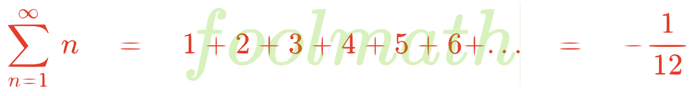

<!-- TOC -->

# Welcome to the **_foolmath_** repository!



<!--
<script src="https://cdnjs.cloudflare.com/ajax/libs/mathjax/2.7.7/MathJax.js?config=TeX-MML-AM_CHTML"></script>

<script type="text/javascript" id="MathJax-script" async src="https://cdn.jsdelivr.net/npm/mathjax@3/es5/tex-mml-chtml.js"></script>
-->

## What is **_foolmath_**?

If you are a math enthusiast or aficionado, have you ever encountered a mathematical fool proofs? Those seem so strange, queer, quirky and absurd. Many of them are foolish, while some of them are backed by impeccable logic. That's what **_foolmath_** is all about! I intend this repository to be a treasure trove or collection of mind-bending demonstrations that challenge your concepts about numbers, algebra, calculus and more. They will leave you scratching your head dissecting each equation to find errors or oversights in each proof. I also include some valid proofs, which are considered interesting and worth reading.

**Notes:**
1. Almost all mathematical proofs here are foolish, unless noted otherwise.
2. Plain-text LaTeX `.tex` code is in `src/`.
3. It is the best, to view **_foolmath_** on [GitHub.com](https://github.com/chunglim/foolmath) using any browsers, `GitHub` app on mobile devices or `GitHub.io` doesn't render LaTeX.

**Proofs are louder than words. Let's start!**

## Table of Contents
- Ramanujan summation [|view it|](#ramanujan-summation)
- Ramanujan alternative [|view it|](#yet-there-is-a-ramanujan-alternative)
- Summing the power of two [|view it|](#what-if-summing-the-power-of-two)
- Summing all natural odd numbers [|view it|](#what-if-summing-all-natural-odd-numbers)
- Summing all natural even numbers [|view it|](#trying-summing-all-natural-even-numbers)
- Why $0=1$? [|view it|](#why-01)
- Why $1=2$? [|view it|](#why-12)
- Do you know that $1=-1$? [|view it|](#do-you-know-that-1-1)
- Let's see a little higher numbers, $4=5$. [|view it|](#lets-see-a-little-higher-numbers-45)
- Are all intergers equal? [|view it|](#are-all-intergers-equal)
- Why $2+5=8$? [|view it|](#was-i-wrongly-taught-why-258)
- Very silly solutions to find $\frac{0}{0}$. [|view it|](#very-silly-solutions-to-find-frac00)
- Who said $i$ is imaginary, why $i=1$ then? [|view it|](#who-said-i-is-imaginary-why-i1-then)
- Let's talk more about $i$. [|view it|](#lets-talk-more-about-i)
- $i=\pm1$, isn't it? [|view it|](#ipm1-isnt-it)
- How much is $\infty$? [|view it|](#how-much-is-infty)
- How much is $0.\infty$? [|view it|](#how-much-is-0infty)
- Is $0$ an even number? [|view it|](#is-0-an-even-number)
- Solve $x$ for $x+2=x$. [|view it|](#solve-x-for-x2x)
- $e^{i\pi}=$?, also known as Euler's Identity [|view it|](#eipi-also-known-as-eulers-identity)
- $e^x=1$, no matter what $x$ maybe. [|view it|](#ex1-no-matter-what-x-maybe)
- How much is $\pi$? [|view it|](#how-much-is-pi)
- How much is $i^i$? [|view it|](#how-much-is-ii)
- How much is $\sqrt[^i]{i}$? [|view it|](#how-much-is-sqrtii)
- Who said $n^0=1$? [|view it|](#who-said-n01)
- Why $\frac{d}{dx}e^x=e^x$? [|view it|](#you-might-be-wondering-why-fracddxexex)
- Why is multiplying factor converting the power $1\phi$ to $3\phi$ is $\sqrt{3}$? [|view it|](https://github.com/chunglim/foolmath#multiplying-factor-to-change-power-voltage-from-1phi-to-3phi)

### **Ramanujan summation**

We firstly start from the well-known **Ramanujan Summation**, which is known to most mathematicians.

$\qquad1+2+3+4+5+6+...\quad=\quad?$

```math
\begin{align*}
S\quad&\,=\quad1+2+3+...\\
\mathrm{Let}\qquad S_1\quad&\,=\quad1-1+1-1+...\\
1-S_1\quad&\,=\quad1-(1+1-1+1-...)\\
\,&\,=\quad1-1+1-1+...\\
\,&\,=\quad S_1\\
2S_1\quad&\,=\quad1\\
S_1\quad&\,=\quad\frac{1}{2}\\
\mathrm{Let}\qquad S_2\quad&\,=\quad1-2+3-4+5-6+...\\
2S_2\quad&=\quad1-2+3-4+5-6+...\\
\quad&\,\qquad\quad\,+1-1+3-4+5-6\\
\,&\,=\quad1-1+1-1+...\\
2S_2\quad&\,=\quad S_1\\
S_2\quad&\,=\quad\frac{S_1}{2}\\
S_2\quad&\,=\quad\frac{1}{4}\\
S-S_2\quad&\,=\quad1+2+3+4+5+6+7+8+...\\
\quad&\,\quad-(1-2+3-4+5-6+7-...)\\
\,&\,=\quad4+8+12+16+...\\
\,&\,=\quad4(1+2+3+4+...)\\
S-S_2\quad&\,=\quad4S\\
3S\quad&\,=\quad-S_2\\
S\quad&\,=\quad-\frac{S_2}{3}\\
\,&\,=\quad-\frac{1}{3*4}\\
\mathrm{Thus}\qquad S\quad&\,=\quad-\frac{1}{12}
\end{align*}
```
_source code:_&nbsp;[rama_sum.tex](./src/rama_sum.tex)

### **Yet, there is a Ramanujan alternative**

```math
\begin{align*}
S\quad&\,=\quad1+2+3+4+5+6+7+8+9+10+...\\
\,&\,=\quad1+(2+3+4)+(5+6+7)+(8+9+10)+...\\
\,&\,=\quad1+(9+18+27+...)\\
\,&\,=\quad1+9(1+2+3+...)\\
S\quad&\,=\quad1+9S\\
8S\quad&\,=\quad-1\\
\mathrm{Thus}\qquad S\quad&\,=\quad-\frac{1}{8}
\end{align*}
```
_source code:_&nbsp;[rama_alt.tex](./src/rama_alt.tex)

Oops, was Ramanujan wrong?

### **What if summing the power of two?**

```math
\begin{align*}
\mathrm{Let}\qquad S\quad&\,=\quad\sum_{n=0}^\infty 2^n\\
\,&\,=\quad1+2+4+8+16+32+...\\
\,&\,=\quad1+2(1+2+4+8+16+...)\\
S\quad&\,=\quad1+2S\\
\mathrm{Thus}\qquad S\quad&\,=\quad-1
\end{align*}
```
_source code:_&nbsp;[sum_power_of_2.tex](./src/sum_power_of_2.tex)

Negative! once again.

### **What if summing all natural odd numbers?**

```math
\begin{align*}
S\quad&\,=\quad1+3+5+7+9+...\\
-\frac{1}{12}\quad&\,=\quad1+2+3+4+5+6+7+8+9+10+...\\
\,&\,=\quad(1+3+5+7+9+...)+(2+4+6+8+10+...)\\
\,&\,=\quad(1+3+5+7+9+...)+2(1+2+3+4+5+...)\\
\,&\,=\quad(1+3+5+7+9+...)+2\left(-\frac{1}{12}\right)\\
-\frac{1}{12}\quad&\,=\quad(1+3+5+7+9+...)-\frac{2}{12}\\
\frac{2}{12}-\frac{1}{12}\quad&\,=\quad1+3+5+7+9+...\\
\mathrm{Thus}\qquad\frac{1}{12}\quad&\,=\quad1+3+5+7+9+...
\end{align*}
```
_source code:_&nbsp;[sum_of_odd.tex](./src/sum_of_odd.tex)

Wow! this time the summation is positive.

### **Trying summing all natural even numbers**

```math
\begin{align*}
S\quad&\,=\quad2+4+6+8+10+...\\
-\frac{1}{12}\quad&\,=\quad1+2+3+4+5+6+7+8+9+10+...\\
\,&\,=\quad(1+3+5+7+9+...)+(2+4+6+8+10+...)\\
-\frac{1}{12}\quad&\,=\quad\frac{1}{12}+(2+4+6+8+10+...)\\
-\frac{1}{12}\quad&\,=\quad\frac{1}{12}+S\\
\mathrm{Thus}\qquad S\quad&\,=\quad-\frac{1}{6}
\end{align*}
```
_source code:_&nbsp;[sum_of_even.tex](./src/sum_of_even.tex)

Why is it negative again, who know?

### **Why $0=1$?**

Here come the most foolish proof!

#### **Solution 1**

```math
\begin{align*}
0\quad&\,=\quad0+0+0+0+...\\
\,&\,=\quad(1-1)+(1-1)+(1-1)+(1-1)+...\\
\,&\,=\quad1+(-1+1)+(-1+1)+(-1+1)+...\\
\,&\,=\quad1+0+0+0+0+...\\
\mathrm{Thus}\qquad0\quad&\,=\quad1
\end{align*}
```
_source code:_&nbsp;[0eq1_0.tex](./src/0eq1_0.tex)

What about the second most foolish proof?

#### **Solution 2**

```math
\begin{align*}
\mathrm{Let}\qquad S\quad&\,=\quad1+1+1+1++1...\\
\,&\,=\quad1+(1+1+1+1+...)\\
\cancel{S}\quad&\,=\quad1+\cancel{S}\\
\mathrm{Thus}\qquad0\quad&\,=\quad1
\end{align*}
```
_source code:_&nbsp;[0eq1_1.tex](./src/0eq1_1.tex)

Is there any proof looking more advanced than these?

#### **Solution 3**

```math
\begin{align*}
\int u\,dv\quad&\,=\quad uv-\int v\,du\\
\int\frac{1}{x}\,dx\quad&\,=\quad\cancel{x}\frac{1}{\cancel{x}}-\int x\,d\left(\frac{1}{x}\right)\\
\,&\,=\quad1-\int x\,d(x^{-1})\\
\,&\,=\quad1-\int x\,(-1x^{-2})\,dx\\
\,&\,=\quad1+\int x.x^{-2}\,dx\\
\cancel{\int\frac{1}{x}\,dx}\quad&\,=\quad1+\cancel{\int\frac{1}{x}\,dx}\\
\mathrm{Thus}\qquad0\quad&\,=\quad1
\end{align*}
```
_source code:_&nbsp;[0eq1_2.tex](./src/0eq1_2.tex)

Can you find an error?<br><br>
Hmm, binary no longer exists.

### **Why $1=2$?**

Here, the proof I learnt in junior high school.

#### **Solution 1**

```math
\begin{alignat*}{3}
&\mathrm{Let}&&\qquad a&&=\quad b\\
&*b~\mathrm{both~sides}&&\quad a*b&&=\quad b*b\\
&\,&&\quad a*b&&=\quad b^2\\
&-a^2~\mathrm{both~sides}\qquad&& a*b-a^2&&=\quad b*b-a^2\\
&\,&&a(b-a)&&=\quad b^2-a^2\\
&\,&&a\cancel{(b-a)}&&=\quad\cancel{(b-a)}(b+a)\\
&\mathrm{since}~b=a&&\qquad a&&=\quad a+a\\
&\,&&\qquad\cancel{a}&&=\quad2\cancel{a}\\
&\mathrm{Thus}&&\qquad1&&=\quad2
\end{alignat*}
```
_source code:_&nbsp;[1eq2_0.tex](./src/1eq2_0.tex)

Nah, there is another proof in high school using trigonometry.

#### **Solution 2**

```math
\begin{alignat*}{3}
&\mathrm{Where}~x=\frac{\pi}{4}~or~\frac{5\pi}{4}&&\qquad\cos{x}&&=\quad\sin{x}\\
&\,&&\qquad\cos{2x}&&=\quad\sin{2x}\\
&\,&&1-2\sin^2{x}&&=\quad2\sin{x}\cos{x}\\
&\mathrm{As}~\sin{x}=\cos{x}\quad&&1-2\sin^2{x}&&=\quad2\cos{x}\cos{x}\\
&\,&&\,&&=\quad2\cos^2{x}\\
&\,&&\qquad\quad1&&=\quad2\sin^2{x}+2\cos^2{x}\\
&\,&&\,&&=\quad2\cancelto{1}{(\sin^2{x+\cos^2{x}})}\\
&\mathrm{Thus}&&\qquad\quad1&&=\quad2
\end{alignat*}
```
_source code:_&nbsp;[1eq2_1.tex](./src/1eq2_1.tex)

Yet, there is another proof using calculus.

#### **Solution 3**

```math
\begin{align*}
\underbrace{x+x+x+...+x}_{x~terms}\quad&\,=\quad x*x\\
\,&\,=\quad x^2\\ \\
\mathrm{diff~both~sides}\qquad\underbrace{1+1+1+...+1}_{x~terms}\quad&\,=\quad2x\\
\cancel{x}\quad&\,=\quad2\cancel{x}\\ \\
\mathrm{Thus}\qquad1\quad&\,=\quad2
\end{align*}
```
_source code:_&nbsp;[1eq2_2.tex](./src/1eq2_2.tex)

Do you find any clues?

### **Do you know that $1=-1$?**

```math
\begin{align*}
1\quad&\,=\quad\sqrt{1}\\
\,&\,=\quad\sqrt{(-1)(-1)}\\
\,&\,=\quad\sqrt{-1}\sqrt{-1}\\
\,&\,=\quad i*i\\
\,&\,=\quad i^2\\
\mathrm{Thus}\qquad1\quad&\,=\quad-1
\end{align*}
```
_source code:_&nbsp;[1eq-1_0.tex](./src/1eq-1_0.tex)

From now on, what I owe you is what you owe me.

### **Let's see a little higher numbers, $4=5$.**

```math
\begin{alignat*}{3}
&\,&&\qquad\qquad\qquad-20&&=\quad-20\\
&\,&&\qquad\qquad\quad16-36&&=\quad25-45\\
&\,&&\qquad\qquad4^2-4*9&&=\quad5^2-5*9\\
&+\frac{81}{4}\mathrm{both~sides}&&\qquad4^2-4*9+\frac{81}{4}&&=\quad5^2-5*9+\frac{81}{4}\\
&\,&&4^2-2*4*\frac{9}{2}+\left(\frac{9}{2}\right)^2&&=\quad5^2-2*5*\frac{9}{2}+ \left(\frac{9}{2}\right)^2\\
&\,&&\qquad\qquad\quad\left(4-\frac{9}{2}\right)^2&&=\quad\left(5-\frac{9}{2}\right)^2\\
&\sqrt{}~\mathrm{both~sides}&&\qquad\qquad\qquad4-\cancel{\frac{9}{2}}&&=\quad5-\cancel{\frac{9}{2}}\\
&\mathrm{Thus}&&\qquad\qquad\qquad\qquad4&&=\quad5
\end{alignat*}
```
_source code:_&nbsp;[4eq5_0.tex](./src/4eq5_0.tex)

Hey, what? How come, $4=5$?<br><br>
Wait, there are something more.

### **Are all intergers equal?**

```math
\begin{alignat*}{3}
&\,&&\qquad\frac{-1}{1}&&=\quad\frac{1}{-1}\quad&&(1)\\
&\,&&\quad\sqrt{\frac{-1}{1}}&&=\quad\sqrt{\frac{1}{-1}}\quad&&(2)\\
&\,&&\quad\frac{\sqrt{-1}}{\sqrt{1}}&&=\quad\frac{\sqrt{1}}{\sqrt{-1}}\quad&&(3)\\
&\,&&\qquad\quad\frac{i}{1}&&=\quad\frac{1}{i}\quad&&(4)\\
&*\frac{1}{2}&&\qquad\quad\frac{i}{2}&&=\quad\frac{1}{2i}\quad&&(5)\\
&+\frac{3}{2i}&&\quad\frac{i}{2}+\frac{3}{2i}&&=\quad\frac{1}{2i}+\frac{3}{2i}\quad&&(6)\\
&*i&&i\left(\frac{i}{2}+\frac{3}{2i}\right)&&=\quad i\left(\frac{1}{2i}+\frac{3}{2i}\right)\quad&&(7)\\
&\,&&\frac{i^2}{2}+\frac{3\cancel{i}}{2\cancel{i}}&&=\quad\frac{\cancel{i}}{2\cancel{i}}+\frac{3\cancel{i}}{2\cancel{i}}\quad&&(8)\\
&\.&&-\frac{1}{2}+\frac{3}{2}&&=\quad\frac{1}{2}+\frac{3}{2}\quad&&(9)\\
&\,&&\frac{-1+3}{2}&&=\quad\frac{1+3}{2}\quad&&(10)\\
&\,&&\qquad\quad\frac{\cancel{2}}{\cancel{2}}&&=\quad\cancelto{2}{\frac{4}{2}}\quad&&(11)\\
&\,&&\qquad\quad1&&=\quad2\quad&&(12)\\
&\mathrm{from~(9)}&&-\frac{1}{2}+\cancel{\frac{3}{2}}&&=\quad\frac{1}{2}+\cancel{\frac{3}{2}}\quad&&(13)\\
% line (14): Can't add `\cancel` inside `\frac`, MathJax bug?
&\,&&\qquad\quad-\frac{1}{2}&&=\quad\frac{1}{2}\quad&&(14)\\
&\,&&\qquad\quad-1&&=\quad1\quad&&(15)\\
&+1&&\qquad-1+1&&=\quad1+1\quad&&(16)\\
&\,&&\qquad\qquad0&&=\quad2\quad&&(17)\\
&\mathrm{from~(12),(15),(17)}\qquad&&-1~=~0&&=\quad1~=~2\quad&&(18)
\end{alignat*}
```
_source code:_&nbsp;[all_int_eq.tex](./src/all_int_eq.tex)

It is very articulate, indeed.<br><br>
There is one more simple equation. Have a look.

### **Was I wrongly taught? Why $2+5=8$?**

```math
\begin{align*}
2+5\quad&\,=\quad4+3\\
\,&\,=\quad4-\frac{9}{2}+\frac{9}{2}+3\\
\,&\,=\quad\sqrt{\left(4-\frac{9}{2}\right)^2}+\frac{9}{2}+3\\
\,&\,=\quad\sqrt{16-2.4.\frac{9}{2}+\left(\frac{9}{2}\right)^2}+\frac{9}{2}+3\\
\,&\,=\quad\sqrt{16-36+\left(\frac{9}{2}\right)^2}+\frac{9}{2}+3\\
\,&\,=\quad\sqrt{-20+\left(\frac{9}{2}\right)^2}+\frac{9}{2}+3\\
\,&\,=\quad\sqrt{25-45+\left(\frac{9}{2}\right)^2}+\frac{9}{2}+3\\
\,&\,=\quad\sqrt{25-2.5.\frac{9}{2}+\left(\frac{9}{2}\right)^2}+\frac{9}{2}+3\\
\,&\,=\quad\sqrt{5^2-2.5.\frac{9}{2}+\left(\frac{9}{2}\right)^2}+\frac{9}{2}+3\\
\,&\,=\quad\sqrt{\left(5-\frac{9}{2}\right)^2}+\frac{9}{2}+3\\
\,&\,=\quad5-\cancel{\frac{9}{2}}+\cancel{\frac{9}{2}}+3\\
\mathrm{Thus}\qquad2+5\quad&\,=\quad8
\end{align*}
```
_source code:_&nbsp;[2plus5eq8_0.tex](./src/2plus5eq8_0.tex)

Do you find any errors?<br><br>
Who said $0$ couldn't be a denominator? See the following fool proofs.

### **Very silly solutions to find $\frac{0}{0}$.**

#### **Let's see the first fool.**

```math
\begin{alignat*}{3}
&\mathrm{Let}&&\qquad\quad\frac{2}{0}&&=\quad\frac{x}{1}\\
&\mathrm{*~0~both~sides}&&\qquad\frac{2*0}{0}&&=\quad\frac{x*0}{1}\\
&\mathrm{/~2~both~sides}&&\qquad\frac{\cancel{2}*0}{0*\cancel{2}}&&=\quad\cancelto{0}{\frac{x*0}{1*2}}\\
&\mathrm{Thus}&&\qquad\quad\frac{0}{0}&&=\quad0
\end{alignat*}
```
_source code:_&nbsp;[0by0_0.tex](./src/0by0_0.tex)

#### **Here, the second fool, which is very silly.**

```math
\begin{align*}
\frac{0}{0}\quad&\,=\quad\frac{100-100}{100-100}\\
\,&\,=\quad\frac{10*10-10*10}{10*10-10*10}\\
\,&\,=\quad\frac{10^2-10^2}{10(10-10)}\\
\,&\,=\quad\frac{(10+10)\cancel{(10-10)}}{10\cancel{(10-10)}}\\
\,&\,=\quad\frac{20}{10}\\
\mathrm{Thus}\qquad\frac{0}{0}\quad&\,=\quad2
\end{align*}
```
_source code:_&nbsp;[0by0_1.tex](./src/0by0_1.tex)

Bruh, how can you divide $(10-10)$ with $(10-10)$?

### **Who said $i$ is imaginary, why $i=1$, then?**

```math
\begin{align*}
i\quad&\,=\quad\sqrt{-1}\\
i^2\quad&\,=\quad \sqrt{-1}.\sqrt{-1}\\
\,&\,=\quad\sqrt{(-1)(-1)}\\
\,&\,=\quad\sqrt{1}\\
i^2\quad&\,=\quad1\\
\mathrm{Thus}\qquad i\quad&\,=\quad1
\end{align*}
```
_source code:_&nbsp;[ieq1_0.tex](./src/ieq1_0.tex)

### **Let's talk more about $i$.**

#### **This is the _sane proof_ of $\frac{1}{i}$.**

```math
\begin{align*}
-1\quad&\,=\quad i^2\\
\mathrm{/~(-i)~both~sides}\qquad\frac{-1}{-i}\quad&\,=\quad\frac{i^2}{-i}\\
\mathrm{Thus}\qquad\frac{1}{i}\quad&\,=\quad-i\qquad\mathrm{(sane~proof)}
\end{align*}
```
_source code:_&nbsp;[inv_i_sane.tex](./src/inv_i_sane.tex)

Nah, there is another $\frac{1}{i}$, but it is foolish.

#### **This is the _fool proof_ of $\frac{1}{i}$.**

```math
\begin{align*}
\frac{1}{i}\quad&\,=\quad i^{-1}\\
\,&\,=\quad\sqrt{-1}^{-1}\\
\,&\,=\quad\left((-1)^\frac{1}{2}\right)^{-1}\\
\,&\,=\quad\left((-1)^{-1}\right)^\frac{1}{2}\\
\,&\,=\quad\left(\frac{1}{-1}\right)^\frac{1}{2}\\
\,&\,=\quad-1^\frac{1}{2}\\
\,&\,=\quad\sqrt{-1}\\
\mathrm{Thus}\qquad\frac{1}{i}\quad&\,=\quad i\qquad\mathrm{(fool~proof)}
\end{align*}
```
_source code:_&nbsp;[inv_i_fool.tex](./src/inv_i_fool.tex)

Which one will you believe?

### **$i=\pm1$, isn't it?**

```math
\begin{align*}
i^2\qquad&\,=\qquad-1\\
i*i\qquad&\,=\qquad-1\\
i\qquad&\,=\qquad\frac{-1}{i}\\
i=\frac{-1}{i}&\,=\frac{-1}{\frac{-1}{i}}=\frac{-1}{\frac{-1}{\frac{-1}{i}}}=...\\
i\qquad&\,=\qquad(-1)^\infty\\
\mathrm{Thus}\qquad i\qquad&\,=\qquad\pm1
\end{align*}
```
_source code:_&nbsp;[i_eq_pm1.tex](./src/i_eq_pm1.tex)

Whatever it is, but it is not imaginary, anyway.

### **How much is $\infty$?**

```math
\begin{align*}
-\frac{1}{12}\qquad&\,=\qquad1+2+3+...+\infty\\
\,&\,=\qquad\frac{\infty(\infty+1)}{2}\\
-1\qquad&\,=\qquad6\infty(\infty+1)\\
0\qquad&\,=\qquad6\infty^2+6\infty+1\\
\infty\qquad&\,=\qquad\frac{-6\pm\sqrt{6^2-4*6*1}}{2*6}\\
\,&\,=\qquad\frac{-6\pm\sqrt{36-24}}{12}\\
\,&\,=\qquad\frac{-6\pm\sqrt{12}}{12}\\
\,&\,=\qquad\frac{-6\pm\sqrt{2^2*3}}{12}\\
\,&\,=\qquad\frac{-6\pm2\sqrt{3}}{12}\\
\mathrm{Thus}\qquad\infty\qquad&\,=\qquad\frac{-3\pm\sqrt{3}}{6}
\end{align*}
```
_source code:_&nbsp;[infty.tex](./src/infty.tex)

Here, $\infty$ is so small, you see?

### **How much is $0.\infty$?**

```math
\begin{alignat*}{5}
&\,&&S\quad&&\,=\quad1+1+1+1+1+1+...\\
&\,&&\,&&\,=\quad(1+1)+(1+1)+(1+1)+...\\
&\,&&\,&&\,=\quad2+2+2+...\\
&\,&&\,&&\,=\quad2(1+1+1+...)\\
&\,&&S\quad&&\,=\quad2S\\
&\,&&S\quad&&\,=\quad0&&(1)\\
&\,&&2S\quad&&\,=\quad1+1+1+1+1+1+...\\
&\,&&\,&&\qquad\qquad1+1+1+1+1+...\\
&\,&&2S&&\,=\quad1+2+2+2+2+2+...\\
&\,&&3S\quad&&\,=\quad1+1+1+1+1+1+...\\
&\,&&\,&&\qquad\quad\quad1+1+1+1+1+...\\
&\,&&\,&&\qquad\qquad\quad~~~1+1+1+1+...\\
&\,&&3S\quad&&\,=\quad1+2+3+3+3+3+...\\
&\,&&...\\
&\,&&\infty S\quad&&\,=\quad1+2+3+4+5+6+...\\
&\mathrm{from~(1)}\,S=0\qquad&&\infty0\quad&&\,=\quad1+2+3+4+5+6+...\\
&\mathrm{Thus}\qquad&&0\infty\quad&&\,=\quad-\frac{1}{12}
\end{alignat*}
```
_source code:_&nbsp;[0infty.tex](./src/0infty.tex)

Hmm, I will never believe.

### **Is $0$ an even number?**

This proof is known to be correct!

```math
\begin{alignat*}{3}
&\,&&\quad0\qquad&&=\qquad0\\
&\,&&\,&&=\qquad1-1\\
&\,&&\,&&=\qquad1^2-1^2\\
&\,&&\,&&=\qquad(1+1)(1-1)\\
&\,&&\,&&=\qquad(1+1)(1^2-1^2)\\
&\,&&\,&&=\qquad(1+1)(1+1)(1-1)\\
&\mathrm{repeat~the~last~term}&&\quad&&=\qquad(1+1)(1+1)(1+1)...(1-1)\\
&\,&&\quad0&&=\qquad(1+1)^\infty*(1-1)\\
&\mathrm{Thus}\,&&\quad0&&=\qquad2^\infty*0\qquad\mathrm{(sane~proof)}\\
&\rlap{\qquad\qquad\mathrm{Any~number~being~a~multiple~of~2~is~always~even.}}
\end{alignat*}
```
_source code:_&nbsp;[0_even.tex](./src/0_even.tex)

### **Solve $x$ for $x+2=x$.**

```math
\begin{align*}
x+2\qquad&\,=\qquad x\\
(x+2)^2\qquad&\,=\qquad x^2\\
\cancel{x^2}+4x+4\qquad&\,=\qquad \cancel{x^2}\\
4x\qquad&\,=\qquad-4\\
\mathrm{Thus}\qquad x\qquad&\,=\qquad-1
\end{align*}
```
_source code:_&nbsp;[x+2eqx.tex](./src/x+2eqx.tex)

A silly equation always has the solution.

Now, have a look at the sane proof of _Euler's identity_.

### **$e^{i\pi}=?$, also known as Euler's identity**

```math
\begin{alignat*}{5}
&\,&&\sin{x}&&=\sum_{n=0}^{\infty}\frac{(-1)^n}{(2n+1)!}x^{2n+1}&&=x-\frac{x^3}{3!}+\frac{x^5}{5!}-\frac{x^7}{7!}+...&&\quad\mathrm{for~all~x}\\
&\,&&\cos{x}&&=\sum_{n=0}^{\infty}\frac{(-1)^n}{(2n)!}x^{2n}&&=1-\frac{x^2}{2!}+\frac{x^4}{4!}-\frac{x^6}{6!}+...&&\quad\mathrm{for~all~x}\\
&\,&&e^x&&=\sum_{n=0}^{\infty}\frac{x^n}{n!}&&=1+x+\frac{x^2}{2!}+\frac{x^3}{3!}+\frac{x^4}{4!}+...&&\quad\mathrm{for~all~x}\\
&\,&&e^{ix}&&=\rlap{1+ix+\frac{(ix)^2}{2!}+\frac{(ix)^3}{3!}+\frac{(ix)^4}{4!}+\frac{(ix)^5}{5!}+\frac{(ix)^6}{6!}+\frac{(ix)^7}{7!}+\frac{(ix)^8}{8!}+...}\\
&\,&&\,&&=\rlap{1+ix-\frac{x^2}{2!}-\frac{ix^3}{3!}+\frac{x^4}{4!}+\frac{ix^5}{5!}-\frac{x^6}{6!}-\frac{ix^7}{7!}+\frac{x^8}{8!}+...}\\
&\,&&\,&&=\rlap{\left(1-\frac{x^2}{2!}+\frac{x^4}{4!}-\frac{x^6}{6!}+\frac{x^8}{8!}-...\right)+i\left(x-\frac{x^3}{3!}+\frac{x^5}{5!}-\frac{x^7}{7!}+...\right)}\\
&\,&&e^{ix}&&=\cos{x}+i\sin{x}&&\,&&\quad\mathrm{***}\\
&\,&&e^{ix}&&=\cos{\pi}+\cancelto{0}{i\sin{\pi}}\\
&\mathrm{Thus}\quad&&e^{i\pi}&&=-1\qquad\mathrm{(sane~proof)}
\end{alignat*}
```
_source code:_&nbsp;[euler.tex](./src/euler.tex)

Euler's identity shall be used in the other proofs (whether sane or fool).<br>
Let's see the first fool proofs using Euler's identity.

### **$e^x=1$, no matter what $x$ maybe.**

```math
\begin{alignat*}{5}
&\,&&\quad e^x&&=\quad e^{i\pi.2\frac{x}{i\pi.2}}\\
&\,&&\,&&=\quad(e^{i\pi})^{2\frac{x}{2i\pi}}\\
&\,&&\,&&=\quad(-1)^{2\frac{x}{2i\pi}}\\
&\,&&\quad e^x&&=\quad1^\frac{x}{2i\pi}\qquad&&(1)\\
&\mathrm{as}\qquad&&\quad e^{i\pi}&&=\quad-1\\
&\,&&\ln{e^{i\pi}}&&=\quad\ln{(-1)}\\
&\,&&i\pi\cancelto{1}{\ln{e}}&&=\quad\ln{(-1)}\\
&\,&&\quad i\pi&&=\quad\ln{(-1)}\qquad&&(2)\\
&\mathrm{from~(1)}\qquad&&\quad e^x&&=\quad1^\frac{x}{2\ln(-1)}\\
&\,&&\,&&=\quad1^\frac{x}{\ln(-1^2)}\\
&\,&&\,&&=\quad1^\frac{x}{\cancelto{0}{\ln{1}}}\\
&\,&&\,&&=\quad1^\frac{x}{0}\\
&\,&&\,&&=\quad1^\infty\\
&\mathrm{Thus}\qquad&&\quad e^x&&=\quad1\qquad\mathrm{(so~foolish)}
\end{alignat*}
```
_source code:_&nbsp;[ex_eq_1_0.tex](./src/ex_eq_1_0.tex)

Bruh, how can you divide by $0$ and evaluate $1^\infty$ to $1$?<br><br>
Now, let's see the value of $\frac{circumference}{diameter}$, you know.

### **How much is $\pi$?**

#### **Solution 1**

```math
\begin{alignat*}{3}
&\,&&\,\quad e^{i\pi}&&\,=\qquad-1\\
&\,&&\,\ln{e^{i\pi}}&&\,=\qquad\ln{(-1)}\\
&\,&&\,i\pi\cancelto{1}{\ln e}&&\,=\qquad\ln{(-1)}\\
&\,&&\,\quad\pi&&\,=\qquad\frac{\ln{(-1)}}{i}\\
&\,&&\,&&\,=\qquad\frac{2\ln{(-1)}}{2i}\\
&\,&&\,&&\,=\qquad\frac{\ln{(-1)^2}}{2i}\\
&\,&&\,&&\,=\qquad\frac{\cancelto{0}{\ln{1}}}{2i}\\
&\mathrm{Thus}\qquad&&\,\quad\pi&&\,=\qquad0
\end{alignat*}
```
_source code:_&nbsp;[pi_eq_0_0.tex](./src/pi_eq_0_0.tex)

If you don't believe, yet there are another proofs.

#### **Solution 2**

```math
\begin{alignat*}{4}
&\,&&\qquad e^{i\pi}&&\,=\qquad-1\\
&\,&&\qquad (e^{i\pi})^2&&\,=\qquad(-1)^2\\
&\,&&\qquad e^{2i\pi}&&\,=\qquad1&&\qquad(1)\\
&\,&&\qquad e^{2i\pi}.e&&\,=\qquad e\\
&\,&&\qquad e^{2i\pi+1}&&\,=\qquad e\\
&\,&&\left(e^{2i\pi+1}\right)^{2i\pi+1}&&\,=\qquad e^{2i\pi+1}\\
&\,&&e^{(2i\pi+1)(2i\pi+1)}&&\,=\qquad e^{2i\pi}.e\\
&\mathrm{from~(1)}\qquad&&e^{(2i\pi+1)(2i\pi+1)}&&\,=\qquad1e\\
&\,&&e^{(2i\pi)^2+2.2i\pi+1^2}&&\,=\qquad e\\
&\,&&e^{(-4\pi^2+4i\pi+1)}&&\,=\qquad e\\
&\,&&e^{-4\pi^2}.e^{4i\pi}.\cancel{e}&&\,=\qquad\cancel{e}\\
&\,&&e^{-4\pi^2}.e^{4i\pi}&&\,=\qquad1\\
&\,&&e^{-4\pi^2}.e^{i\pi.2.2}&&\,=\qquad1\\
&\,&&e^{-4\pi^2}.(-1)^{2.2}&&\,=\qquad1\\
&\,&&\quad e^{-4\pi^2}.\cancel{1}^2&&\,=\qquad\cancel{1}\\
&\,&&\quad \ln{(e^{-4\pi^2})}&&\,=\qquad\ln1\\
&\,&&-4\pi^2\cancelto{1}{\ln{(e)}}&&\,=\qquad0\\
&\,&&\qquad \pi^2&&\,=\qquad0\\
&\mathrm{Thus}&&\qquad \pi&&\,=\qquad0
\end{alignat*}
```
_source code:_&nbsp;[pi_eq_0_1.tex](./src/pi_eq_0_1.tex)

Wait, $\pi$ is probably something else.

#### **Solution 3**

```math
\begin{alignat*}{4}
&\,&&\quad e^{i\pi}&&\,=\quad-1\\
&\,&&\ln{e^{i\pi}}&&\,=\quad\ln{(-1)}\\
&\,&&i\pi\cancelto{1}{\ln{e}}&&\,=\quad\ln{(-1)}\\
&\,&&\quad1^{i\pi}&&\,=\quad1^{\ln{(-1)}}\\
&\,&&\quad(1^\pi)^i&&\,=\quad1^{\ln{(-1)}}\\
&\,&&\quad1^i&&\,=\quad1^{\ln{(-1)}}\\
&\,&&\log_{1}1^i&&\,=\quad\log_{1}1^{\ln{(-1)}}\\
&\,&&i\log_{1}1&&\,=\quad\ln{(-1)}\log_{1}1\\
&\,&&\quad i&&\,=\quad\ln{(-1)}\\
&\,&&\quad i&&\,=\quad\ln{(e^{i\pi})}\\
&\,&&\quad\cancel{i}&&\,=\quad\cancel{i}\pi\cancelto{1}{\ln{e}}\\
&\mathrm{Thus}\qquad&&\quad\pi&&\,=\qquad1
\end{alignat*}
```
_source code:_&nbsp;[pi_eq_1_0.tex](./src/pi_eq_1_0.tex)

Yet, there is another silly proof.

#### **Solution 4**

```math
\begin{alignat*}{4}
\rlap{\mathrm{Rotate~6~by~180}^\circ\mathrm{,~it~will~be~9.}}\\
\rlap{\mathrm{Rotate~6~by~}\pi~\mathrm{radians,~it~will~be~9.}}\\
&\,&&6+\pi\quad&&\,=\qquad9\\
&\,&&\quad\pi&&\,=\qquad9-6\\
&\mathrm{Thus}\qquad&&\quad\pi&&\,=\qquad3
\end{alignat*}
```
_source code:_&nbsp;[pi_eq_3_0.tex](./src/pi_eq_3_0.tex)

Oops! engineers also say that!<br><br>

We have seen several fool proofs, let's see sane proofs.

### **How much is $i^i$?**

```math
\begin{alignat*}{5}
&\mathrm{from~Euler's~identity}&&\qquad e^{ix}\quad&&\,=\quad\cos{x}+i\sin{x}\\
&\,&&\qquad i\quad&&=\quad0+i\\
&\,&&\,\quad&&\,=\quad\cos{\left(\frac{\pi}{2}\right)}+i\sin{\left(\frac{\pi}{2}\right)}\\
&\,&&\,\quad&&\,=\quad e^{i\frac{\pi}{2}}\\
&\mathrm{power}~i~\mathrm{both~sides}&&\qquad i^i\quad&&\,=\quad e^{i^2\frac{\pi}{2}}\\
&\mathrm{Thus}&&\,\qquad i^i\quad&&\,=\quad e^{-\frac{\pi}{2}}\qquad\mathrm{(sane~proof)}\\
&\rlap{\qquad\qquad\qquad\qquad\quad\mathrm{And~it~is~a~real~number.}}\\
\end{alignat*}
```
_source code:_&nbsp;[i_power_i.tex](./src/i_power_i.tex)

### **How much is $\sqrt[^i]{i}$?**

```math
\begin{alignat*}{5}
&\,&&\quad e^{i\pi}\quad&&\,=\quad-1\\
&\,&&\,&&\,=\quad i^2\\
&\mathrm{take~ln~both~sides}\qquad&&\ln{e^{i\pi}}\quad&&\,=\quad\ln{i^2}\\
&\,&&i\pi\cancelto{1}{\ln{e}}\quad&&\,=\quad2\ln{i}\\
&\,&&\quad\frac{\pi}{2}\quad&&\,=\quad\frac{{1}}{i}\ln{i}\\
&\,&&\quad\ln{i^\frac{1}{i}}\quad&&\,=\quad\frac{\pi}{2}\\
&\,&&\quad i^\frac{1}{i}\quad&&\,=\quad e^\frac{\pi}{2}\\
&\mathrm{Thus}&&\quad\sqrt[^i]{i}&&\,=\quad e^\frac{\pi}{2}&&\qquad\mathrm{(sane~proof)}\\
&\rlap{\qquad\qquad\qquad\qquad\quad\mathrm{And~it~is~a~real~number.}}\\
\end{alignat*}
```
_source code:_&nbsp;[i_root_i.tex](./src/i_root_i.tex)

### **Who said $n^0=1$?**

```math
\begin{alignat*}{5}
&\,&&\qquad n^{-1}&&\,\quad=\quad\frac{1}{n}\\
&\,&&\qquad n^{\left(i^2\right)}&&\,\quad=\quad\frac{1}{n}\\
&\mathrm{power}~\frac{1}{i}~\mathrm{both~sides}\quad&&\qquad n^{\left(\frac{i^2}{i}\right)} &&\,\quad=\quad\left(\frac{1}{n}\right)^\frac{1}{i}\\
&\,&&\qquad n^i&&\,\quad=\quad\frac{1^\frac{1}{i}}{n^\frac{1}{i}}\\
&\,&&\quad n^i.n^\frac{i}{i}&&\,\quad=\quad1^\frac{1}{i}\\
&\,&&\quad n^{i+\frac{i}{i}}&&\,\quad=\quad1^\frac{1}{i}\\
&\mathrm{As}~i=\frac{1}{-i}&&\quad n^{-\frac{1}{i}+\frac{1}{i}}&&\,\quad=\quad1^\frac{1}{i}\\
&\,&&\,\qquad n^0&&\,\quad=\quad(-1)^{2.\frac{1}{i}}\\
&\mathrm{As}~e^{i\pi}=-1&&\,&&\,\quad=\quad(e^{\cancel{i}\pi})^\frac{2}{\cancel{i}}\\
&\mathrm{Thus}&&\qquad n^0&&\,\quad=\quad e^{2\pi}\\
\end{alignat*}
```
_source code:_&nbsp;[nto0neq1.tex](./src/nto0neq1.tex)

It is still a constant, but not `1`, not even an integer.<br>
It is even an irrational and transcendental number.<br><br>
Next, let's see sane proofs.

### **You might be wondering, why $\frac{d}{dx}e^x=e^x$?**

There are many solutions out there, let's have a look.

#### **Solution 1: Limit Definition**

```math
\begin{alignat*}{5}
&\,&&\,&&f'(x)\quad&&\,=\quad\lim_{h\to0}\frac{f(x+h)-f(x)}{h}\\
&\,&&\,&&\frac{d}{dx}e^x\quad&&\,=\quad\lim_{h\to0}\frac{e^{x+h}-e^x}{h}\\
&\,&&\,&&\frac{d}{dx}e^x&&\,=\quad e^x.\frac{e^h-1}{h}\quad&&(1)\\
&\,&&\mathrm{let}&&\quad t&&\,=\quad e^h-1\quad&&(2)\\
&\,&&\,&&\ln{t}&&\,=\quad\ln{(e^h-1)}\\
&\,&&\,&&\quad&&\,=\quad\frac{\ln{e^h}}{\ln{1}}\\
&\,&&\,&&\ln{t}\quad&&\,=\quad h.\frac{\cancelto{1}{\ln{e}}}{\ln{1}}\\
&\,&&\,&&\quad h&&\,=\quad\ln{t}.\ln{1}\\
&\,&&\,&&\quad h&&=\quad\ln{(t+1)}\quad&&(3)\\
&\rlap{\qquad\qquad\mathrm{Since~h~approaches~0,~in~order~to~balance~the~equation,}}\\
&\rlap{\qquad\qquad\quad\qquad\qquad\mathrm{so~t~must~also~approach~0.}}\\
&\mathrm{from~(1),~(2)~and~(3)}&&\,&&\frac{d}{dx}e^x\quad&&\,=\quad e^x\lim_{t\to0}\frac{t}{\ln{(t+1)}}\\
&\,&&\,&&\quad&&=\quad e^x\lim_{t\to0}\frac{1}{\frac{1}{t}\ln{(t+1)}}\\
&\,&&\,&&\frac{d}{dx}e^x&&=\quad e^x\lim_{t\to0}\frac{1}{\ln{(t+1)}^\frac{1}{t}}\quad&&(4))\\
&\mathrm{recall}&&\rlap{e=\lim_{n\to0}(1+n)^\frac{1}{n}=\lim_{n\to\infty}\left(1+\frac{1}{n}\right)^n}\\
&\mathrm{from~(4)}&&\,&&\frac{d}{dx}e^x\quad&&\,=\quad e^x\frac{1}{\cancelto{1}{\ln{e}}}\\
&\,&&\mathrm{Thus}\quad&&\frac{d}{dx}e^x\quad&&\,=\quad e^x\qquad\mathrm{(sane~proof)}
\end{alignat*}
```
_source code:_&nbsp;[d_e_power_x_0.tex](./src/d_e_power_x_0.tex)

#### **Solution 2: Taylor Series**

```math
\begin{alignat*}{5}
&\,&&\quad e^x\quad&&\,=\quad\sum_{i=0}^\infty\frac{x^n}{n!}\\
&\,&&\,&&\,=\quad\frac{x^0}{0!}+\frac{x^1}{1!}+\frac{x^2}{2!}+\frac{x^3}{3!}+\frac{x^4}{4!}+...\\
&\,&&\quad e^x\quad&&\,=\quad1+\frac{x^1}{1}+\frac{x^2}{2!}+\frac{x^3}{3!}+\frac{x^4}{4!}+...\quad&&(1)\\
&\mathrm{diff}\quad&&\frac{d}{dx}e^x\quad&&\,=\quad0+1+\frac{2x^1}{2!}+\frac{3x^2}{3!}+\frac{4x^3}{4!}+...\\
&\,&&\,&&\,=\quad1+\frac{\cancel{2}x^1}{\cancel{2}.1!}+\frac{\cancel{3}x^2}{\cancel{3}.2!}+\frac{\cancel{4}x^3}{\cancel{4}.3!}+...\\
&\,&&\,&&\,=\quad(1)\\
&\mathrm{thus}&&\frac{d}{dx}e^x\quad&&\,=\quad e^x\qquad\mathrm{(sane~proof)}
\end{alignat*}
```
_source code:_&nbsp;[d_e_power_x_1.tex](./src/d_e_power_x_1.tex)

#### **Solution 3: Implicit Differentiation**

```math
\begin{alignat*}{5}
&\,&&y\quad&&\,=\quad e^x\\
&\,&&\ln{y}\quad&&\,=\quad\ln{e^x}\\
&\,&&\,\quad&&\,=\quad x\cancelto{1}{\ln{e}}\\
&\,&&\ln{y}\quad&&\,=\quad x\\
&\mathrm{diff~both~sides}\quad&&\frac{d}{dx}\ln{y}\quad&&\,=\quad \frac{dx}{dx}\\
&\,&&\frac{1}{y}\frac{dy}{dx}\quad&&\,=\quad1\\
&\,&&\frac{dy}{dx}\quad&&\,=\quad y\\
&\mathrm{Thus}\quad&&\frac{d}{dx}e^x\quad&&\,=\quad e^x&&\mathrm{(sane~proof)}
\end{alignat*}
```
_source code:_&nbsp;[d_e_power_x_2.tex](./src/d_e_power_x_2.tex)

#### **Solution 4: Differential Equation**

```math
\begin{alignat*}{5}
&\,&&\quad\frac{dy}{dx}\quad&&\,=\quad y\\
&\,&&\quad\frac{dy}{y}\quad&&\,=\quad dx\\
&\mathrm{integral}\qquad&&\int\frac{dy}{y}\quad&&\,=\quad \int{dx}\\
&\,&&\quad\ln{y}\quad&&\,=\quad x\qquad&&\mathrm{omit}~C\\
&\,&&\quad y\quad&&\,=\quad e^x\\
&\mathrm{Thus}&&\quad\frac{d}{dx}e^x\quad&&\,=\quad e^x\qquad&&\mathrm{(sane~proof)}
\end{alignat*}
```
_source code:_&nbsp;[d_e_power_x_3.tex](./src/d_e_power_x_3.tex)

Four proofs should suffice.<br>
$e^x$ is the only expression, you can't kill with differentiation.

### **Multiplying factor to change power voltage from $1\phi$ to $3\phi$**

You may notice that the electrical power $1\phi\cdot110V$ is branched from $3\phi\cdot190V$. Or $1\phi\cdot220V$ is branched from $3\phi\cdot380V$ in some countries. This is because $110\sqrt{3}=190$ or $220\sqrt{3}=380$. You may wonder, why the factor is $\sqrt{3}$. Here's the proof.

This proof is kinda engineering, so $j$ denotes an imaginary number.


A full circle covers the angle of $2\pi$ radians or $360^{\circ}$. And it is split into $3\phi$. So each phase will set an angle by $\frac{2\pi}{3}$ radians or $120^\circ$ apart from one another. The voltage across phases can be computed by the difference between phases. In this case we will subtract the voltage at $120^\circ$ from the voltage at $0^\circ$.

```math
\begin{alignat*}{5}
&\,&&V_{ab}\quad&&\,=\quad V_{an}\angle0^\circ-V_{bn}\angle120^\circ\\
&\,&&\,&&\,=\quad V_{an}(\cos{0^\circ}+j\sin{{0^\circ}})+V_{bn}(\cos{120^\circ}+j\sin{{120^\circ}})\\
&\,&&\,&&\,=\quad V_{an}(1+0)-V_{bn}(-\frac{1}{2}+j\cdot\frac{\sqrt{3}}{2})\\
&\,&&\,&&\,=\quad V_{an}-V_{bn}(-\frac{1}{2}+j\cdot\frac{\sqrt{3}}{2})\\
&\mathrm{\text{take magnitude}}&&\rlap{|V_{an}|=|V_{bn}|=|V|}\\
&\,&&|V_{ab}|\quad&&\,=\quad|V|+\frac{1}{2}|V|-j|V|\cdot\frac{\sqrt{3}}{2}\\
&\,&&\,&&\,=\quad|V|\frac{3}{2}-j|V|\cdot\frac{\sqrt{3}}{2}\\
&\,&&\,&&\,=\quad|V|\left(\frac{3}{2}-j\cdot\frac{\sqrt{3}}{2}\right)\\
&\mathrm{\text{polar to rectangular}}\quad&&|V_{ab}|\quad&&\,=\quad|V|\sqrt{\left(\frac{3}{2}\right)^2+\left(\frac{\sqrt{3}}{2}\right)^2}\\
&\,&&\,&&\,=\quad|V|\sqrt{\frac{9}{4}+\frac{3}{4}}\\
&\,&&\,&&\,=\quad|V|\sqrt{\frac{12}{4}}\\
&\text{Thus}&&|V_{ab}|\quad&&\,=\quad|V|\sqrt{3}\qquad\text{(sane proof)}\\
\end{alignat*}
```
_source code:_&nbsp;[3p_power.tex](./src/3p_power.tex)

So now you know that the power $1\phi\cdot110V$ is branched from $3\phi\cdot190V$. Or $1\phi\cdot220V$ is branched from $3\phi\cdot380V$ in some countries. The multiplying factor is $\sqrt{3}$.

<br><br>

I generally keep adding these kinds of freaks or something that I consider them interesting, no matter what they are fool math or sane math. If you enjoy this content or just feeling generous, please consider [buy me a coffee](https://www.buymeacoffee.com/chunglim), I will be very grateful.

<a href="https://www.buymeacoffee.com/chunglim" target="_blank"></a>

<br><br>

_More to come, keep following ..._
