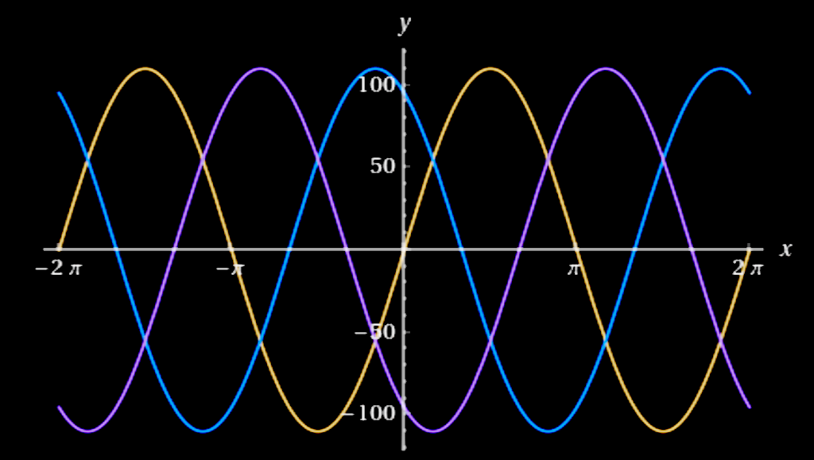
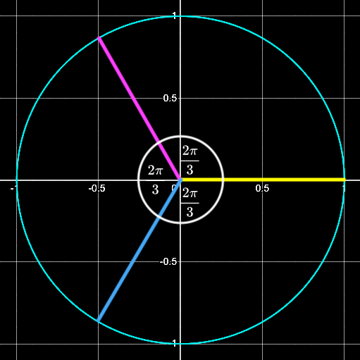

# Welcome to the **_foolmath_** repository!


## What is **_foolmath_**?

If you are a math enthusiast or aficionado, have you ever encountered a mathematical fool proofs like $1=2$ or evaluating $\infty$? Those seem so strange, queer, quirky and absurd. Many of them are foolish, while some of them are backed by impeccable logic. I intend this repository to be a treasure trove or collection of mind-bending demonstrations that challenge your concepts about numbers, algebra, trigonometry, logarithm, calculus and more. They will leave you scratching your head dissecting each equation to find errors, incorrectness or oversights in each proof. I also include some valid proofs and strange mathematical properties, which are considered interesting and worth reading. That's what **_foolmath_** is all about!

**Notes:**
1. Almost all mathematical proofs here are foolish, unless explicitly noted as _valid_.
2. Plain-text LaTeX `.tex` code is in `src/`.
3. Best to view **_foolmath_** on [GitHub.com](https://github.com/chunglim/foolmath) using any browsers on any devices, `GitHub` app on mobile devices or `GitHub.io` doesn't render LaTeX.

**Proofs are louder than words. Let's start!**

## Table of Contents
- Ramanujan summation [|view it|](#ramanujan-summation)
- Ramanujan alternative [|view it|](#yet-there-is-a-ramanujan-alternative)
- Summing the power of two [|view it|](#what-if-summing-the-power-of-two)
- Summing all natural odd numbers [|view it|](#what-if-summing-all-natural-odd-numbers)
- Summing all natural even numbers [|view it|](#trying-summing-all-natural-even-numbers)
- Why $0=1$? [|view it|](#why-01)
- Why $1=2$? [|view it|](#why-12)
- Do you know that $1=-1$? [|view it|](#do-you-know-that-1-1)
- Let's see a little higher numbers, $4=5$. [|view it|](#lets-see-a-little-higher-numbers-45)
- Are all intergers equal? [|view it|](#are-all-intergers-equal)
- Why $2+5=8$? [|view it|](#was-i-wrongly-taught-why-258)
- Very silly solutions to find $\frac{0}{0}$. [|view it|](#very-silly-solutions-to-find-frac00)
- Who said $i$ is imaginary, why $i=1$ then? [|view it|](#who-said-i-is-imaginary-why-i1-then)
- Let's talk more about $i$. [|view it|](#lets-talk-more-about-i)
- $i=\pm1$, isn't it? [|view it|](#ipm1-isnt-it)
- How much is $\infty$? [|view it|](#how-much-is-infty)
- How much is $0.\infty$? [|view it|](#how-much-is-0infty)
- Is $0$ an even number? [|view it|](#is-0-an-even-number)
- Solve $x$ for $x+2=x$. [|view it|](#solve-x-for-x2x)
- $e^{i\pi}=$?, also known as Euler's Identity [|view it|](#eipi-also-known-as-eulers-identity)
- $e^x=1$, no matter what $x$ maybe. [|view it|](#ex1-no-matter-what-x-maybe)
- How much is $\pi$? [|view it|](#how-much-is-pi)
- How much is $i^i$? [|view it|](#how-much-is-ii)
- How much is $\sqrt[^i]{i}$? [|view it|](#how-much-is-sqrtii)
- Who said $n^0=1$? [|view it|](#who-said-n01)
- Why $\frac{d}{dx}e^x=e^x$? [|view it|](#you-might-be-wondering-why-fracddxexex)
- Why is multiplying factor converting the power $1\phi$ to $3\phi$ is $\sqrt{3}$? [|view it|](#multiplying-factor-to-change-power-voltage-from-1phi-to-3phi)
- Magic numbers [|view it|](#magic-numbers)
- Vortex math [|view it|](#vortex-math)
- A property of prime numbers [|view it|](#a-property-of-prime-numbers)
- Relation between $e$ and $\pi$ a.k.a. Gaussian integral [|view it|](#proof-of-int_-inftyinfty-e-x2dxsqrtpi)
- Golden ratio from Fibonacci sequence [|view it|](#golden-ratio-from-fibonacci-sequence)
- Isn't it $\infty=\Phi$? [|view it|](#isnt-it-inftyphi)
- How much is $1^i$? [|view it|](#how-much-is-1i)
- How much is $\sqrt[^i]{1}$? [|view it|](#how-much-is-sqrti1)
- Whether $e=1$ or $\pi=0$ [|view it|](#whether-e1-or-pi0)
- How much is $e^i$? [|view it|](#how-much-is-ei)
- Simple continued fraction expansion of $\pi$ [|view it|](#simple-continued-fraction-expansion-of-pi)
- $\sqrt{-\ln{(-1)}\ln{(-1)}}=\pi$, how? [|view it|](#sqrt-ln-1ln-1pi-how)
- How is $6$ afraid of $7$? It ain't and will never be. [|view it|](#how-is-6-afraid-of-7-it-aint-and-will-never-be)
- The first equation we learnt in kindergartens [|view it|](#the-first-equation-we-learnt-in-kindergartens)
- Production of all multiple of $2$ [|view it|](#production-of-all-multiple-of-2)
- Production of all natural odd numbers [|view it|](#production-of-all-natural-odd-numbers)
- Production of all natural numbers [|view it|](#production-of-all-natural-numbers)
- Production of all natural even numbers [|view it|](#production-of-all-natural-even-numbers)
- Infinite numbers of primes [|view it|](#infinite-numbers-of-primes)
- Magic squares [|view it|](#magic-squares)
- Support **_foolmath_** [|here|](#support-foolmath)

### **Ramanujan summation**

We firstly start from the well-known **_Ramanujan Summation_**, which is known to most mathematicians.

$\qquad1+2+3+4+5+6+...\quad=\quad?$

```math
\begin{alignat*}{5}
&\,&S\quad&=\quad&&1+2+3+4+5+6+...\\
&\small\text{Let}&S_1\quad&=&&1-1+1-1+...\\
&\,&1-S_1\quad&=&&1-(1+1-1+1-...)\\
&\,&\,&=&&1-1+1-1+...\\
&\,&\,&=&& S_1\\
&\,&2S_1\quad&=&&1\\
&\,&S_1\quad&=&&\frac{1}{2}\\
&\small\text{Let}&S_2\quad&=&&1-2+3-4+5-6+...\\
&\,&2S_2\quad&=&&1-2+3-4+5-6+...\\
&\,&\,&\,&&\quad+1-1+3-4+5-6\\
&\,&\,&=&&1-1+1-1+...\\
&\,&2S_2\quad&=&& S_1\\
&\,&S_2\quad&=&&\frac{S_1}{2}\\
&\,&S_2\quad&=&&\frac{1}{4}\\
&\,&S-S_2\quad&=&&1+2+3+4+5+6+7+8+...\\
&\,&\,&\,&&\,\,\,-(1-2+3-4+5-6+7-...)\\
&\,&\,&=&&4+8+12+16+...\\
&\,&\,&=&&4(1+2+3+4+...)\\
&\,&S-S_2\quad&=&&4S\\
&\,&3S\quad&=&&-S_2\\
&\,&S\quad&=&&-\frac{S_2}{3}\\
&\,&\,&=&&-\frac{1}{3*4}\\
&\small\text{Thus}&S\quad&=&&-\frac{1}{12}
\end{alignat*}
```
_source code:_&nbsp;[rama_sum.tex](./src/rama_sum.tex)&nbsp;|&nbsp;[Go to top](#welcome-to-the-foolmath-repository)&nbsp;|&nbsp;[TOC](#table-of-contents)

### **Yet, there is a Ramanujan alternative**

```math
\begin{alignat*}{5}
&\,&S\quad&=\quad&&1+2+3+4+5+6+7+8+9+10+...\\
&\,&\,&=&&1+(2+3+4)+(5+6+7)+(8+9+10)+...\\
&\,&\,&=&&1+(9+18+27+...)\\
&\,&\,&=&&1+9(1+2+3+...)\\
&\,&S\quad&=&&1+9S\\
&\,&8S\quad&=&&-1\\
&\small\text{Thus}&\qquad S\quad&=&&-\frac{1}{8}
\end{alignat*}
```
_source code:_&nbsp;[rama_alt.tex](./src/rama_alt.tex)&nbsp;|&nbsp;[Go to top](#welcome-to-the-foolmath-repository)&nbsp;|&nbsp;[TOC](#table-of-contents)

Oops, was Ramanujan wrong?

### **What if summing the power of two?**

```math
\begin{alignat*}{5}
&\small\text{Let}&S\quad&=\quad&&\sum_{n=0}^\infty 2^n\\
&\,&\,&=&&1+2+4+8+16+32+...\\
&\,&\,&=&&1+2(1+2+4+8+16+...)\\
&\,&S\quad&=&&1+2S\\
&\small\text{Thus}\normalsize\qquad&S\quad&=&&-1
\end{alignat*}
```
_source code:_&nbsp;[sum_power_of_2.tex](./src/sum_power_of_2.tex)&nbsp;|&nbsp;[Go to top](#welcome-to-the-foolmath-repository)&nbsp;|&nbsp;[TOC](#table-of-contents)

Negative! once again.

### **What if summing all natural odd numbers?**

```math
\begin{alignat*}{5}
&\,&S\quad&=\quad&&1+3+5+7+9+...\\
&\,&-\frac{1}{12}\quad&=&&1+2+3+4+5+6+7+8+9+10+...\\
&\,&\,&=&&(1+3+5+7+9+...)+(2+4+6+8+10+...)\\
&\,&\,&=&&(1+3+5+7+9+...)+2(1+2+3+4+5+...)\\
&\,&\,&=&&(1+3+5+7+9+...)+2\left(-\frac{1}{12}\right)\\
&\,&-\frac{1}{12}\quad&=&&(1+3+5+7+9+...)-\frac{2}{12}\\
&\,&\frac{2}{12}-\frac{1}{12}\quad&=&&1+3+5+7+9+...\\
&\small\text{Thus}&\frac{1}{12}\quad&=&&1+3+5+7+9+...
\end{alignat*}
```
_source code:_&nbsp;[sum_of_odd.tex](./src/sum_of_odd.tex)&nbsp;|&nbsp;[Go to top](#welcome-to-the-foolmath-repository)&nbsp;|&nbsp;[TOC](#table-of-contents)

Wow! this time the summation is positive.

### **Trying summing all natural even numbers**

#### **Solution 1**

```math
\begin{alignat*}{5}
&\,&S\quad&=\quad&&2+4+6+8+10+...\\
&\,&-\frac{1}{12}\quad&=&&1+2+3+4+5+6+7+8+9+10+...\\
&\,&\,&=&&(1+3+5+7+9+...)+(2+4+6+8+10+...)\\
&\,&\,&=&&\frac{1}{12}+(2+4+6+8+10+...)\\
&\,&-\frac{1}{12}\quad&=&&\frac{1}{12}+S\\
&\small\text{Thus}\normalsize\qquad&S\quad&=&&-\frac{1}{6}
\end{alignat*}
```
_source code:_&nbsp;[sum_of_even_0.tex](./src/sum_of_even_0.tex)&nbsp;|&nbsp;[Go to top](#welcome-to-the-foolmath-repository)&nbsp;|&nbsp;[TOC](#table-of-contents)

Why is it negative again, who know? Probably something wrong.<br>
Try the next proof, which is simpler.

#### **Solution 2**

```math
\begin{alignat*}{5}
&\,&S\quad&=\quad&&2+4+6+8+10+...\\
&\,&\,&=&&2(1+2+3+4+5+...)\\
&\,&\,&=&&2\left(-\frac{1}{12}\right)\\
&\small\text{Thus}\normalsize\qquad&S\quad&=&&-\frac{1}{6}
\end{alignat*}
```
_source code:_&nbsp;[sum_of_even_1.tex](./src/sum_of_even_1.tex)&nbsp;|&nbsp;[Go to top](#welcome-to-the-foolmath-repository)&nbsp;|&nbsp;[TOC](#table-of-contents)

Same result, do you start to believe?

### **Why $`0=1`$?**

Here come the most foolish proof!

#### **Solution 1**

```math
\begin{alignat*}{5}
&\,&0\quad&=\quad&&0+0+0+0+...\\
&\,&\,&=&&(1-1)+(1-1)+(1-1)+(1-1)+...\\
&\,&\,&=&&1+(-1+1)+(-1+1)+(-1+1)+...\\
&\,&\,&=&&1+0+0+0+0+...\\
&\small\text{Thus}\normalsize\qquad&0\quad&=&&1
\end{alignat*}
```
_source code:_&nbsp;[0eq1_0.tex](./src/0eq1_0.tex)&nbsp;|&nbsp;[Go to top](#welcome-to-the-foolmath-repository)&nbsp;|&nbsp;[TOC](#table-of-contents)

What about the second most foolish proof?

#### **Solution 2**

```math
\begin{alignat*}{5}
&\small\text{Let}\normalsize\qquad&S\quad&=\quad&&1+1+1+1++1...\\
&\,&\,&=&&1+(1+1+1+1+...)\\
&\,&\cancel{S}\quad&=&&1+\cancel{S}\\
&\small\text{Thus}\normalsize\qquad&0\quad&=&&1
\end{alignat*}
```
_source code:_&nbsp;[0eq1_1.tex](./src/0eq1_1.tex)&nbsp;|&nbsp;[Go to top](#welcome-to-the-foolmath-repository)&nbsp;|&nbsp;[TOC](#table-of-contents)

Is there any proof looking more advanced than these?

#### **Solution 3**

```math
\begin{alignat*}{5}
&\,&\int u\,dv\quad&=\quad&&uv-\int v\,du\\
&\,&\int\frac{1}{x}\,dx\quad&=&&\cancel{x}\frac{1}{\cancel{x}}-\int x\,d\left(\frac{1}{x}\right)\\
&\,&\,&=&&1-\int x\,d(x^{-1})\\
&\,&\,&=&&1-\int x\,(-1x^{-2})\,dx\\
&\,&\,&=&&1+\int x.x^{-2}\,dx\\
&\,&\cancel{\int\frac{1}{x}\,dx}\quad&=&&1+\cancel{\int\frac{1}{x}\,dx}\\
&\small\text{Thus}\normalsize\qquad&0\quad&=&&1
\end{alignat*}
```
_source code:_&nbsp;[0eq1_2.tex](./src/0eq1_2.tex)&nbsp;|&nbsp;[Go to top](#welcome-to-the-foolmath-repository)&nbsp;|&nbsp;[TOC](#table-of-contents)

Can you find an error?<br>
Hmm, binary no longer exists.

### **Why $`1=2`$?**

Here, the proof I learnt in junior high school.

#### **Solution 1**

```math
\begin{alignat*}{5}
&\,&\small\text{Let}\normalsize\qquad a\quad&=\quad&&b\\
&\times b\small\text{ both sides}\quad&a*b\quad&=&&b*b\\
&\,&a*b\quad&=&&b^2\\
&-a^2\small\text{ both sides}\quad&a*b-a^2\quad&=&&b*b-a^2\\
&\,&a(b-a)\quad&=&&b^2-a^2\\
&\,&a\cancel{(b-a)}\quad&=&&\cancel{(b-a)}(b+a)\\
&\small\text{since }b=a&a\quad&=&&a+a\\
&\,&\cancel{a}\quad&=&&2\cancel{a}\\
&\,&\small\text{Thus}\normalsize\qquad1\quad&=&&2
\end{alignat*}
```
_source code:_&nbsp;[1eq2_0.tex](./src/1eq2_0.tex)&nbsp;|&nbsp;[Go to top](#welcome-to-the-foolmath-repository)&nbsp;|&nbsp;[TOC](#table-of-contents)

Nah, there is another proof in high school using trigonometry.

#### **Solution 2**

```math
\begin{alignat*}{5}
&\small\text{where }x=\frac{\pi}{4}~or~\frac{5\pi}{4}&\cos{x}\quad&=\quad&&\sin{x}\\
&\,&\cos{2x}\quad&=&&\sin{2x}\\
&\,&1-2\sin^2{x}\quad&=&&2\sin{x}\cos{x}\\
&\small\text{as }\sin{x}=\cos{x}&\,&=&&2\cos{x}\cos{x}\\
&\,&1-2\sin^2{x}\quad&=&&2\cos^2{x}\\
&\,&1\quad&=&&2\sin^2{x}+2\cos^2{x}\\
&\,&\,&=&&2\cancelto{1}{(\sin^2{x+\cos^2{x}})}\\
&\,&\small\text{Thus}\normalsize\qquad1\quad&=&&2
\end{alignat*}
```
_source code:_&nbsp;[1eq2_1.tex](./src/1eq2_1.tex)&nbsp;|&nbsp;[Go to top](#welcome-to-the-foolmath-repository)&nbsp;|&nbsp;[TOC](#table-of-contents)

Yet, there is another proof using calculus.

#### **Solution 3**

```math
\begin{alignat*}{5}
&\,&\underbrace{x+x+x+...+x}_{x\text{ terms}}\quad&=\quad&&x*x\\
&\,&\,&=&&x^2\\ \\
&\small\text{diff both sides }&\underbrace{1+1+1+...+1}_{x\text{ terms}}\quad&=&&2x\\
&\,&\cancel{x}\quad&=&&2\cancel{x}\\ \\
&\,&\small\text{Thus}\normalsize\qquad1\quad&=&&2
\end{alignat*}
```
_source code:_&nbsp;[1eq2_2.tex](./src/1eq2_2.tex)&nbsp;|&nbsp;[Go to top](#welcome-to-the-foolmath-repository)&nbsp;|&nbsp;[TOC](#table-of-contents)

Do you find any clues?

### **Do you know that $`1=-1`$?**

#### **Solution 1**

```math
\begin{alignat*}{5}
&\,&1\quad&=\quad&&\sqrt{1}\\
&\,&\,&=&&\sqrt{(-1)(-1)}\\
&\,&\,&=&&\sqrt{-1}\sqrt{-1}\\
&\,&\,&=&&i*i\\
&\,&\,&=&&i^2\\
&\small\text{Thus}\normalsize\qquad&1\quad&=&&-1
\end{alignat*}
```
_source code:_&nbsp;[1eq-1_0.tex](./src/1eq-1_0.tex)&nbsp;|&nbsp;[Go to top](#welcome-to-the-foolmath-repository)&nbsp;|&nbsp;[TOC](#table-of-contents)

Or even an easier proof

#### **Solution 2**

```math
\begin{alignat*}{5}
&\,&-1\quad&=\quad&&(-1)^{2.\frac{1}{2}}\\
&\,&\,&=&&1^\frac{1}{2}\\
&\small\text{Thus}\normalsize\qquad&-1\quad&=&&1
\end{alignat*}
```
_source code:_&nbsp;[1eq-1_1.tex](./src/1eq-1_1.tex)&nbsp;|&nbsp;[Go to top](#welcome-to-the-foolmath-repository)&nbsp;|&nbsp;[TOC](#table-of-contents)

Yet, there is another proof.

#### **Solution 3**

```math
\begin{alignat*}{5}
&\,&\frac{-1}{1}\quad&=\quad&&\frac{1}{-1}\\
&\,&\sqrt{\frac{-1}{1}}\quad&=&&\sqrt{\frac{1}{-1}}\\
&\,&\frac{i}{1}\quad&=&&\frac{1}{i}\\
&\,&i\quad&=&&\frac{1}{i}\\
&\,&i^2\quad&=&&1\\
&\small\text{Thus}\normalsize\qquad&-1\quad&=&&1
\end{alignat*}
```
_source code:_&nbsp;[1eq-1_2.tex](./src/1eq-1_2.tex)&nbsp;|&nbsp;[Go to top](#welcome-to-the-foolmath-repository)&nbsp;|&nbsp;[TOC](#table-of-contents)

From now on, what I owe you is what you owe me.

### **Let's see a little higher numbers, $`4=5`$.**

```math
\begin{alignat*}{5}
&\,&-20\quad&=\quad&&-20\\
&\,&16-36\quad&=&&25-45\\
&\,&4^2-4*9\quad&=&&5^2-5*9\\
&\small+\frac{81}{4}\text{both sides }&4^2-4*9+\frac{81}{4}\quad&=&&5^2-5*9+\frac{81}{4}\\
&\,&4^2-2*4*\frac{9}{2}+\left(\frac{9}{2}\right)^2\quad&=&&5^2-2*5*\frac{9}{2}+ \left(\frac{9}{2}\right)^2\\
&\,&\left(4-\frac{9}{2}\right)^2\quad&=&&\left(5-\frac{9}{2}\right)^2\\
&\small\sqrt{}~\text{both sides }&4-\cancel{\frac{9}{2}}\quad&=&&5-\cancel{\frac{9}{2}}\\
&\,&\small\text{Thus}\normalsize\qquad4\quad&=&&5
\end{alignat*}
```
_source code:_&nbsp;[4eq5_0.tex](./src/4eq5_0.tex)&nbsp;|&nbsp;[Go to top](#welcome-to-the-foolmath-repository)&nbsp;|&nbsp;[TOC](#table-of-contents)

Hey, what? How come, $4=5$?<br><br>
Wait, there are something more.

### **Are all intergers equal?**

```math
\begin{alignat*}{5}
&\,&\frac{-1}{1}\quad&=\quad&&\frac{1}{-1}&(1)\\
&\,&\sqrt{\frac{-1}{1}}\quad&=&&\sqrt{\frac{1}{-1}}&(2)\\
&\,&\frac{\sqrt{-1}}{\sqrt{1}}\quad&=&&\frac{\sqrt{1}}{\sqrt{-1}}&(3)\\
&\,&\frac{i}{1}\quad&=&&\frac{1}{i}&(4)\\
&\small\times\frac{1}{2}&\frac{i}{2}\quad&=&&\frac{1}{2i}&(5)\\
&\small+\frac{3}{2i}&\frac{i}{2}+\frac{3}{2i}\quad&=&&\frac{1}{2i}+\frac{3}{2i}&(6)\\
&\times i&i\left(\frac{i}{2}+\frac{3}{2i}\right)\quad&=&&i\left(\frac{1}{2i}+\frac{3}{2i}\right)\qquad&(7)\\
&\,&\frac{i^2}{2}+\frac{3\cancel{i}}{2\cancel{i}}\quad&=&&\frac{\cancel{i}}{2\cancel{i}}+\frac{3\cancel{i}}{2\cancel{i}}&(8)\\
&\,&-\frac{1}{2}+\frac{3}{2}\quad&=&&\frac{1}{2}+\frac{3}{2}&(9)\\
&\,&\frac{-1+3}{2}\quad&=&&\frac{1+3}{2}&(10)\\
&\,&\frac{\cancel{2}}{\cancel{2}}\quad&=&&\cancelto{2}{\frac{4}{2}}&(11)\\
&\,&1\quad&=&&2&(12)\\
&\small\text{from (9)}&-\frac{1}{2}+\cancel{\frac{3}{2}}\quad&=&&\frac{1}{2}+\cancel{\frac{3}{2}}&(13)\\
% line (14): Can't add `\cancel` inside `\frac`, MathJax bug?
&\,&-\frac{1}{2}\quad&=&&\frac{1}{2}&(14)\\
&\,&-1\quad&=&&1&(15)\\
&\small+1&-1+1\quad&=&&1+1&(16)\\
&\,&0\quad&=&&2&(17)\\
&\small\text{from (12), (15), (17)}&-1~=~0\quad&=&&1~=~2&(18)
\end{alignat*}
```
_source code:_&nbsp;[all_int_eq.tex](./src/all_int_eq.tex)&nbsp;|&nbsp;[Go to top](#welcome-to-the-foolmath-repository)&nbsp;|&nbsp;[TOC](#table-of-contents)

It is very articulate, indeed.<br><br>
There is one more simple equation. Have a look.

### **Was I wrongly taught? Why $`2+5=8`$?**

```math
\begin{alignat*}{5}
&\,&2+5\quad&=\quad&&4+3\\
&\,&\,&=&&4-\frac{9}{2}+\frac{9}{2}+3\\
&\,&\,&=&&\sqrt{\left(4-\frac{9}{2}\right)^2}+\frac{9}{2}+3\\
&\,&\,&=&&\sqrt{16-2.4.\frac{9}{2}+\left(\frac{9}{2}\right)^2}+\frac{9}{2}+3\\
&\,&\,&=&&\sqrt{16-36+\left(\frac{9}{2}\right)^2}+\frac{9}{2}+3\\
&\,&\,&=&&\sqrt{-20+\left(\frac{9}{2}\right)^2}+\frac{9}{2}+3\\
&\,&\,&=&&\sqrt{25-45+\left(\frac{9}{2}\right)^2}+\frac{9}{2}+3\\
&\,&\,&=&&\sqrt{25-2.5.\frac{9}{2}+\left(\frac{9}{2}\right)^2}+\frac{9}{2}+3\\
&\,&\,&=&&\sqrt{5^2-2.5.\frac{9}{2}+\left(\frac{9}{2}\right)^2}+\frac{9}{2}+3\\
&\,&\,&=&&\sqrt{\left(5-\frac{9}{2}\right)^2}+\frac{9}{2}+3\\
&\,&\,&=&&5-\cancel{\frac{9}{2}}+\cancel{\frac{9}{2}}+3\\
&\small\text{Thus}\normalsize\qquad&2+5\quad&=&&8
\end{alignat*}
```
_source code:_&nbsp;[2plus5eq8_0.tex](./src/2plus5eq8_0.tex)&nbsp;|&nbsp;[Go to top](#welcome-to-the-foolmath-repository)&nbsp;|&nbsp;[TOC](#table-of-contents)

Do you find any errors?<br><br>
Who said $0$ couldn't be a denominator? See the following fool proofs.

### **Very silly solutions to find $`\frac{0}{0}`$.**

#### **Let's see the first fool.**

```math
\begin{alignat*}{5}
&\,&\small\text{Let}\normalsize\qquad\frac{2}{0}\quad&=\quad&&\frac{x}{1}\\
&\times\small\text{0 both sides}&\frac{2*0}{0}\quad&=&&\frac{x*0}{1}\\
&\,\small &divide\text{ 2 both sides}&\frac{\cancel{2}*0}{0*\cancel{2}}\quad&=&&\cancelto{0}{\frac{x*0}{1*2}}\\
&\,&\small\text{Thus}\normalsize\qquad\frac{0}{0}\quad&=&&0
\end{alignat*}
```
_source code:_&nbsp;[0by0_0.tex](./src/0by0_0.tex)&nbsp;|&nbsp;[Go to top](#welcome-to-the-foolmath-repository)&nbsp;|&nbsp;[TOC](#table-of-contents)

#### **Here, the second fool, which is very silly.**

```math
\begin{alignat*}{5}
&\,&\frac{0}{0}\quad&=\quad&&\frac{100-100}{100-100}\\
&\,&\,&=&&\frac{10*10-10*10}{10*10-10*10}\\
&\,&\,&=&&\frac{10^2-10^2}{10(10-10)}\\
&\,&\,&=&&\frac{(10+10)\cancel{(10-10)}}{10\cancel{(10-10)}}\\
&\,&\,&=&&\frac{20}{10}\\
&\small\text{Thus}\normalsize\qquad&\frac{0}{0}\quad&=&&2
\end{alignat*}
```
_source code:_&nbsp;[0by0_1.tex](./src/0by0_1.tex)&nbsp;|&nbsp;[Go to top](#welcome-to-the-foolmath-repository)&nbsp;|&nbsp;[TOC](#table-of-contents)

Bruh, how can you divide $(10-10)$ with $(10-10)$?

### **Who said $`i`$ is imaginary, why $`i=1`$, then?**

```math
\begin{alignat*}{5}
&\,&i\quad&=\quad&&\sqrt{-1}\\
&\,&i^2\quad&=&&\sqrt{-1}.\sqrt{-1}\\
&\,&\,&=&&\sqrt{(-1)(-1)}\\
&\,&\,&=&&\sqrt{1}\\
&\,&i^2\quad&=&&1\\
&\small\text{Thus}\normalsize\qquad&i\quad&=&&1
\end{alignat*}
```
_source code:_&nbsp;[ieq1_0.tex](./src/ieq1_0.tex)&nbsp;|&nbsp;[Go to top](#welcome-to-the-foolmath-repository)&nbsp;|&nbsp;[TOC](#table-of-contents)

### **Let's talk more about $`i`$.**

#### **This is the _valid proof_ of $`\frac{1}{i}`$.**

```math
\begin{alignat*}{5}
&\,&-1\quad&=\quad&&i^2\\
&\small &divide(-i)\text{ both sides}&\frac{-1}{-i}\quad&=&&\frac{i^2}{-i}\\
&\,&\small\text{Thus}\normalsize\qquad\frac{1}{i}\quad&=&&-i\qquad\small\text{(valid proof)}
\end{alignat*}
```
_source code:_&nbsp;[inv_i_valid.tex](./src/inv_i_valid.tex)&nbsp;|&nbsp;[Go to top](#welcome-to-the-foolmath-repository)&nbsp;|&nbsp;[TOC](#table-of-contents)

Nah, there is another $\frac{1}{i}$, but it is foolish.

#### **This is the _fool proof_ of $`\frac{1}{i}`$.**

```math
\begin{alignat*}{5}
&\,&\frac{1}{i}\quad&=\quad&&i^{-1}\\
&\,&\,&=&&\sqrt{-1}^{-1}\\
&\,&\,&=&&\left((-1)^\frac{1}{2}\right)^{-1}\\
&\,&\,&=&&\left((-1)^{-1}\right)^\frac{1}{2}\\
&\,&\,&=&&\left(\frac{1}{-1}\right)^\frac{1}{2}\\
&\,&\,&=&&-1^\frac{1}{2}\\
&\,&\,&=&&\sqrt{-1}\\
&\small\text{Thus}\normalsize\qquad&\frac{1}{i}\quad&=&& i\qquad\small\text{(fool proof)}
\end{alignat*}
```
_source code:_&nbsp;[inv_i_fool.tex](./src/inv_i_fool.tex)&nbsp;|&nbsp;[Go to top](#welcome-to-the-foolmath-repository)&nbsp;|&nbsp;[TOC](#table-of-contents)

Which one will you believe?

### **$`i=\pm1`$, isn't it?**

```math
\begin{alignat*}{5}
&\,&i^2\quad&=\quad&&-1\\
&\,&i*i\quad&=&&-1\\
&\,&i\quad&=&&\frac{-1}{i}\\
&\rlap{i=\frac{-1}{i}=\frac{-1}{\frac{-1}{i}}=\frac{-1}{\frac{-1}{\frac{-1}{i}}}=...}\\
&\,&i\quad&=&&(-1)^\infty\\
&\,&\small\text{Thus}\normalsize\qquad i\quad&=&&\pm1
\end{alignat*}
```
_source code:_&nbsp;[i_eq_pm1.tex](./src/i_eq_pm1.tex)&nbsp;|&nbsp;[Go to top](#welcome-to-the-foolmath-repository)&nbsp;|&nbsp;[TOC](#table-of-contents)

Whatever it is, but it is not imaginary, anyway.

### **How much is $`\infty`$?**

```math
\begin{alignat*}{5}
&\,&-\frac{1}{12}\quad&=\quad&&1+2+3+...+\infty\\
&\,&\,&=&&\frac{\infty(\infty+1)}{2}\\
&\,&-1\quad&=&&6\infty(\infty+1)\\
&\,&0\quad&=&&6\infty^2+6\infty+1\\
&\,&\infty\quad&=&&\frac{-6\pm\sqrt{6^2-4(6)(1)}}{2(6)}\\
&\,&\,&=&&\frac{-6\pm\sqrt{36-24}}{12}\\
&\,&\,&=&&\frac{-6\pm\sqrt{12}}{12}\\
&\,&\,&=&&\frac{-6\pm\sqrt{2^2*3}}{12}\\
&\,&\,&=&&\frac{-6\pm2\sqrt{3}}{12}\\
&\small\text{Thus}&\infty\quad&=&&\frac{-3\pm\sqrt{3}}{6}
\end{alignat*}
```
_source code:_&nbsp;[infty.tex](./src/infty.tex)&nbsp;|&nbsp;[Go to top](#welcome-to-the-foolmath-repository)&nbsp;|&nbsp;[TOC](#table-of-contents)

Here, $\infty$ is so small, you see?

### **How much is $`0.\infty`$?**

```math
\begin{alignat*}{5}
&\,&S\quad&=\quad&&1+1+1+1+1+1+...\\
&\,&\,&=&&(1+1)+(1+1)+(1+1)+...\\
&\,&\,&=&&2+2+2+...\\
&\,&\,&=&&2(1+1+1+...)\\
&\,&S\quad&=&&2S\\
&\,&S\quad&=&&0\qquad&\small\text{(1)}\\
&\,&2S\quad&=&&1+1+1+1+1+1+...\\
&\,&\,&\,&&\quad~~~1+1+1+1+1+...\\
&\,&2S\quad&=&&1+2+2+2+2+2+...\\
&\,&3S\quad&=&&1+1+1+1+1+1+...\\
&\,&\,&\,&&\quad~~~1+1+1+1+1+...\\
&\,&\,&\,&&\qquad\quad~~1+1+1+1+...\\
&\,&3S\quad&=&&1+2+3+3+3+3+...\\
&\,&\,&\,&&...\\
&\,&\infty S\quad&=\quad&&1+2+3+4+5+6+...\\
&\small\text{from (1) }S=0\normalsize\quad&\infty0\quad&=&&1+2+3+4+5+6+...\\
&\qquad\small\text{Thus}&0\infty\quad&=&&-\frac{1}{12}
\end{alignat*}
```
_source code:_&nbsp;[0infty.tex](./src/0infty.tex)&nbsp;|&nbsp;[Go to top](#welcome-to-the-foolmath-repository)&nbsp;|&nbsp;[TOC](#table-of-contents)

Hmm, I will never believe.

### **Is $`0`$ an even number?**

This proof is believed to be valid.

```math
\begin{alignat*}{5}
&\,&0\quad&=\quad&&0\\
&\,&\,&=&&1-1\\
&\,&\,&=&&1^2-1^2\\
&\,&\,&=&&(1+1)(1-1)\\
&\,&\,&=&&(1+1)(1^2-1^2)\\
&\,&\,&=&&(1+1)(1+1)(1-1)\\
&\small\text{repeat the last term}&\,&=&&(1+1)(1+1)(1+1)...(1-1)\\
&\,&0\quad&=&&(1+1)^\infty*(1-1)\\
&\qquad\qquad\small\text{Thus}\normalsize\qquad&0\quad&=&&2^\infty*0\qquad\small\text{(valid proof)}\\
&\rlap{\qquad\qquad\small\text{Any number being a multiple of 2 is always even.}}
\end{alignat*}
```
_source code:_&nbsp;[0_even.tex](./src/0_even.tex)&nbsp;|&nbsp;[Go to top](#welcome-to-the-foolmath-repository)&nbsp;|&nbsp;[TOC](#table-of-contents)

### **Solve $`x`$ for $`x+2=x`$.**

```math
\begin{alignat*}{5}
&\,&x+2\quad&=\quad&&x\\
&\,&(x+2)^2\quad&=&& x^2\\
&\,&\cancel{x^2}+4x+4\quad&=&&\cancel{x^2}\\
&\,&4x\quad&=&&-4\\
&\,&\small\text{Thus}\normalsize\qquad x\quad&=&&-1
\end{alignat*}
```
_source code:_&nbsp;[x+2eqx.tex](./src/x+2eqx.tex)&nbsp;|&nbsp;[Go to top](#welcome-to-the-foolmath-repository)&nbsp;|&nbsp;[TOC](#table-of-contents)

A silly equation always has the solution.<br><br>
Now, have a look at the valid proof of _Euler's identity_.

### **$`e^{i\pi}=?`$, also known as _Euler's identity_**

```math
\begin{alignat*}{7}
&\,&\sin{x}&=\sum_{n=0}^{\infty}\frac{(-1)^n}{(2n+1)!}x^{2n+1}&&=x-\frac{x^3}{3!}+\frac{x^5}{5!}-\frac{x^7}{7!}+...\qquad&\small\text{for all x}\\
&\,&\cos{x}&=\sum_{n=0}^{\infty}\frac{(-1)^n}{(2n)!}x^{2n}&&=1-\frac{x^2}{2!}+\frac{x^4}{4!}-\frac{x^6}{6!}+...\qquad&\small\text{for all x}\\
&\,&e^x&=\sum_{n=0}^{\infty}\frac{x^n}{n!}&&=1+x+\frac{x^2}{2!}+\frac{x^3}{3!}+\frac{x^4}{4!}+...\qquad&\small\text{for all x}\\
&\,&e^{ix}&=\rlap{1+ix+\frac{(ix)^2}{2!}+\frac{(ix)^3}{3!}+\frac{(ix)^4}{4!}+\frac{(ix)^5}{5!}+\frac{(ix)^6}{6!}+\frac{(ix)^7}{7!}+\frac{(ix)^8}{8!}+...}\\
&\,&\,&=\rlap{1+ix-\frac{x^2}{2!}-\frac{ix^3}{3!}+\frac{x^4}{4!}+\frac{ix^5}{5!}-\frac{x^6}{6!}-\frac{ix^7}{7!}+\frac{x^8}{8!}+...}\\
&\,&\,&=\rlap{\left(1-\frac{x^2}{2!}+\frac{x^4}{4!}-\frac{x^6}{6!}+\frac{x^8}{8!}-...\right)+i\left(x-\frac{x^3}{3!}+\frac{x^5}{5!}-\frac{x^7}{7!}+...\right)}\\
&\,&e^{ix}&=\cos{x}+i\sin{x}&&\small\text{***}\\
&\,&e^{i\pi}&=\cos{\pi}+\cancelto{0}{i\sin{\pi}}\\
&\small\text{Thus}\normalsize\qquad&e^{i\pi}&=-1\qquad\small\text{(valid proof)}
\end{alignat*}
```
_source code:_&nbsp;[euler.tex](./src/euler.tex)&nbsp;|&nbsp;[Go to top](#welcome-to-the-foolmath-repository)&nbsp;|&nbsp;[TOC](#table-of-contents)

Euler's identity shall be used in the other proofs (whether valid or fool).<br>
Let's see the first fool proofs using _Euler's identity_.

### **$`e^x=1`$, no matter what $`x`$ maybe.**

#### **Solution 1**

```math
\begin{alignat*}{5}
&\,&e^x\quad&=\quad&&e^{i\pi.2\frac{x}{i\pi.2}}\\
&\,&\,&=&&(e^{i\pi})^{2\frac{x}{2i\pi}}\\
&\,&\,&=&&(-1)^{2\frac{x}{2i\pi}}\\
&\,&e^x\quad&=&&1^\frac{x}{2i\pi}\qquad&\small(1)\\
&\small\text{as}&e^{i\pi}\quad&=&&-1\\
&\,&\ln{e^{i\pi}}\quad&=&&\ln{(-1)}\\
&\,&i\pi\cancelto{1}{\ln{e}}&=&&\ln{(-1)}\\
&\,&i\pi\quad&=&&\ln{(-1)}\qquad&\small(2)\\
&\small\text{from (1)}&e^x\quad&=&&1^\frac{x}{2\ln(-1)}\\
&\,&\,&=&&1^\frac{x}{\ln(-1^2)}\\
&\,&\,&=&&1^\frac{x}{\cancelto{0}{\ln{1}}}\\
&\,&\,&=&&1^\frac{x}{0}\\
&\,&\,&=&&1^\infty\\
&\small\text{Thus}&e^x\quad&=&&1\qquad&\small\text{(so foolish)}
\end{alignat*}
```
_source code:_&nbsp;[ex_eq_1_0.tex](./src/ex_eq_1_0.tex)&nbsp;|&nbsp;[Go to top](#welcome-to-the-foolmath-repository)&nbsp;|&nbsp;[TOC](#table-of-contents)

Q: Bruh, how can you divide by $0$ and evaluate $1^\infty$ to $1$?<br>
A: Hold on, there is another neater proof.

#### **Solution 2**

```math
\begin{alignat*}{5}
&\,&e^{i\pi}\quad&=\quad&&-1\\
&\,&\left(e^{i\pi}\right)^2\quad&=&&-1^2\\
&\,&e^{2i\pi}\quad&=&&1\\
&\small\text{power }n\text{ both sides}&e^{2ni\pi}\quad&=&&1^n\qquad&\small\text{for all n}\\
&\,&e^{2ni\pi}\quad&=&&1\\
&\small\times e\text{ both sides}&e^{2ni\pi}.e\quad&=&&e\\
&\,&e^{2ni\pi+1}\quad&=&&e&\small(1)\\
&\small\text{power }(2ni\pi+1)\text{ both sides}&\left(e^{2ni\pi+1}\right)^{2ni\pi+1}\quad&=&&e^{2ni\pi+1}\\
&\small\text{from (1)}\normalsize\quad\,&e^{(2ni\pi+1)(2ni\pi+1)}\quad&=&&e\\
&\,&e^{(2ni\pi+1)^2}\quad&=&&e\\
&\,&e^{(2ni\pi)^2+2(2ni\pi)(1)+1^2}\quad&=&&e\\
&\,&e^{-4n^2\pi^2+4ni\pi+1}\quad&=&&e\\
&\,&e^{-4n^2\pi^2}.e^{4ni\pi}.\cancel{e}\quad&=&&\cancel{e}\\
&\,&e^{-4n^2\pi^2}.e^{4ni\pi}\quad&=&&1\\
&\,&e^{-4n^2\pi^2}.\left(e^{i\pi}\right)^{4n}\quad&=&&1\\
&\,&e^{-4n^2\pi^2}.(-1)^{2.2n}\quad&=&&1\\
&\,&e^{-4n^2\pi^2}.\cancelto{1}{1^{2n}}\quad&=&&1\\
&\,&e^{-4n^2\pi^2}\quad&=&&1\\
&\rlap{\small\text{as }n\text{ can be any real values, }x=-4n^2\pi^2\text{, can also be any real values.}}\\
&\,&\small\text{Thus}\normalsize\qquad e^x\quad&\,=\quad1
\end{alignat*}
```
_source code:_&nbsp;[ex_eq_1_1.tex](./src/ex_eq_1_1.tex)&nbsp;|&nbsp;[Go to top](#welcome-to-the-foolmath-repository)&nbsp;|&nbsp;[TOC](#table-of-contents)

Now, let's see the value of $\frac{\text{circumference}}{\text{diameter}}$, you know.

### **How much is $`\pi`$?**

#### **Solution 1**

```math
\begin{alignat*}{5}
&\,&e^{i\pi}\quad&=\quad&&-1\\
&\,&\ln{e^{i\pi}}\quad&=&&\ln{(-1)}\\
&\,&i\pi\cancelto{1}{\ln e}\quad&=&&\ln{(-1)}\\
&\,&\pi\quad&=&&\frac{\ln{(-1)}}{i}\\
&\,&\,&=&&\frac{2\ln{(-1)}}{2i}\\
&\,&\,&=&&\frac{\ln{(-1)^2}}{2i}\\
&\,&\,&=&&\frac{\cancelto{0}{\ln{1}}}{2i}\\
&\small\text{Thus}&\pi\quad&=&&0
\end{alignat*}
```
_source code:_&nbsp;[pi_eq_0_0.tex](./src/pi_eq_0_0.tex)&nbsp;|&nbsp;[Go to top](#welcome-to-the-foolmath-repository)&nbsp;|&nbsp;[TOC](#table-of-contents)

If you don't believe, yet there are another proofs.

#### **Solution 2**

```math
\begin{alignat*}{5}
&\,&e^{i\pi}\quad&=\quad&&-1\\
&\,&(e^{i\pi})^2\quad&=&&(-1)^2\qquad&\,\\
&\,&e^{2i\pi}\quad&=&&1&\small(1)\\
&\,&e^{2i\pi}.e\quad&=&&e\\
&\,&e^{2i\pi+1}\quad&=&&e\\
&\,&\left(e^{2i\pi+1}\right)^{2i\pi+1}\quad&=&&e^{2i\pi+1}\\
&\,&e^{(2i\pi+1)(2i\pi+1)}\quad&=&&e^{2i\pi}.e\\
&\small\text{from (1)}\normalsize\qquad&e^{(2i\pi+1)(2i\pi+1)}\quad&=&&1e\\
&\,&e^{(2i\pi)^2+2.2i\pi+1^2}\quad&=&&e\\
&\,&e^{(-4\pi^2+4i\pi+1)}\quad&=&&e\\
&\,&e^{-4\pi^2}.e^{4i\pi}.\cancel{e}\quad&=&&\cancel{e}\\
&\,&e^{-4\pi^2}.e^{4i\pi}\quad&=&&1\\
&\,&e^{-4\pi^2}.e^{i\pi.2.2}\quad&=&&1\\
&\,&e^{-4\pi^2}.(-1)^{2.2}\quad&=&&1\\
&\,&e^{-4\pi^2}.\cancel{1}^2\quad&=&&\cancel{1}\\
&\,&\ln{(e^{-4\pi^2})}\quad&=&&\ln1\\
&\,&-4\pi^2\cancelto{1}{\ln{(e)}}\quad&=&&0\\
&\,&\pi^2\quad&=&&0\\
&\,&\small\text{Thus}\normalsize\qquad\pi\quad&=&&0
\end{alignat*}
```
_source code:_&nbsp;[pi_eq_0_1.tex](./src/pi_eq_0_1.tex)&nbsp;|&nbsp;[Go to top](#welcome-to-the-foolmath-repository)&nbsp;|&nbsp;[TOC](#table-of-contents)

Wait, $\pi$ is probably something else.

#### **Solution 3**

```math
\begin{alignat*}{5}
&\,&e^{i\pi}\quad&=\quad&&-1\\
&\,&\ln{e^{i\pi}}\quad&=&&\ln{(-1)}\\
&\,&i\pi\cancelto{1}{\ln{e}}\quad&=&&\ln{(-1)}\\
&\,&1^{i\pi}\quad&=&&1^{\ln{(-1)}}\\
&\,&(1^\pi)^i\quad&=&&1^{\ln{(-1)}}\\
&\,&1^i\quad&=&&1^{\ln{(-1)}}\\
&\,&\log_{1}1^i\quad&=&&\log_{1}1^{\ln{(-1)}}\\
&\,&i\log_{1}1\quad&=&&\ln{(-1)}\log_{1}1\\
&\,&i\quad&=&&\ln{(-1)}\\
&\,&i\quad&=&&\ln{(e^{i\pi})}\\
&\,&\cancel{i}\quad&=&&\cancel{i}\pi\cancelto{1}{\ln{e}}\\
&\small\text{Thus}&\pi\quad&=&&1
\end{alignat*}
```
_source code:_&nbsp;[pi_eq_1_0.tex](./src/pi_eq_1_0.tex)&nbsp;|&nbsp;[Go to top](#welcome-to-the-foolmath-repository)&nbsp;|&nbsp;[TOC](#table-of-contents)

Yet, there is another silly proof.

#### **Solution 4**

```math
\begin{alignat*}{5}
&\rlap{\text{Rotate 6 by 180}^\circ\text{, it will be 9.}}\\
&\rlap{\text{Rotate 6 by }\pi~\text{radians, it will be 9.}}\\
&\,&6+\pi\quad&=\quad&&9\\
&\,&\pi\quad&=&&9-6\\
&\small\text{Thus}&\pi\quad&=&&3
\end{alignat*}
```
_source code:_&nbsp;[pi_eq_3_0.tex](./src/pi_eq_3_0.tex)&nbsp;|&nbsp;[Go to top](#welcome-to-the-foolmath-repository)&nbsp;|&nbsp;[TOC](#table-of-contents)

Oops! engineers also say that!<br><br>
We have seen several fool proofs, let's see valid proofs.

### **How much is $`i^i`$?**

```math
\begin{alignat*}{5}
&\small\text{from Euler's identity}&e^{ix}\quad&=\quad&&\cos{x}+i\sin{x}\\
&\,&i\quad&=&&0+i\\
&\,&\,&=&&\cos{\left(\frac{\pi}{2}\right)}+i\sin{\left(\frac{\pi}{2}\right)}\\
&\,&\,&=&&e^{i\frac{\pi}{2}}\\
&\small\text{power }i\text{ both sides}&i^i\quad&=&& e^{i^2\frac{\pi}{2}}\\
&\,&\small\text{Thus}\normalsize\qquad i^i\quad&=&&e^{-\frac{\pi}{2}}\qquad\small\text{(valid proof)}\\
&\rlap{\qquad\qquad\qquad\qquad\small\text{And it is a real number.}}
\end{alignat*}
```
_source code:_&nbsp;[i_power_i.tex](./src/i_power_i.tex)&nbsp;|&nbsp;[Go to top](#welcome-to-the-foolmath-repository)&nbsp;|&nbsp;[TOC](#table-of-contents)

### **How much is $`\sqrt[^i]{i}`$?**

```math
\begin{alignat*}{5}
&\,&e^{i\pi}\quad&=\quad&&-1\\
&\,&\,&=&&i^2\\
&\small\text{take ln both sides}&\ln{e^{i\pi}}\quad&=&&\ln{i^2}\\
&\,&i\pi\cancelto{1}{\ln{e}}\quad&=&&2\ln{i}\\
&\,&\quad\frac{\pi}{2}\quad&=&&\frac{{1}}{i}\ln{i}\\
&\,&\quad\ln{i^\frac{1}{i}}\quad&=&&\frac{\pi}{2}\\
&\,&\quad i^\frac{1}{i}\quad&=&&e^\frac{\pi}{2}\\
&\,&\small\text{Thus}\normalsize\qquad\sqrt[^i]{i}\quad&=&&e^\frac{\pi}{2}\qquad\small\text{(valid proof)}\\
&\rlap{\qquad\qquad\qquad\qquad\small\text{And it is a real number.}}
\end{alignat*}
```
_source code:_&nbsp;[i_root_i.tex](./src/i_root_i.tex)&nbsp;|&nbsp;[Go to top](#welcome-to-the-foolmath-repository)&nbsp;|&nbsp;[TOC](#table-of-contents)

### **Who said $`n^0=1`$?**

```math
\begin{alignat*}{5}
&\,&n^{-1}\quad&=\quad&&\frac{1}{n}\\
&\,&n^{\left(i^2\right)}\quad&=&&\frac{1}{n}\\
&\small\text{power }\frac{1}{i}\text{ both sides}&n^{\left(\frac{i^2}{i}\right)}\quad&=&&\left(\frac{1}{n}\right)^\frac{1}{i}\\
&\,&n^i\quad&=&&\frac{1^\frac{1}{i}}{n^\frac{1}{i}}\\
&\,&n^i.n^\frac{1}{i}\quad&=&&1^\frac{1}{i}\\
&\,&n^{i+\frac{1}{i}}\quad&=&&1^\frac{1}{i}\\
&\small\text{as }i=\frac{1}{-i}&n^{-\frac{1}{i}+\frac{1}{i}}\quad&=&&1^\frac{1}{i}\\
&\,&n^0\quad&=&&(-1)^{2.\frac{1}{i}}\\
&\small\text{as }e^{i\pi}=-1&\,&=&&(e^{\cancel{i}\pi})^\frac{2}{\cancel{i}}\\
&\,&\small\text{Thus}\normalsize\qquad n^0\quad&=&&e^{2\pi}\\
\end{alignat*}
```
_source code:_&nbsp;[nto0neq1.tex](./src/nto0neq1.tex)&nbsp;|&nbsp;[Go to top](#welcome-to-the-foolmath-repository)&nbsp;|&nbsp;[TOC](#table-of-contents)

It is still a constant, but not `1`, not even an integer.<br>
It is even an irrational and transcendental number.<br><br>
Next, let's see valid proofs.

### **You might be wondering, why $`\frac{d}{dx}e^x=e^x`$?**

There are many solutions out there, let's have a look.

#### **Solution 1: _Limit Definition_**

```math
\begin{alignat*}{5}
&\,&f'(x)\quad&=\quad&&\lim_{h\to0}\frac{f(x+h)-f(x)}{h}\\
&\,&\frac{d}{dx}e^x\quad&=&&\lim_{h\to0}\frac{e^{x+h}-e^x}{h}\\
&\,&\frac{d}{dx}e^x\quad&=&&e^x.\frac{e^h-1}{h}\qquad&\small(1)\\
&\,&\small\text{Let}\normalsize\qquad t\quad&=&&e^h-1\qquad&\small(2)\\
&\,&\ln{t}\quad&=&&\ln{(e^h-1)}\\
&\,&\,&=&&\frac{\ln{e^h}}{\ln{1}}\\
&\,&\ln{t}\quad&=&&h.\frac{\cancelto{1}{\ln{e}}}{\ln{1}}\\
&\,&h\quad&=&&\ln{t}.\ln{1}\\
&\,&h\quad&=&&\ln{(t+1)}\qquad&\small(3)\\
&\rlap{\qquad\qquad\small\text{since }h\text{ approaches }0\text{ , in order to balance the equation,}}\\
&\rlap{\qquad\qquad\qquad\qquad\quad\small\text{so }t\text{ must also approach }0.}\\
&\small\text{from (1), (2) and (3)}&\frac{d}{dx}e^x\quad&=&& e^x\lim_{t\to0}\frac{t}{\ln{(t+1)}}\\
&\,&\,&=&&e^x\lim_{t\to0}\frac{1}{\frac{1}{t}\ln{(t+1)}}\\
&\,&\frac{d}{dx}e^x\quad&=&&e^x\lim_{t\to0}\frac{1}{\ln{(t+1)}^\frac{1}{t}}\qquad&\small(4)\\
&\rlap{\small\text{recall}\normalsize\qquad\qquad\qquad e=\lim_{n\to0}(1+n)^\frac{1}{n}=\lim_{n\to\infty}\left(1+\frac{1}{n}\right)^n}\\
&\small\text{from (4)}&\frac{d}{dx}e^x\quad&=&&e^x\frac{1}{\cancelto{1}{\ln{e}}}\\
&\,&\small\text{Thus}\normalsize\qquad\frac{d}{dx}e^x\quad&=&&e^x\qquad\small\text{(valid proof)}
\end{alignat*}
```
_source code:_&nbsp;[d_e_power_x_0.tex](./src/d_e_power_x_0.tex)&nbsp;|&nbsp;[Go to top](#welcome-to-the-foolmath-repository)&nbsp;|&nbsp;[TOC](#table-of-contents)

#### **Solution 2: _Taylor Series_**

```math
\begin{alignat*}{5}
&\,&e^x\quad&=\quad&&\sum_{i=0}^\infty\frac{x^n}{n!}\\
&\,&\,&=&&\frac{x^0}{0!}+\frac{x^1}{1!}+\frac{x^2}{2!}+\frac{x^3}{3!}+\frac{x^4}{4!}+...\\
&\,&e^x\quad&=&&1+\frac{x^1}{1}+\frac{x^2}{2!}+\frac{x^3}{3!}+\frac{x^4}{4!}+...\qquad&\small\text{(1)}\\
&\small\text{diff}&\frac{d}{dx}e^x\quad&=&&0+1+\frac{2x^1}{2!}+\frac{3x^2}{3!}+\frac{4x^3}{4!}+...\\
&\,&\,&=&&1+\frac{\cancel{2}x^1}{\cancel{2}.1!}+\frac{\cancel{3}x^2}{\cancel{3}.2!}+\frac{\cancel{4}x^3}{\cancel{4}.3!}+...\\
&\,&\,&=&&(1)\\
&\small\text{Thus}\normalsize\qquad&\frac{d}{dx}e^x\quad&=&&e^x\qquad\small\text{(valid proof)}
\end{alignat*}
```
_source code:_&nbsp;[d_e_power_x_1.tex](./src/d_e_power_x_1.tex)&nbsp;|&nbsp;[Go to top](#welcome-to-the-foolmath-repository)&nbsp;|&nbsp;[TOC](#table-of-contents)

#### **Solution 3: _Implicit Differentiation_**

```math
\begin{alignat*}{5}
&\,&y\quad&=\quad&&e^x\\
&\,&\ln{y}\quad&=&&\ln{e^x}\\
&\,&\,&=&&x\cancelto{1}{\ln{e}}\\
&\,&\ln{y}\quad&=&&x\\
&\small\text{diff both sides}\normalsize\quad&\frac{d}{dx}\ln{y}\quad&=&&\frac{dx}{dx}\\
&\,&\frac{1}{y}\frac{dy}{dx}\quad&=&&1\\
&\,&\frac{dy}{dx}\quad&=&&y\\
&\qquad\small\text{Thus}\normalsize\qquad&\frac{d}{dx}e^x\quad&=&&e^x\qquad\small\text{(valid proof)}
\end{alignat*}
```
_source code:_&nbsp;[d_e_power_x_2.tex](./src/d_e_power_x_2.tex)&nbsp;|&nbsp;[Go to top](#welcome-to-the-foolmath-repository)&nbsp;|&nbsp;[TOC](#table-of-contents)

#### **Solution 4: _Differential Equation_**

```math
\begin{alignat*}{5}
&\,&\frac{dy}{dx}\quad&=\quad&&y\\
&\,&\frac{dy}{y}\quad&=&&dx\\
&\small\text{integral}\quad&\int\frac{dy}{y}\quad&=&&\int{dx}\\
&\,&\ln{y}\quad&=&&x\qquad&\small\text{omit}~C\\
&\,&y\quad&=&&e^x\\
&\small\text{Thus}&\frac{d}{dx}e^x\quad&=&&e^x\qquad&\small\text{(valid proof)}
\end{alignat*}
```
_source code:_&nbsp;[d_e_power_x_3.tex](./src/d_e_power_x_3.tex)&nbsp;|&nbsp;[Go to top](#welcome-to-the-foolmath-repository)&nbsp;|&nbsp;[TOC](#table-of-contents)

Four proofs should suffice.<br>
$e^x$ is the only expression, you can't kill with differentiation.

### **Multiplying factor to change power voltage from $`1\phi`$ to $`3\phi`$**

You may notice that the electrical power $1\phi\cdot110V$ is branched from $3\phi\cdot190V$. Or $1\phi\cdot220V$ is branched from $3\phi\cdot380V$ in some countries. This is because $110\sqrt{3}=190$ or $220\sqrt{3}=380$. You may wonder, why the factor is $\sqrt{3}$. Here's the proof.

This proof is kinda engineering, so $j$ denotes an imaginary number.



In $1\phi$ electricity, the voltage is measured across the _live_ line and _neutral_, which is always `0` and the amplitude of _live_ line is always a constant. But in $3\phi$ electricity, the voltage is measured across two _live_ lines. And each _live_ line is a sine curve (plus offset). How can we measure the voltage across two _live_ lines? Let's see.



A full circle covers the angle of $2\pi$ radians or $360^{\circ}$. And it is split into $3\phi$. So each phase will set an angle by $\frac{2\pi}{3}$ radians or $120^\circ$ apart from one another. The voltage across phases can be computed by the difference between phases. In this case we will subtract the voltage at $120^\circ$ from the voltage at $0^\circ$.

```math
\begin{alignat*}{5}
&\,&V_{ab}\quad&=\quad&&V_{an}\measuredangle0^\circ-V_{bn}\measuredangle120^\circ\\
&\,&\,&=&& V_{an}(\cos{0^\circ}+j\sin{{0^\circ}})-V_{bn}(\cos{120^\circ}+j\sin{{120^\circ}})\\
&\,&\,&=&&V_{an}(1+0)-V_{bn}(-\frac{1}{2}+j\cdot\frac{\sqrt{3}}{2})\\
&\,&V_{ab}\quad&=&&V_{an}-V_{bn}(-\frac{1}{2}+j\cdot\frac{\sqrt{3}}{2})\qquad&\small\text(1)\\
&\small\text{take magnitude}&|V_{an}|\quad&=&&|V_{bn}|\quad=\quad|V|\quad\small\text{(measure line to neutral)}\\
&\small\text{from (1)}&|V_{ab}|\quad&=&&|V|-|V|(-\frac{1}{2}+j\cdot\frac{\sqrt{3}}{2})\\
&\,&|V_{ab}|\quad&=&&|V|+\frac{1}{2}|V|-j|V|\cdot\frac{\sqrt{3}}{2}\\
&\,&\,&=&&|V|\frac{3}{2}-j|V|\cdot\frac{\sqrt{3}}{2}\\
&\,&\,&=&&|V|\left(\frac{3}{2}-j\cdot\frac{\sqrt{3}}{2}\right)\\
&\small\text{polar to rectangular}\normalsize\quad&|V_{ab}|\quad&=&&|V|\sqrt{\left(\frac{3}{2}\right)^2+\left(\frac{\sqrt{3}}{2}\right)^2}\\
&\,&\,&=&&|V|\sqrt{\frac{9}{4}+\frac{3}{4}}\\
&\,&\,&=&&|V|\sqrt{\frac{12}{4}}\\
&\qquad\qquad\small\text{Thus}\normalsize\qquad&|V_{ab}|\quad&=&&|V|\sqrt{3}\qquad\small\text{(valid proof)}\\
\end{alignat*}
```
_source code:_&nbsp;[3p_power.tex](./src/3p_power.tex)&nbsp;|&nbsp;[Go to top](#welcome-to-the-foolmath-repository)&nbsp;|&nbsp;[TOC](#table-of-contents)

So now you know that the power $1\phi\cdot110V$ is branched from $3\phi\cdot190V$. Or $1\phi\cdot220V$ is branched from $3\phi\cdot380V$ in some countries. The multiplying factor is $\sqrt{3}$.

**Let's see some weirdness of mathematics.**

**The following math properties are not the proofs, but they are the demonstrations showing the valid weirdness of mathematics.**

### **Magic numbers**

Have you ever know a magic number `9`? Whatever multiplying with `9` will result number of digits. We keep adding each digit until the final result is one digit. The final result is always `9` for examples ...

`5 * 9 = 45`,<br>
then `4 + 5 = 9`

or

`135686 * 9 = 1221174`<br>
then `1 + 2 + 2 + 1 + 1 + 7 + 4 = 18`,<br>
and then `1 + 8 = 9`.

All explaination above is on base `10`. However this concept also applies to all bases. The magic number for each base is `base - 1`. This is a valid weirdness.

```
base 10: magic number = 10 - 1 = 9
1 * 9 = 9
2 * 9 = 18 --> 1 + 8 = 9
3 * 9 = 27 --> 2 + 7 = 9
4 * 9 = 36 --> 3 + 6 = 9
5 * 9 = 45 --> 4 + 5 = 9
6 * 9 = 54 --> 5 + 4 = 9
7 * 9 = 63 --> 6 + 3 = 9
8 * 9 = 72 --> 7 + 2 = 9
9 * 9 = 81 --> 8 + 1 = 9
The final result will always be 9.

base 8: magic number = 010 - 01 = 07
01 * 07 = 07
02 * 07 = 016 --> 01 + 06 = 07
03 * 07 = 025 --> 02 + 05 = 07
04 * 07 = 034 --> 03 + 04 = 07
05 * 07 = 043 --> 04 + 03 = 07
06 * 07 = 052 --> 05 + 02 = 07
07 * 07 = 061 --> 06 + 01 = 07
The final result will always be 07.

base 16: magic number = 0x10 - 0x1 = 0xf
0x1 * 0xf = 0xf
0x2 * 0xf = 0x1e --> 0x1 + 0xe = 0xf
0x3 * 0xf = 0x2d --> 0x2 + 0xd = 0xf
0x4 * 0xf = 0x3c --> 0x3 + 0xc = 0xf
0x5 * 0xf = 0x4b --> 0x4 + 0xb = 0xf
0x6 * 0xf = 0x5a --> 0x5 + 0xa = 0xf
0x7 * 0xf = 0x69 --> 0x6 + 0x9 = 0xf
0x8 * 0xf = 0x78 --> 0x7 + 0x8 = 0xf
0x9 * 0xf = 0x87 --> 0x8 + 0x7 = 0xf
0xa * 0xf = 0x96 --> 0x9 + 0x6 = 0xf
0xb * 0xf = 0xa5 --> 0xa + 0x5 = 0xf
0xc * 0xf = 0xb4 --> 0xb + 0x4 = 0xf
0xd * 0xf = 0xc3 --> 0xc + 0x3 = 0xf
0xe * 0xf = 0xd2 --> 0xd + 0x2 = 0xf
0xf * 0xf = 0xe1 --> 0xe + 0x1 = 0xf
The final result will always be 0xf.
```

You can try different bases. The results will be the same.

### **Vortex math**

Consider the following series, each number is the power of `2`. This is a valid math property.

```math
\begin{alignat*}{15}
&1,&\quad2,&\quad4,&\quad8,&~~~16,&~~32,&~~64,&~128,&~256,&~512,&~1024,&~2048,&~4096, ...\\
\rlap{\text{Keep adding each digit, until the final result is one digit, ...}}\\
&1,&\quad2,&\quad4,&\quad8,&\quad~7,&\quad5,&\quad1,&\quad~2,&\quad~4,&\quad~8,&\quad~~~7,&\quad~~~5,&\quad~~~1, ...\\
\rlap{\text{The series will repeat with the following sub-series.}}\\
&1,&\quad2,&\quad4,&\quad8,&\quad~7,&\quad5~
\end{alignat*}
```
_source code:_&nbsp;[vortex.tex](./src/vortex.tex)&nbsp;|&nbsp;[Go to top](#welcome-to-the-foolmath-repository)&nbsp;|&nbsp;[TOC](#table-of-contents)

Do you feel that math is so strange?

### **A property of prime numbers**

The _square of a prime number_ other than `2` or `3` is always `a multiple of 24 pluses 1`. Let's see.

```math
\begin{alignat*}{3}
&~~5^2&=~~25&=(24*~~1)+1\\
&~~7^2&=~~49&=(24*~~2)+1\\
&11^2&=121&=(24*~~5)+1\\
&13^2&=169&=(24*~~7)+1\\
&17^2&=289&=(24*12)+1\\
&19^2&=361&=(24*15)+1\\
&23^2&=529&=(24*22)+1\\
&29^2&=841&=(24*35)+1\\
&31^2&=961&=(24*40)+1
\end{alignat*}
```
_source code:_&nbsp;[prime_0.tex](./src/prime_0.tex)&nbsp;|&nbsp;[Go to top](#welcome-to-the-foolmath-repository)&nbsp;|&nbsp;[TOC](#table-of-contents)

Primes (other than `2` and `3`) can only have remainders of `1` or `5` when they are divided by `6`. If the remainder was `0`, `2` or `4` it would be _even_, and if it was `3`, it would be _divisible_ by `3`.

```math
\begin{alignat*}{5}
&\,&p\quad&=\quad&&6n+1\\
&\,&p^2\quad&=&&(6n+1)^2\\
&\,&p^2\quad&=&&36n^2+12n+1&&\qquad\small\text{(1)}\\
&\qquad\qquad\qquad\rlap{\text{If }n\text{ is even, }n(3n+1)\text{ is also even.}}\\
&\qquad\rlap{\text{If }n\text{ is odd, }3n+1\text{ is even, so }n(3n+1)\text{ is still even.}}\\
&\small\text{so for all }n\normalsize\quad&n(3n+1)\quad&=&&2k\qquad\small\text{for some integer }k\\
&\small\text{from (1)}&p^2\quad&=&&12n(3n+1)+1\\
&\,&\,&=&&12(2k)+1\\
&\qquad\qquad\small\text{Thus}&p^2\quad&=&&24k+1\qquad\small\text{(valid proof)}
\end{alignat*}
```
_source code:_&nbsp;[prime_1.tex](./src/prime_1.tex)&nbsp;|&nbsp;[Go to top](#welcome-to-the-foolmath-repository)&nbsp;|&nbsp;[TOC](#table-of-contents)

The proof for the case that `p` has a remainder of `5` is almost the same, just start with `p = 6n - 1` instead of `6n + 1`.

### **Proof of $`\int_{-\infty}^\infty e^{-x^2}dx=\sqrt\pi`$**

This valid proof is called **_Gaussian intergral_**. It demonstrates the relation between $e$ and $\pi$.

```math
\begin{alignat*}{5}
&\,&I^2\quad&=\quad&&\int_{-\infty}^\infty\,e^{-x^2}\,dx.\int_{-\infty}^\infty\,e^{-y^2}\,dy\\
&\,&\,&=&&\iint_{-\infty}^\infty\,e^{-(x^2+y^2)}\,dx\,dy\\
&\rlap{\small\text{convert the double integral into polar coordinates}}\\
&\,&I^2\quad&=&&\int_0^{2\pi}\int_0^\infty\,e^{-r^2}rdr\,d\theta\\
&\rlap{\small\text{the inner integral}}\\
&\,&\int_0^\infty\,e^{-r^2}rdr\quad&=&&\left.-\frac{1}{2}e^{-r^2}\right\vert_0^\infty\\
&\,&\,&=&&-\frac{1}{2}e^{-\infty^2}-\left(\frac{1}{2}e^{-0^2}\right)\\
&\,&\,&=&&-0-\left(-\frac{1}{2}\right)\\
&\,&\int_0^\infty\,e^{-r^2}rdr\quad&=&&\frac{1}{2}\\
&\rlap{\small\text{substituting this result back into the double integral}}\\
&\,&I^2\quad&=&&\int_0^{2\pi}\,\frac{1}{2}\,d\theta\\
&\,&\,&=&&\left.\frac{\theta}{2}\right\vert_0^{2\pi}\\
&\,&\,&=&&\frac{\cancel{2}\pi}{\cancel{2}}-\cancelto{0}{\frac{0}{2}}\\
&\,&I^2\quad&=&&\pi\\
&\,&\small\text{Thus}\normalsize\qquad I~~\quad&=&&\sqrt{\pi}\qquad\small\text{(valid proof)}
\end{alignat*}
```
_source code:_&nbsp;[e_pi_relation.tex](./src/e_pi_relation_0.tex)&nbsp;|&nbsp;[Go to top](#welcome-to-the-foolmath-repository)&nbsp;|&nbsp;[TOC](#table-of-contents)

Gaussian integral is one of many relations between $e$ and $\pi$.

### **Golden ratio from _Fibonacci sequence_**

```math
\begin{alignat*}{5}
&\,&F_0\quad&=\quad&&0\\
&\,&F_1\quad&=&&1\\
&\small\text{where }n\geqslant2&F_n\quad&=&&F_{n-1}+F_{n-2}\\
&\small\text{Let }&\Phi\quad&=&&\lim_{n\to\infty}\frac{F_{n+1}}{F_n}\\
&\,&\,&=&&\lim_{n\to\infty}\frac{F_n+F_{n-1}}{F_n}\\
&\,&\,&=&&1+\lim_{n\to\infty}\frac{F_{n-1}}{F_n}\\
&\,&\,&=&&1+\frac{1}{\Phi}\\
&\,&\Phi\quad&=&&\frac{\Phi+1}{\Phi}\\
&\,&\Phi^2\quad&=&&\Phi+1\\
&\,&\Phi^2-\Phi-1\quad&=&&0\\
&\,&\Phi\quad&=&&\frac{-(-1)\pm\sqrt{(-1^2)-4(1)(-1)}}{2(1)}\\
&\small\Phi\text{ is positive}&\,&=&&\frac{1+\sqrt{1+4}}{2}\\
&\,&\small\text{Thus}\normalsize\qquad\Phi\quad&=&&\frac{1+\sqrt{5}}{2}\qquad\small\text{(valid proof)}
\end{alignat*}
```
_source code:_&nbsp;[golden_fib.tex](./src/golden_fib.tex)&nbsp;|&nbsp;[Go to top](#welcome-to-the-foolmath-repository)&nbsp;|&nbsp;[TOC](#table-of-contents)

Well, we have been talking about valid proofs for long.<br><br>
Let's start freaks again.

### **Isn't it $`\infty=\Phi`$?**

```math
\begin{alignat*}{5}
&\,&\infty^2\quad&=\quad&&\infty\qquad&\small\text{(1)}\\
&\,&\infty+1\quad&=&&\infty&\small\text{(2)}\\
&\small\text{(1)=(2)}\normalsize\quad&\infty^2\quad&=&&\infty+1\\
&\,&\infty^2-\infty-1\quad&=&&0\\
&\,&\infty\quad&=&&\frac{-(-1)\pm\sqrt{(-1^2)-4(1)(-1)}}{2(1)}\\
&\,&\,&=&&\frac{1\pm\sqrt{1+4}}{2}\\
&\small\text{take positive}&\infty\quad&=&&\frac{1+\sqrt{5}}{2}\\
&\,&\small\text{Thus}\normalsize\qquad\infty\quad&=&&\Phi\quad\small\text{a.k.a. Fibonacci golden ratio}
\end{alignat*}
```
_source code:_&nbsp;[infty_fibo.tex](./src/infty_fibo.tex)&nbsp;|&nbsp;[Go to top](#welcome-to-the-foolmath-repository)&nbsp;|&nbsp;[TOC](#table-of-contents)

Now you can see, $\infty$ is as small as $1.618034$.

### **How much is $`1^i`$?**

```math
\begin{alignat*}{5}
&\,&-1\quad&=\quad&&e^{i\pi}\\
&\small\text{power }2i&-1^{2i}\normalsize\quad&=&&\left(e^{i\pi}\right)^{2i}\\
&\,&\left(-1^2\right)^i\quad&=&&e^{2\pi.i^2}\\
&\,&1^i\quad&=&&e^{2\pi.(-1)}\\
&\small\text{Thus}&1^i\quad&=&&e^{-2\pi}
\end{alignat*}
```
_source code:_&nbsp;[1poweri.tex](./src/1poweri.tex)&nbsp;|&nbsp;[Go to top](#welcome-to-the-foolmath-repository)&nbsp;|&nbsp;[TOC](#table-of-contents)

Oops, a `unit real number` raises `a unit imaginary number` is real. The number is so small `0.001867...`. And it is not `1`, like what being said by _WolframAlpha_. Why, who know?

Let's see more about `a unit real number` and `a unit imaginary number`.

### **How much is $`\sqrt[^i]{1}`$?**

```math
\begin{alignat*}{5}
&\,&-1\quad&=\quad&&e^{i\pi}\\
&\small\text{power }i^3&\left(-1\right)^{i^3}\quad&=&&(e^{i\pi})^{i^3}\\
&\,&-1^{i^2i}\quad&=&&e^{i^4\pi}\\
&\,&-1^{-1i}\quad&=&&e^{(i^2)^2\pi}\\
&\,&-1^{-i}\quad&=&&e^{-1^2\pi}\\
&\,&-1^{-i}\quad&=&&e^{1\pi}\\
&\small\text{as }-i=\frac{1}{i}&-1^\frac{1}{i}\quad&=&&e^\pi\\
&\small\text{power }2&-1^\frac{2}{i}\quad&=&&e^{2\pi}\\
&\,&\left(-1^2\right)^\frac{1}{i}\quad&=&&e^{2\pi}\\
&\,&\quad1^{\frac{1}{i}}\quad&=&&e^{2\pi}\\
&\qquad\small\text{Thus}&\sqrt[^i]{1}\quad&=&&e^{2\pi}
\end{alignat*}
```
_source code:_&nbsp;[sqrti1.tex](./src/sqrti1.tex)&nbsp;|&nbsp;[Go to top](#welcome-to-the-foolmath-repository)&nbsp;|&nbsp;[TOC](#table-of-contents)

You can see `a unit imaginary root` of `a unit real number` is real and indeed a big real. It is as big as `535.5`. Once again, it is not `1`, why does _WolframAlpha_ say so?

### **Whether $`e=1`$ or $`\pi=0`$**

```math
\begin{alignat*}{5}
&\,&e^{i\pi}\quad&=\quad&&-1\\
&\small\text{power }i^3&\left(e^{i\pi}\right)^{i^3}\quad&=&&-1^{i^3}\\
&\,&\left(e^\pi\right)^{i^4}\quad&=&&\left(-1^{i^2}\right)^i\\
&\,&\left(e^\pi\right)^{i^2.i^2}\quad&=&&\left(-1^{-1}\right)^i\\
&\,&\left(e^\pi\right)^{(-1)(-1)}\quad&=&&\left(\frac{1}{-1}\right)^i\\
&\,&\left(e^\pi\right)^1\quad&=&&(-1)^i\\
&\small\text{power }2&e^{2\pi}\quad&=&&(-1)^{2i}\\
&\,&\,&=&&1^i\\
&\small\text{from the previous proof}&\,&=&&e^{-2\pi}\\
&\,&\small\text{Thus}\normalsize\qquad e^{2\pi}\quad&=&&e^{-2\pi}
\end{alignat*}
```
_source code:_&nbsp;[e1pi0.tex](./src/e1pi0.tex)&nbsp;|&nbsp;[Go to top](#welcome-to-the-foolmath-repository)&nbsp;|&nbsp;[TOC](#table-of-contents)

Oops, whether $e=1$ or $\pi=0$, indeed!

### **How much is $`e^i`$?**

```math
\begin{alignat*}{5}
&\,&e^i\quad&=\quad&&\left(e^i\right)^\frac{2\pi}{2\pi}\\
&\,&\,&=&&\left(e^{i\pi}\right)^{2.\frac{1}{2\pi}}\\
&\,&\,&=&&(-1)^{2.\frac{1}{2\pi}}\\
&\,&\,&=&&1^\frac{1}{2\pi}\\
&\small\text{Thus}\normalsize\qquad&e^i\quad&=&&1
\end{alignat*}
```
_source code:_&nbsp;[etoi.tex](./src/etoi.tex)&nbsp;|&nbsp;[Go to top](#welcome-to-the-foolmath-repository)&nbsp;|&nbsp;[TOC](#table-of-contents)

### **Simple continued fraction expansion of $`\pi`$**

In our early primary school, we were taught that $\pi$ is approximately a rational number `22/7`. But actually $\pi$ is an irrational number. We can have higher degree of accuracy and precision using higher numerator and denomerator. This method is called **a simple continued fraction expansion of $\pi$**, of which the series has been evaluated by matheticians over the centuries. That is ...

```
3, 7, 15, 1, 292, 1, 1, 1, 2, 1, 3, 1, 14, 2, 1, 1, 2, 2, 2, 2, 1, 84, 2, 1, 1, 15, 3, 13, 1, 4, 2, 6, 6, 99, 1, 2, 2, 6, 3, 5, 1, 1, 6, 8, 1, 7, 1, 2, 3, 7, 1, 2, 1, 1, 12, 1, 1, 1, 3, 1, 1, 8, 1, 1, 2, 1, 6, 1, 1, 5, 2, 2, 3, 1, 2, 4, 4, 16, 1, 161, 45, 1, 22, 1, 2, 2, 1, 4, 1, 2, 24, 1, 2, 1, 3, 1, 2, 1, ...
```
(valid $\pi$ fraction expansion)

[Further reference](https://oeis.org/A001203)

**We might start with the first _two terms_.**

```math
\begin{alignat*}{5}
&\,&\pi\quad&\approx\quad&&3+\frac{1}{7}\\
&\,&\,&\approx&&\frac{21+1}{7}\\
&\small\text{Thus}\qquad&\pi\quad&\approx&&\frac{22}{7}\rlap{\quad=\quad3.14}\\
&\rlap{\qquad\quad\small\text{(valid approximation)}}
\end{alignat*}
```
_source code:_&nbsp;[pi_exp_2_terms.tex](./src/pi_exp_2_terms.tex)&nbsp;|&nbsp;[Go to top](#welcome-to-the-foolmath-repository)&nbsp;|&nbsp;[TOC](#table-of-contents)

**Or we might want higher accuracy and precision. Let's take _three terms_.**

```math
\begin{alignat*}{5}
&\,&\pi\quad&\approx\quad&&3+\frac{1}{7+\frac{1}{15}}\\
&\,&\,&\approx&&3+\frac{1}{\frac{106}{15}}\\
&\,&\,&\approx&&3+\frac{15}{106}\\
&\small\text{Thus}\qquad&\pi\quad&\approx&&\frac{333}{106}\rlap{\quad=\quad3.1415}\\
&\rlap{\qquad\qquad\small\text{(valid approximation)}}
\end{alignat*}
```
_source code:_&nbsp;[pi_exp_3_terms.tex](./src/pi_exp_3_terms.tex)&nbsp;|&nbsp;[Go to top](#welcome-to-the-foolmath-repository)&nbsp;|&nbsp;[TOC](#table-of-contents)

**And we go a little further, Let's take _five terms_.**

```math
\begin{alignat*}{5}
&\,&\pi\quad&\approx\quad&&3+\frac{1}{7+\frac{1}{15+\frac{1}{1+\frac{1}{292}}}}\\
&\,&\,&\approx\quad&&3+\frac{1}{7+\frac{1}{15+\frac{1}{\frac{293}{292}}}}\\
&\,&\,&\approx\quad&&3+\frac{1}{7+\frac{1}{15+\frac{292}{293}}}\\
&\,&\,&\approx\quad&&3+\frac{1}{7+\frac{1}{\frac{4687}{293}}}\\
&\,&\,&\approx\quad&&3+\frac{1}{7+\frac{293}{4687}}\\
&\,&\,&\approx\quad&&3+\frac{1}{\frac{33102}{4687}}\\
&\,&\,&\approx\quad&&3+\frac{4687}{33102}\\
&\small\text{Thus}\quad&\pi\quad&\approx\quad&&\frac{103993}{33102}\rlap{\quad=\quad3.141592653}\\
&\rlap{\qquad\qquad\quad\small\text{(valid approximation)}}
\end{alignat*}
```
_source code:_&nbsp;[pi_exp_5_terms.tex](./src/pi_exp_5_terms.tex)&nbsp;|&nbsp;[Go to top](#welcome-to-the-foolmath-repository)&nbsp;|&nbsp;[TOC](#table-of-contents)

### **$`\sqrt{-\ln{(-1)}\ln{(-1)}}=\pi`$, how?**

In terms of _complex numbers_, this proof is believed to be valid.

```math
\begin{alignat*}{5}
&\,&-1\quad&=\quad&&e^{i\pi}\\
&\small\text{take ln both sides}&\ln{(-1)}\quad&=&&\ln{e^{i\pi}}\\
&\,&\,&=&&i\pi\cancelto{1}{\ln{e}}\\
&\,&\ln{(-1)}\quad&=&&i\pi&\small\text{(1)}\\
&\small\text{from (1)}&\sqrt{-\ln{(-1)}\ln{(-1)}}\quad&=&&\sqrt{-(i\pi)(i\pi)}\\
&\,&\,&=&&\sqrt{-(i\pi)^2}\\
&\,&\,&=&&\sqrt{-i^2\pi^2}\\
&\,&\,&=&&\sqrt{-(-1)(\pi^2)}\\
&\,&\,&=&&\sqrt{\pi^2}\\
&\small\text{Thus}&\sqrt{-\ln{(-1)}\ln{(-1)}}\quad&=&&\pi\qquad\small\text{(valid proof)}
\end{alignat*}
```
_source code:_&nbsp;[ln-1.tex](./src/ln-1.tex)&nbsp;|&nbsp;[Go to top](#welcome-to-the-foolmath-repository)&nbsp;|&nbsp;[TOC](#table-of-contents)


Well, WolframAlpha confirms that!

### **How is $`6`$ afraid of $`7`$? It ain't and will never be.**

There was a joke from our childhood, why $6$ is afraid of $7$. Because $7$ ate $9$ or someone say $\cos{(789)}$. Moreover, now 7 turns around and it opens its mouth while facing 6.

Nah, 6 ain't afraid of 7, here's the proof. I can't believe, I simply thought about this joke, then discovered this fool proof within a few hours. ;-p

```math
\begin{alignat*}{5}
&\,&6-7\quad&=\quad&&-1\\
&\,&\,&=&&2-3\\
&\,&\,&=&&2-\frac{5}{2}+\frac{5}{2}-3\\
&\,&\,&=&&\sqrt{\left(2-\frac{5}{2}\right)^2}+\frac{5}{2}-3\\
&\,&\,&=&&\sqrt{2^2-2(\cancel{2})\left(\frac{5}{\cancel{2}}\right)+\left(\frac{5}{2}\right)^2}+\frac{5}{2}-3\\
&\,&\,&=&&\sqrt{4-10+\left(\frac{5}{2}\right)^2}+\frac{5}{2}-3\\
&\,&\,&=&&\sqrt{-6+\left(\frac{5}{2}\right)^2}+\frac{5}{2}-3\\
&\,&\,&=&&\sqrt{9-15+\left(\frac{5}{2}\right)^2}+\frac{5}{2}-3\\
&\,&\,&=&&\sqrt{3^2-2(3)\left(\frac{5}{2}\right)+\left(\frac{5}{2}\right)^2}+\frac{5}{2}-3\\
&\,&\,&=&&\sqrt{\left(3-\frac{5}{2}\right)^2}+\frac{5}{2}-3\\
&\,&\,&=&&3-\frac{5}{2}+\frac{5}{2}-3\\
&\,&6-7\quad&=&&0\\
&\small\text{Thus}&6\quad&=&&7
\end{alignat*}
```
_source code:_&nbsp;[6_not_afraid_7.tex](./src/6_not_afraid_7.tex)&nbsp;|&nbsp;[Go to top](#welcome-to-the-foolmath-repository)&nbsp;|&nbsp;[TOC](#table-of-contents)

So, $6$ is not afraid of $7$ and will never be. They are on par.

### **The first equation we learnt in kindergartens**

The first and the simplest equation is $1+1=2$.<br>
We learnt this equation in kindergartens, but it seems wrong.<br>
Here, we prove the same way we previously did.

```math
\begin{alignat*}{5}
&\,&1+1\quad&=\quad&&2\\
&\,&\,&=\quad&&4-2\\
&\,&\,&=\quad&&4-\frac{9}{2}+\frac{9}{2}-2\\
&\,&\,&=\quad&&\sqrt{\left(4-\frac{9}{2}\right)^2}+\frac{9}{2}-2\\
&\,&\,&=\quad&&\sqrt{4^2-\cancel{2}(4)\left(\frac{9}{\cancel{2}}\right)+\left(\frac{9}{2}\right)^2}+\frac{9}{2}-2\\
&\,&\,&=\quad&&\sqrt{16-36+\left(\frac{9}{2}\right)^2}+\frac{9}{2}-2\\
&\,&\,&=\quad&&\sqrt{-20+\left(\frac{9}{2}\right)^2}+\frac{9}{2}-2\\
&\,&\,&=\quad&&\sqrt{25-45+\left(\frac{9}{2}\right)^2}+\frac{9}{2}-2\\
&\,&\,&=\quad&&\sqrt{25-2(5)\left(\frac{9}{2}\right)+\left(\frac{9}{2}\right)^2}+\frac{9}{2}-2\\
&\,&\,&=\quad&&\sqrt{5^2-2(5)\left(\frac{9}{2}\right)+\left(\frac{9}{2}\right)^2}+\frac{9}{2}-2\\
&\,&\,&=\quad&&\sqrt{\left(5-\frac{9}{2}\right)^2}+\frac{9}{2}-2\\
&\,&\,&=\quad&&5-\cancel{\frac{9}{2}}+\cancel{\frac{9}{2}}-2\\
&\small\text{Thus}\normalsize\qquad&1+1\quad&=\quad&&3
\end{alignat*}
```
_source code:_&nbsp;[11_3.tex](./src/11_3.tex)&nbsp;|&nbsp;[Go to top](#welcome-to-the-foolmath-repository)&nbsp;|&nbsp;[TOC](#table-of-contents)

Do you find any difference from what you have learnt in your kindergarten?

### **Production of all multiple of $`2`$**

```math
\begin{alignat*}{5}
&\rlap{\text{Find production of all multiple of 2}}\\
&\small\text{find}\normalsize\qquad&A\quad&=\quad&&2*4*8*16*32*64*...\\
&\,&\,&=&&2^1\cdot2^2\cdot2^3\cdot2^4\cdot2^5\cdot2^6\cdot...\\
&\,&\,&=&&2^{(1+2+3+4+5+6+...)}\\
&\small\text{Thus}&A\quad&=&&2^{-\frac{1}{12}}
\end{alignat*}
```
_source code:_&nbsp;[prod_mul2.tex](./src/prod_mul2.tex)&nbsp;|&nbsp;[Go to top](#welcome-to-the-foolmath-repository)&nbsp;|&nbsp;[TOC](#table-of-contents)

The result is so small, indeed.

### **Production of all natural odd numbers**

```math
\begin{alignat*}{5}
&\rlap{\text{Find production of all natural odd numbers}}\\
&\small\text{find}\normalsize\qquad&B\quad&=\quad&&1*3*5*7*...\\
&\small\text{let}&C\quad&=&&1*2*3*4*5*6*7*8*...\\
&\,&\,&=&&(2*4*6*8*...)(1*3*5*7*...)\\
&\,&\,&=&&(2(1)*2(2)*2(3)*2(4)*...)(1*3*5*7*...)\\
&\,&\,&=&&2^\infty(1*2*3*4*...)(1*3*5*7*...)\\
&\,&\cancel{C}\quad&=&&2^\infty\cancel{C}B\\
&\,&B\quad&=&&\frac{1}{2^\infty}\\
&\small\text{Thus}&B\quad&=&&0
\end{alignat*}
```
_source code:_&nbsp;[prod_nat_odd.tex](./src/prod_nat_odd.tex)&nbsp;|&nbsp;[Go to top](#welcome-to-the-foolmath-repository)&nbsp;|&nbsp;[TOC](#table-of-contents)

Nah nah, it shouldn't be that small.

### **Production of all natural numbers**

```math
\begin{alignat*}{5}
&\rlap{\text{Find production of all natural numbers}}\\
&\small\text{find}\normalsize\qquad&C\quad&=\quad&&1*2*3*4*5*6*7*8*...\\
&\,&\,&=&&(1*3*5*7*...)(2*4*6*8*...)\\
&\,&\,&=&&B(2*4*6*8*...)\\
&\,&\,&=&&0(2*4*6*8*...)\\
&\small\text{Thus}&C\quad&=&&0
\end{alignat*}
```
_source code:_&nbsp;[prod_nat.tex](./src/prod_nat.tex)&nbsp;|&nbsp;[Go to top](#welcome-to-the-foolmath-repository)&nbsp;|&nbsp;[TOC](#table-of-contents)

Oops, zero once again!

### **Production of all natural even numbers**

```math
\begin{alignat*}{5}
&\rlap{\text{Find production of all natural even numbers}}\\
&\small\text{find}&D\quad&=\quad&&2*4*6*8*...\\
&\,&\,&=&&2(1*2*3*4*...)\\
&\rlap{\small\text{From the previous proof}}\\
&\,&D\quad&=&&2C\\
&\small\text{As }C=0\normalsize\qquad&D\quad&=&&2\cdot0\\
&\small\text{Thus}&D\quad&=&&0
\end{alignat*}
```
_source code:_&nbsp;[prod_nat_even.tex](./src/prod_nat_even.tex)&nbsp;|&nbsp;[Go to top](#welcome-to-the-foolmath-repository)&nbsp;|&nbsp;[TOC](#table-of-contents)

Hey what? Why are these results zero? Is the universe simply empty?<br><br>
We have been dealing with fool proofs so far, let's talk about valid mathematical properties again.

### **Infinite numbers of primes**

You might have ever wondered, how many prime numbers there are. Is there an upper limit of primes, so called `the highest prime`? As the number grows higher, there will be also higher number of divisible divisors. This assumption may limit the size of primes.<br>
Well, there have been many proofs over centuries. The number of primes is infinite or unlimited. (valid)

#### **Solution: _Euclid's Proof_ (300 BC)**

+ Let's review about divisibility. if $a$ divides $c$ and $b$ divides $c$, then $|a-b|$ must also divide $c$. For example, $6$ divides $3$ and $24$ divides $3$ so $|6-24|$ or $18$ mush also divide $3$. That is $18&divide3$ has no remainder.
+ Assuming we have finite number of primes $p_1, p_2, p_3, ..., p_n$.
+ Let $P$ be a product of all prime numbers i.e. $P=p_1\cdot p_2\cdot p_3\cdot...\cdot p_n$.
+ Let $Q=P+1$, is $Q$ a prime?
  - If $Q$ is a prime, then there is one more prime outside our finite list.
  - If $Q$ is not a prime, then there is at least one $p$ that $Q$ divides $p$.
    * So $P$ divides $p$ and $Q$ divides $p$.
    * And then $|P-Q|$ mush also divide $p$.
    * Since $|P-Q|=|P-(P+1)|=|\cancel{P}-\cancel{P}-1|=1$, so $1$ divides $p$ that is not possible.
+ Thus there are always primes outside our finite list no matter how big our finite list is, i.e. there are infinite number of primes. (valid proof)

#### **Other solutions**

From time to time, there were several proofs, which you can find them in the following list.

- _Furstenberg's proof_ (1955) [|view it|](https://t5k.org/notes/proofs/infinite/topproof.html)
- _Goldbach's Proof_ (1730) [|view it|](https://t5k.org/notes/proofs/infinite/goldbach.html)
- _Kummer's Restatement of Euclid's Proof_ [|view it|](https://t5k.org/notes/proofs/infinite/kummers.html)
- _Filip Saidak's Proof_ (2005) [|view it|](https://t5k.org/notes/proofs/infinite/Saidak.html)
- _Other proofs_ see [Wikipedia](https://en.wikipedia.org/wiki/Euclid%27s_theorem#Variations)

[Go to top](#welcome-to-the-foolmath-repository)&nbsp;|&nbsp;[TOC](#table-of-contents)

### **Magic squares**

Some or most mathematicians know that we can fill numbers in any odd-sized square matrices, and summations of each row, each column and each diagonal line are all equal. The numbers to fill are natural numbers starting from `1` and no overlap. This is caused by balancing numbers in the matrix. This doesn't work with even-sized square matrices, because there is no middle element having the same number of elements at its left and its right.

There is a rule explaining how to fill the matrix. (valid rule)

- `1` is placed at the **middle of the first row**.
- The next element is placed at `+1` **upper right** of the current element.
- If it overflows at the **top** of the matrix, then drop it to the **bottom in that column**.
- If it overflows at the **right** of the matrix, place it at the **first column in that row**.
- If it overflows at the **top right corner**, place it **under the current element** i.e. the same column and the next row.
- If it strikes a **non-empty element**, place it **under the current element** i.e. the same column and the next row.

For simplicity, I created a C source file to generate these numbers.

```c
#include <stdio.h>
#include <string.h>

#define isodd(n)    ((n) % 2)
#define isempty(n)  (!(n))
#define MAXDIM      15

void initialize(int [][MAXDIM+1], int);
void matrix(int [][MAXDIM+1], int);

int main()
{
    int i, j, n, a[MAXDIM+1][MAXDIM+1];

    do {
        printf("enter dimension <odd number 1-%d>: ", MAXDIM);
        scanf("%d", &n);
    } while (!isodd(n) || n > MAXDIM);
    initialize(a, n);
    matrix(a, n);
    int sumrow,
        sumcol[n+1];
    memset(sumcol, 0, sizeof (int) * (n + 1));
    for (i = 1; i <= n; i++) {
        sumrow = 0;
        for (j = 1; j <= n; j++) {
            printf("%*d", j == 1 ? 4 : 5, a[i][j]);
            sumrow += a[i][j];
            sumcol[j] += a[i][j];
        }
        printf("%6d\n", sumrow);
    }
    puts("\n");
    for (j = 1; j <= n; j++)
        printf("%*d", j == 1 ? 4 : 5, sumcol[j]);
    puts("\n");
    return 0;
}

void initialize(int a[][MAXDIM+1], int n)
{
    int i, j;

    for (i = 1; i <= n; i++)
        for (j = 1; j <= n; j++)
            a[i][j] = 0;
}

void matrix(int a[][MAXDIM+1], int n)
{
    int i, j, index;

    i = 1; j = (n + 1) / 2;
    a[i][j] = 1;
    for (index = 2; index <= n * n; index++) {
        j++; i--; /* normal case */
        if (i < 1)
            if (j <= n)
                for (i = n; !isempty(a[i][j]); i--)
                    ; /* overflow top go bottom */
            else { /* top right corner go next row same column */
                i += 2;
                j--;
            }
        else
            if (j > n) /* overflow right go first column */
                j = 1;
            else
                if (!isempty(a[i][j])) { /* next occupied go next row same column */
                    i += 2;
                    j--;
                }
        a[i][j] = index;
    }
}
```
_source code:_&nbsp;[square.c](./src/square.c)&nbsp;|&nbsp;[Go to top](#welcome-to-the-foolmath-repository)&nbsp;|&nbsp;[TOC](#table-of-contents)

**Notes:**

- This property of mathematics is **_valid_**.
- In order to create understandable matrices, I use `.tex` math notation files. But don't rely on these `.tex` files, which are in turn generated from C language. So coding style of these `.tex` files is probably not what you desire. Please refer to the output results or `.c` file, which is well commented, where necessary.
- C source code presented here only generates text output on console or terminal, not `.tex` files.
- In this repository, C source code is rare, I don't write `Makefile`.
- This C source code is expected to compile and run on any operating systems. It is simply C99 source code. I personally use `gcc` compiler on Unix-liked operating systems.

**Compilation and running:**

```
% gcc -Wall -Wextra -Werror -pedantic-errors -Os -std=c99 -pedantic -s square.c
% ./a.out
enter dimension <odd number 1-15>:
```
After running `./a.out`, you will get prompted for an odd number. Fill any odd number in the given range and press enter.

Here we start the first one, `3 x 3` matrix contains `9` elements i.e. `1...9`, so that we fill these numbers into the matrix, then summations of each row, each column and each diagonal line are all equal.

```math
\begin{array}{rrrcr}
\,&\,&\,&15&\,\\
8&1&6&\ldots&15\\
3&5&7&\ldots&15\\
4&9&2&\ldots&15\\
\vdots&\vdots&\vdots&15&\,\\
15&15&15&\,&\,
\end{array}
```
_source code:_&nbsp;[3x3.tex](./src/3x3.tex)&nbsp;|&nbsp;[Go to top](#welcome-to-the-foolmath-repository)&nbsp;|&nbsp;[TOC](#table-of-contents)

You can see that summations of each row, each column and each diagonal line are all `15`.<br><br>
Now let's see a little bigger square matrix i.e. `5 x 5` matrix.

```math
\begin{array}{rrrrrcr}
\,&\,&\,&\,&\,&65&\,\\
17&24&1&8&15&\ldots&65\\
23&5&7&14&16&\ldots&65\\
4&6&13&20&22&\ldots&65\\
10&12&19&21&3&\ldots&65\\
11&18&25&2&9&\ldots&65\\
\vdots&\vdots&\vdots&\vdots&\vdots&65&\,\\
65&65&65&65&65&\,&\,
\end{array}
```
_source code:_&nbsp;[5x5.tex](./src/5x5.tex)&nbsp;|&nbsp;[Go to top](#welcome-to-the-foolmath-repository)&nbsp;|&nbsp;[TOC](#table-of-contents)

Now, the summation for `5 x 5` matrix is `65`.<br><br>
Let's see a big size matrix, not sure if you can display it in mobile devices.<br>
This is the output of `15 x 15` matrix.

```math
\begin{array}{rrrrrrrrrrrrrrrcr}
\,&\,&\,&\,&\,&\,&\,&\,&\,&\,&\,&\,&\,&\,&\,&1695&\,\\
122&139&156&173&190&207&224&1&18&35&52&69&86&103&120&\ldots&1695\\
138&155&172&189&206&223&15&17&34&51&68&85&102&119&121&\ldots&1695\\
154&171&188&205&222&14&16&33&50&67&84&101&118&135&137&\ldots&1695\\
170&187&204&221&13&30&32&49&66&83&100&117&134&136&153&\ldots&1695\\
186&203&220&12&29&31&48&65&82&99&116&133&150&152&169&\ldots&1695\\
202&219&11&28&45&47&64&81&98&115&132&149&151&168&185&\ldots&1695\\
218&10&27&44&46&63&80&97&114&131&148&165&167&184&201&\ldots&1695\\
9&26&43&60&62&79&96&113&130&147&164&166&183&200&217&\ldots&1695\\
25&42&59&61&78&95&112&129&146&163&180&182&199&216&8&\ldots&1695\\
41&58&75&77&94&111&128&145&162&179&181&198&215&7&24&\ldots&1695\\
57&74&76&93&110&127&144&161&178&195&197&214&6&23&40&\ldots&1695\\
73&90&92&109&126&143&160&177&194&196&213&5&22&39&56&\ldots&1695\\
89&91&108&125&142&159&176&193&210&212&4&21&38&55&72&\ldots&1695\\
105&107&124&141&158&175&192&209&211&3&20&37&54&71&88&\ldots&1695\\
106&123&140&157&174&191&208&225&2&19&36&53&70&87&104&\ldots&1695\\
\vdots&\vdots&\vdots&\vdots&\vdots&\vdots&\vdots&\vdots&\vdots&\vdots&\vdots&\vdots&\vdots&\vdots&\vdots&1695&\,\\
1695&1695&1695&1695&1695&1695&1695&1695&1695&1695&1695&1695&1695&1695&1695&\,&\,
\end{array}
```
_source code:_&nbsp;[15x15.tex](./src/15x15.tex)&nbsp;|&nbsp;[Go to top](#welcome-to-the-foolmath-repository)&nbsp;|&nbsp;[TOC](#table-of-contents)

Now, the summation for `15 x 15` matrix is `1695`.

**Summary**

The result of summation for each row, each column or each diagonal line can be calculated.

+ `n x n` is the dimension of the matrix.
+ Total number of all elements will be `n x n` or $n^2$.
+ The sum of all elements will be $\frac{n^2(n^2+1)}{2}$.
+ The sum of each line will be $\frac{n^2(n^2+1)}{2n}$.
+ Thus each sum is $\frac{n(n^2+1)}{2}$.
+ Let's counter check the summation of each matrix, we previously did.
  - `3 x 3` matrix, each sum $=\frac{3(3^2+1)}{2}=\frac{3(9+1)}{2}=\frac{3(10)}{2}=15$
  - `5 x 5` matrix, each sum $=\frac{5(5^2+1)}{2}=\frac{5(25+1)}{2}=\frac{5(26)}{2}=65$
  - `15 x 15` matrix, each sum $=\frac{15(15^2+1)}{2}=\frac{15(225+1)}{2}=\frac{15(226)}{2}=1695$

All summations are correct as expected.

[Go to top](#welcome-to-the-foolmath-repository)&nbsp;|&nbsp;[TOC](#table-of-contents)

### **Support _foolmath_**

I keep adding these kinds of freaks or topics, which are considered interesting, no matter what they are foolish or valid math. **_foolmath_** is a passion project I do under my curiosity at my retirement. Your support will motivate me to curate and expand this repository with even more fascinating content, and especially it can help me pay the bills.

If you find **_foolmath_** entertaining, educational, or you simply enjoy its content, or just feeling generous, please consider [buy me a coffee](https://www.buymeacoffee.com/chunglim). I will highly appreciate and will be very grateful.

<a href="https://www.buymeacoffee.com/chunglim" target="_blank"></a>

Note: All contributions are voluntary and not required to access or use the content. See [LICENSE](./LICENSE)<br><br>
[Go to top](#welcome-to-the-foolmath-repository)&nbsp;|&nbsp;[TOC](#table-of-contents)

<br><br>
